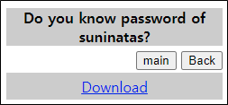

# [목차]
**1. [Description](#Description)**

**2. [Write-Up](#Write-Up)**

**3. [FLAG](#FLAG)**


***


# **Description**




# **Write-Up**

passwd파일과 shadow파일이 주어진다.

```shell
... 생략 ...
festival:*:15426:0:99999:7:::
postgres:!:15426:0:99999:7:::
haldaemon:*:15426:0:99999:7:::
suninatas:$6$QlRlqGhj$BZoS9PuMMRHZZXz1Gde99W01u3kD9nP/zYtl8O2dsshdnwsJT/1lZXsLar8asQZpqTAioiey4rKVpsLm/bqrX/:15427:0:99999:7:::
```

unshadow로 passwd와 shadow를 합칠 수 있다.

```shell
┌──(root💀kali)-[/home/kali/Desktop]
└─# unshadow passwd shadow > unshadow
```

john을 사용하여 crack하면 FLAG를 획득할 수 있다.

```shell
┌──(root💀kali)-[/home/kali/Desktop]
└─# john --wordlist=/usr/share/wordlists/rockyou.txt unshadow 
Using default input encoding: UTF-8
Loaded 2 password hashes with 2 different salts (sha512crypt, crypt(3) $6$ [SHA512 128/128 AVX 2x])
Cost 1 (iteration count) is 5000 for all loaded hashes
Will run 4 OpenMP threads
Press 'q' or Ctrl-C to abort, almost any other key for status
iloveu1          (suninatas)
1g 0:00:00:18 0.43% (ETA: 08:32:08) 0.05347g/s 3928p/s 4011c/s 4011C/s gatecrasher..compusa
Use the "--show" option to display all of the cracked passwords reliably
Session aborted
```

# **FLAG**

**iloveu1**