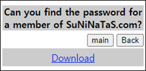
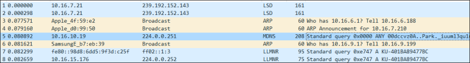
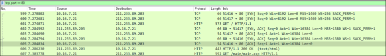
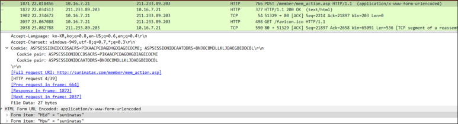
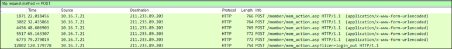
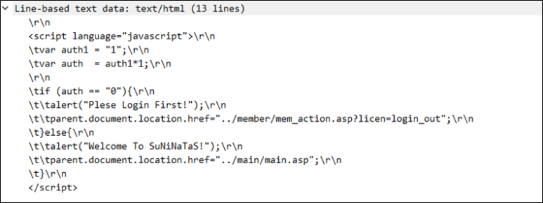
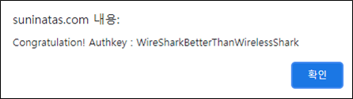

# [목차]
**1. [Description](#Description)**

**2. [Write-Up](#Write-Up)**

**3. [FLAG](#FLAG)**

***

# **Description**

# **Write-Up**

패킷파일을 받을 수 있다.

필요 없어보이는 데이터들을 필터링하면 http통신이 봐야할 데이터라는 것을 직감할 수 있다.

문제에서 패스워드를 찾을 수 있냐고 묻는다. 가장의심스러운 데이터는 POST method로 mem_action.asp로 접근하는 패킷이다.

POST method로 필터링하면 로그인 시도를 한 횟수는 5번이다.

이때, Frame No가 6773번에서 사용한 ultrashark/=SharkPass01를 넘겼을 때, 다른 응답이 온 것으로 보아 이 계정이 맞는 것같다.

suninatas 홈페이지에서 해당 계정으로 로그인하면 FLAG를 획득할 수 있다.

# **FLAG**

**WireSharkBetterThanWirelessShark**