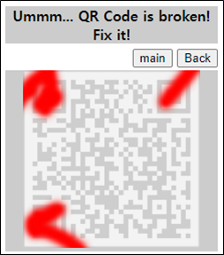
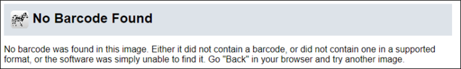
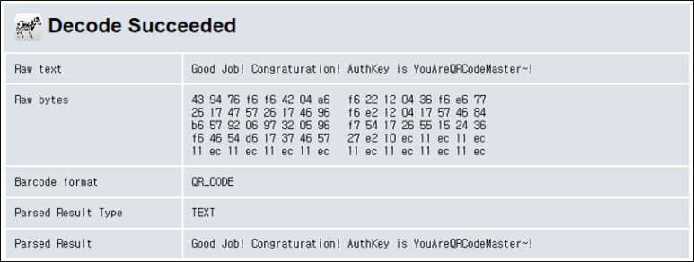

# [목차]
**1. [Description](#Description)**

**2. [Write-Up](#Write-Up)**

**3. [FLAG](#FLAG)**

***

# **Description**

# **Write-Up**

그림 그대로 디코딩을 시도하면 못알아먹는다.

파워포인트로 열심히 수정해주자.

FLAG를 획득할 수 있다.

# **FLAG**

**YouAreQRCodeMaster~!**