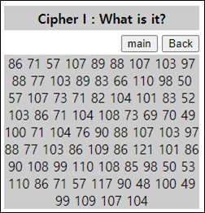

# [목차]
**1. [Description](#Description)**

**2. [Write-Up](#Write-Up)**

**3. [FLAG](#FLAG)**


***


# **Description**




# **Write-Up**

Ascii 값으로 보인다. Python의 chr 함수를 이용하여 변환하면 다음과 같다.

```python
chiper = '86 71 57 107 89 88 107 103 97 88 77 103 89 83 66 110 98 50 57 107 73 71 82 104 101 83 52 103 86 71 104 108 73 69 70 49 100 71 104 76 90 88 107 103 97 88 77 103 86 109 86 121 101 86 90 108 99 110 108 85 98 50 53 110 86 71 57 117 90 48 100 49 99 109 107 104'
chiper_to_list  = chiper.split(' ')
for c in chiper_to_list: print(chr(int(c)),end='')

[Output]
VG9kYXkgaXMgYSBnb29kIGRheS4gVGhlIEF1dGhLZXkgaXMgVmVyeVZlcnlUb25nVG9uZ0d1cmkh
```

base64로 디코딩해보면 FLAG를 획득할 수 있다.

```python
import base64
chiper = '86 71 57 107 89 88 107 103 97 88 77 103 89 83 66 110 98 50 57 107 73 71 82 104 101 83 52 103 86 71 104 108 73 69 70 49 100 71 104 76 90 88 107 103 97 88 77 103 86 109 86 121 101 86 90 108 99 110 108 85 98 50 53 110 86 71 57 117 90 48 100 49 99 109 107 104'
chiper_to_list  = chiper.split(' ')
output  = ''
for c in chiper_to_list: output += chr(int(c))
print(base64.b64decode(output).decode())

[Output]
Today is a good day. The AuthKey is VeryVeryTongTongGuri!
```


# **FLAG**

**VeryVeryTongTongGuri!**