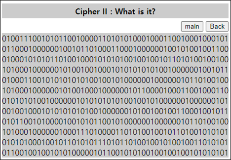
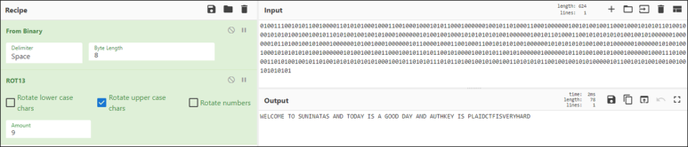

# [목차]
**1. [Description](#Description)**

**2. [Write-Up](#Write-Up)**

**3. [FLAG](#FLAG)**


***


# **Description**




# **Write-Up**

딱봐도 binary값이다. 어서 글자로 바꿔보자.

```python
data = '010011100101011001000011010101000100011001000100010101100010000001001011010001100010000001001010010011000100010101011010010001010101001001001011010100100100101000100000010100100100010101010101001000000100101101000110010101010101001001010000001000000101101001001010001000000101001000100000010110000100011001000110010101010010000001010101010100100101000000100000010100100100010101010101001000000101001001001100010010110101100101000010010101100101000000100000010110100100101000100000010001110100001101010010010110100101010101010100010010110101011101011010010010100100110101010110010010010101000001011001010100100100100101010101'
for d in range(0, len(data), 8):
    print(chr(int(data[d:d+8], 2)), end='')

[Output]
NVCTFDV KF JLEZERKRJ REU KFURP ZJ R XFFU URP REU RLKYBVP ZJ GCRZUTKWZJMVIPYRIU
```

알파벳 대문자로만 이루어져있다. rotaion해보면 FLAG를 획득할 수 있다.




# **FLAG**

**PLAIDCTFISVERYHARD**