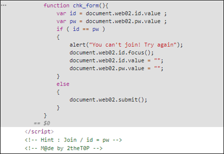

# [목차]
**1. [Description](#Description)**

**2. [Write-Up](#Write-Up)**

**3. [FLAG](#FLAG)**

***

# **Description**

# **Write-Up**

html 소스 밑 부분에 ID와 PW가 같다는 Hint가 있지만, javascript에서 ID와 PW가 다르면 post를 보내지 않는다.

chk_form함수를 덮는다.

ID와 PW를 같은 값을 입력한 뒤 Join버튼을 누르자.

    Authkey : Bypass javascript

# **FLAG**

**Bypass javascript**