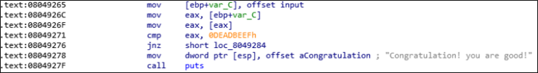

# [목차]
**1. [Description](#Description)**

**2. [Write-Up](#Write-Up)**

**3. [FLAG](#FLAG)**

***

# **Description**

# **Write-Up**

메인을 보면 argv[0]은 ./suninatas여야한다. 즉, 압축을 해제하면 reverseme파일이름일텐데, suninatas로 변경해야 한다.

이후에 30글자를 입력받은 뒤 base64 decoding을 거친다.

이후 auth함수를 호출하는데 auth함수의 내용은 md5를 계산 후 그 값이 f87cd~와 같으면 correct함수를 호출한다.

correct함수는 input으로 들어온 값이 0xDEADBEEF이면 성공메세지를 출력한다.

base64로 인코딩된 값을 넣어야 하는 값이 0xDEADBEEF이여야 하는 것도 이상하지만, md5계산한 값도 매번 달라지는 것이 이상하다.

따라서 이문제는 Authenticate의 해쉬를 통해서 f87cd~를 맞출 수 없게된다. 그래서 취약한 점을 살펴보면 memcpy에서 return주소를 덮어 쓸 수 있을 수 있다는 점이 있다.

즉, return address는 correct함수의 주소가 되어야 하고, input값에 0xDEAFBEEF를 넣으면 된다.

correct의 주소는 0x0804925F이다.

input은 0x0811C9EC이다.

encoding(0x11111111+0x22222222+0x33333333)을 넣으면 ebp는 0x33333333임을 알 수 있다.

input값의 마지막 4byte가 ebp가 참조하게 될 값이라면 ebp에 input주소를 넣으면 leave에서 다음과 같은 상황이 일어난다.

* leave는 mov esp, ebp + pop ebp를 합친 명령어이다.

leave명령어를 수행했으니 이제 retn명령어를 수행할 텐데, 이때 ESP는 input의 두번째 4byte를 바라본다.

즉, 2번째 4byte에 correct 함수의 주소를 넣어야한다.

correct함수에서 input의 첫번째 4byte를 0xDEADBEEF와 비교한다.

이제 입력값은 base64encoding(0xDEADBEEF+0x0804925F+0x0811C9EC)로 넣으면 Congratulation문구가 뜬다.

# **FLAG**

**776t3l+SBAjsyREI**