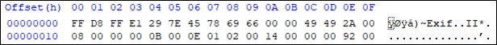
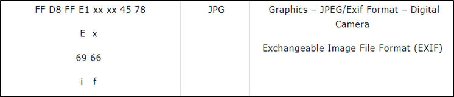
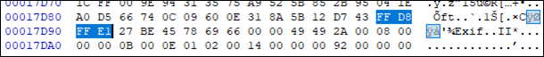
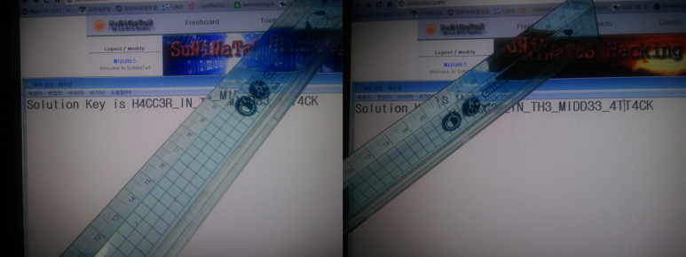

# [목차]
**1. [Description](#Description)**

**2. [Write-Up](#Write-Up)**

**3. [FLAG](#FLAG)**


***


# **Description**


# **Write-Up**

파일을 HxD로 열어보면 FF D8 FF E1으로 시작한다.



Exif 파일 포맷이라고 한다.

> [Exif](http://forensic-proof.com/archives/300)



또한, 파일 크기가 커서 의심해봤지만, 역시나 였다. 시그니처가 또 나온다.



모든 시그니처를 기준으로 Exif파일을 뽑아내자.

```python
import re
data = b''
with open('monitor.jpg', 'rb') as fp: data    = fp.read()

signature_index = [m.start() for m in re.finditer(b'\xFF\xD8\xFF\xE1', data)]

for i in range(len(signature_index)):
    temp = b''
    if i == len(signature_index) - 1: temp = data[signature_index[i]:]
    else: temp = data[signature_index[i]:signature_index[i+1] - 1]

    with open(str(i)+'.jpg', 'wb') as fp: fp.write(temp)
```
총 15개의 파일이 나온다. 파일들을 조합하면 FLAG를 획득할 수 있다.




# **FLAG**

**H4CC3R_IN_TH3_MIDD33_4TT4CK**