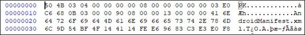
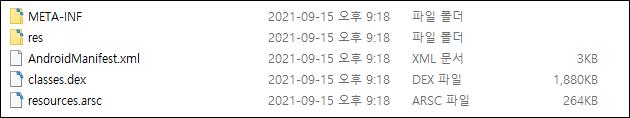
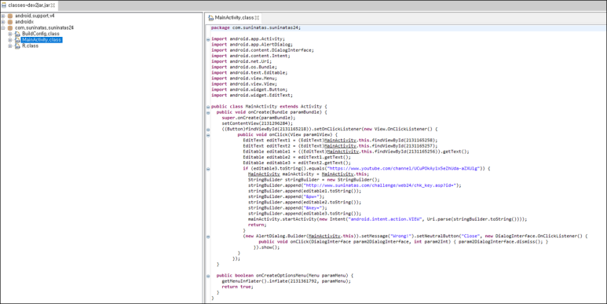
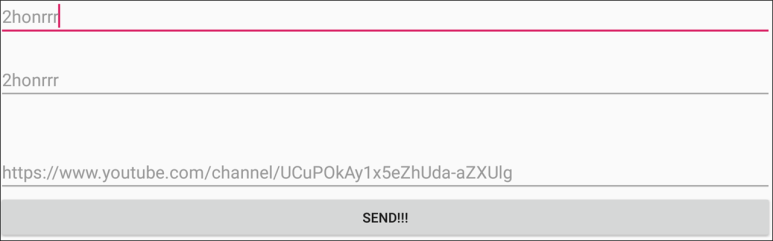
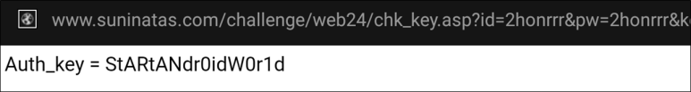

# [목차]
**1. [Description](#Description)**

**2. [Write-Up](#Write-Up)**

**3. [FLAG](#FLAG)**


***


# **Description**


# **Write-Up**

0x50 0x4B로 시작하여 압축파일인 줄 알았지만, AndroidManifest.xml이 있는 것으로 보아 apk파일인듯 하다.



apk파일이라도 기본적으로 압축해제할 수 있으므로 해제한다.



dex2jar를 이용하여 classes.dex를 압축 해제한다.

> [dex2jar](https://sourceforge.net/projects/dex2jar/files/latest/download)

```shell
C:\Users\admin\Downloads\dex2jar-2.0>d2j-dex2jar.bat C:\Users\admin\Downloads\suninatas\suninatas24\classes.dex
dex2jar C:\Users\admin\Downloads\suninatas\suninatas24\classes.dex -> .\classes-dex2jar.jar
Detail Error Information in File .\classes-error.zip
Please report this file to http://code.google.com/p/dex2jar/issues/entry if possible.
```

java decompiler를 이용하여 classes-dex2jar.jar를 디컴파일 한다.

> [jd-gui](http://java-decompiler.github.io/)



id와 pw는 실제 suninatas의 계정으로 가정하고, key는 editable3을 string으로 변환한 값과 youtube링크와 비교하므로 youtube링크 값이 키임을 알 수 있다.

```java
... 생략 ...
            if (editable3.toString().equals("https://www.youtube.com/channel/UCuPOkAy1x5eZhUda-aZXUlg")) {
              MainActivity mainActivity = MainActivity.this;
              StringBuilder stringBuilder = new StringBuilder();
              stringBuilder.append("http://www.suninatas.com/challenge/web24/chk_key.asp?id=");
              stringBuilder.append(editable1.toString());
              stringBuilder.append("&pw=");
              stringBuilder.append(editable2.toString());
              stringBuilder.append("&key=");
              stringBuilder.append(editable3.toString());
              mainActivity.startActivity(new Intent("android.intent.action.VIEW", Uri.parse(stringBuilder.toString())));
              return;
            } 
... 생략 ...
```

에뮬레이터를 이용하여 apk를 설치한 뒤 필요한 파라미터들을 입력해주자.

패스워드는 특수문자가 들어가면 서버가 응답을 안줘서 특수문자가 없는 새 계정 팠다.



SEND를 누르면 FLAG를 획득할 수 있다.




# **FLAG**

**StARtANdr0idW0r1d**