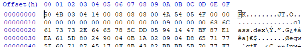

# [목차]
**1. [Description](#Description)**

**2. [Write-Up](#Write-Up)**

**3. [FLAG](#FLAG)**


***


# **Description**


# **Write-Up**

apk파일인가 보다.



dex파일을 jar파일로 바꿔준다.

> [dex2jar](https://sourceforge.net/projects/dex2jar/files/latest/download)

```shell
C:\Users\admin\Downloads\Suninatas25\dex2jar-2.0>d2j-dex2jar.bat C:\Users\admin\Downloads\Suninatas25\class.dex
dex2jar C:\Users\admin\Downloads\Suninatas25\class.dex -> .\class-dex2jar.jar
```

java decompiler를 통해 jar파일을 디컴파일한다.

> [jd-gui](http://java-decompiler.github.io/)

```shell
C:\Users\admin\Downloads\Suninatas25>java -jar jd-gui-1.6.6.jar
```

필요한 인자 값은 id, pw, Name, Number이다.

```java
Intent intent = new Intent("android.intent.action.VIEW", Uri.parse("http://www.suninatas.com/challenge/web25/chk_key.asp?id=" + editable1.toString() + "&pw=" + editable2.toString() + "&Name=" + str.toString() + "&Number=" + str1.toString()));
```

id와 pw는 이전 문제처럼 실제 계정을 넣으면 될 것같고, Number는 문제페이지에서 부여한 숫자인것으로 추정된다.

Name을 추척하면 str변수를 string값으로 변환한 값이다. str변수는 다음과 같다.

```java
String str = Suninatas25.this.getContacts("sb");
```

getContacts에서 return할 때, stringBuffer변수를 반환한다.

```java
... 생략 ...
      if (!cursor.moveToNext())
        return stringBuffer.toString();
... 생략 ...
```

따라서 getContacts에 "sb"를 넘길 때 stringBuffer의 값을 보면 SuNiNaTaS여야 하는 것을 알 수 있다.

```java
... 생략 ...
      if (str1.equals("SuNiNaTaS")) {
        if (paramString.equals("sb")) {
          stringBuffer.append(str1);
          continue;
        }
... 생략 ...
```

apk로 바꿔서 하려고 했지만, 오류가 나서 설치는 안되어서 그냥 모바일 에뮬레이터의 브라우저를 통해 접근하였다.


Chrome developer tools를 이용하여 모바일 처럼 이용할 수 도 있다.


# **FLAG**

**FanTast1c aNdr0id w0r1d!**