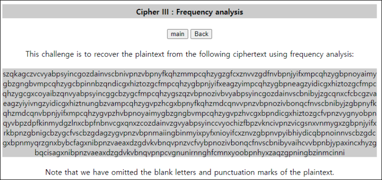
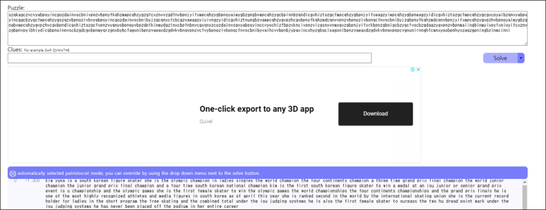

# [목차]
**1. [Description](#Description)**

**2. [Write-Up](#Write-Up)**

**3. [FLAG](#FLAG)**


***


# **Description**




# **Write-Up**

빈도수 및 패턴을 분석하여 암호문을 평문으로 치환하는 문제이다.

먼저 암호문의 알파벳별로 빈도수를 체크하면 n이 가장 많이 나오는데, 영어에서는 e가 가장 많은 비율을 차지하므로, n을 e로 바꿔야 할 것 같다.

```python
import string

data = """
szqkagczvcvyabpsyincgozdainvscbnivpnzvbpnyfkqhzmmpcqhzygzgfcxznvvzgdfnvbpnjyifxmpcqhzygbpnoyaimygbzgngbvmpcqhzygcbpinnbzqndicgxhiztozgcfmpcqhzygbpnjyifxeagzyimpcqhzygbpneagzyidicgxhiztozgcfmpcqhzygcgxcoyaibzqnvyabpsyincggcbzygcfmpcqhzygszqzvbpnozivbvyabpsyincgozdainvscbnibyjzgcqnxcfcbcgzvaeagzyiyivngzyidicgxhiztnungbzvampcqhzygvpzhcgxbpnyfkqhzmdcqnvvpnzvbpnozivbonqcfnvscbnibyjzgbpnyfkqhzmdcqnvbpnjyifxmpcqhzygvpzhvbpnoyaimygbzgngbvmpcqhzygvpzhvcgxbpndicgxhiztozgcfvpnzvygnyobpnqyvbpzdpfkinmydgzlnxcbpfnbnvcgxqnxzcozdainvzgvyabpsyinccvyochizfbpzvkncivpnzvicgsnxvnmygxzgbpnjyifxrkbpnzgbnigcbzygcfvscbzgdagzygvpnzvbpnmaiingbinmyixpyfxnioyifcxznvzgbpnvpyibhiydicqbpnoinnvscbzgdcgxbpnmyqrzgnxbybcfagxnibpnzvaeaxdzgdvkvbnqvpnzvcfvybpnozivbonqcfnvscbnibyvaihcvvbpnbjypaxincxhyzgbqcisagxnibpnzvaeaxdzgdvkvbnqvpnpcvgnunirnnghfcmnxyoobpnhyxzaqzgpningbzinmcinni
"""

ascii_set = string.ascii_lowercase
ascii_dict = dict()
for a in ascii_set: ascii_dict[a] = data.count(a)
sorted_dict = sorted(ascii_dict.items(), key= lambda x: x[1], reverse=True)
print(sorted_dict)

[Output]
[('n', 92), ('z', 78), ('g', 69), ('b', 65), ('c', 65), ('v', 62), ('i', 60), ('y', 59), ('p', 58), ('x', 31), ('q', 30), ('a', 27), ('h', 26), ('f', 25), ('m', 22), ('o', 20), ('d', 19), ('s', 14), ('k', 9), ('j', 7), ('e', 5), ('t', 4), ('r', 3), ('u', 2), ('l', 1), ('w', 0)]
```

다음으로는 e와 관련해서 많이 나오는 단어가 the밖에 안떠오른다. 즉 e전의 단어빈도수를 체크해보면 p가 가장 많이 나오는데 p를 h로 바꿔야 할 것 같다.

```python
best = sorted_dict[0][0]
replaced_data = data.replace(best,'e')

ascii_dict = dict()
for i in range(len(replaced_data)):
    if i == len(replaced_data) - 1: break
    if replaced_data[i+1] == 'e':
        if replaced_data[i] in list(ascii_dict.keys()): ascii_dict[replaced_data[i]] += 1
        else: ascii_dict[replaced_data[i]] = 1

sorted_dict = sorted(ascii_dict.items(), key= lambda x: x[1], reverse=True)
print(sorted_dict)

[Output]
[('p', 32), ('i', 16), ('b', 8), ('q', 6), ('g', 5), ('e', 5), ('f', 4), ('x', 4), ('a', 3), ('z', 2), ('v', 2), ('u', 2), ('o', 2), ('t', 1), ('l', 1), ('k', 1), ('s', 1), ('r', 1), ('m', 1)]
```

똑같이 th앞에 가장 많은 단어를 측정하면 b가 나오는데 b를 t로 치환하면 the라는 글자는 치환이 완료됐다.

```python
best = sorted_dict[0][0]
replaced_data = replaced_data.replace(best, 'h')

ascii_dict = dict()
for i in range(0, len(replaced_data), 2):
    if i == len(replaced_data) - 2: break
    if replaced_data[i+1:i+3] == 'he':
        if replaced_data[i] in list(ascii_dict.keys()): ascii_dict[replaced_data[i]] += 1
        else: ascii_dict[replaced_data[i]] = 1

sorted_dict = sorted(ascii_dict.items(), key= lambda x: x[1], reverse=True)
print(sorted_dict)

[Output]
[('b', 12), ('v', 6), ('g', 1)]
```

다음부터가 영어 실력이 뽀록난다. the의 앞뒤로 어떤 알파벳이 많이 나오는지 모르겠다..... 영문학 교수도 아니고.... 툴을 사용하자.

> [빈도수 자동 분석](https://quipqiup.com/)



개인적으로, 매우 원시적이면서 근본에 충실한 문제라서 아주 맘에 들었지만, 나는 못품


# **FLAG**

**kimyuna**