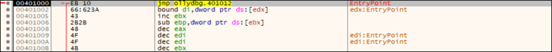
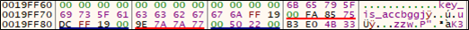

# [목차]
**1. [Description](#Description)**

**2. [Write-Up](#Write-Up)**

**3. [FLAG](#FLAG)**


***


# **Description**


# **Write-Up**

down을 클릭하면 IRC 서버를 통해서 나눈 대화를 볼 수 있다고 한다.

    Pruss is my name. I am a member of russian mafia group. we communacate via a secure channel with secure password like.. $A$"4kruss password has to be long and it should contain alphabet, number, etc. I added 'russ' at the end because my name is Pruss. and this is our password convention. we must add 'russ' to end.. because it is our code name and we are very bad russian. we use secure communication since FBI monitors our communications on the Internet. we can't use password like DDDDDHHHHHHPDDDDDruss. because these passwords can be easily broken by FBI hackers. even if the password is long enough,(something like @@@@@@@@@@@@@@@@@@@@russ) it is not secure because there is only one repeated character '@'. anyway, using secure password is important... Pruss is actually not only my name, it is also code name of our mafia. we use similar names. one of my friend's name is Druss. Druss is my best friend and a professional killer. but he is not good at security. one day Druss used a password DDDDruss I told him this is very bad and weak password. the FBI will break it very easily. so he changed his password into HHHHHHHHHHHHHHHHHHHHHHHHHHruss. I told him even if password is long, it is weak if there is no combination with number and symbol... he said 'ok Pruss, this time I'll make a very long and secure password which contains number and symbol as well!' and he made '11111DDDDD@@@@@@@@@@PDDDDD@@@@@@@@@@PDDDDDHHHHHHHHHHHHHHHHHHHHruss'!! and asked me if this is secure enough. I told him it is secure, but it is long to remember. he said 'thank you Pruss you always teach me computer security' anyway this was small talk and I will tell you something about mafia life. Druss likes to listen to music, such as rock, pop and jazz... even though he is a tough killer he has sensitive heart.. Druss likes to dressed up with very black jacket with black jean, he thinks it is a cool fashion, but I don't like it.. Druss has high IQ, he is a member of group called MENSA(group of people who has IQ over 150) so, he is very very smart. Druss has a girl friend, her name is Hruss. Hruss is also my friend too. she is very very pretty, and also a killer(!). Druss likes Hruss a lot, they are in love with each other. it is common case that mafia members hooks up together. mafia@russia.ru is our server. we have lot of data regarding our crimes in our server so FBI hackers are trying to hack mafia@russia.ru but we don't have to worry since we are using secure password(we discussed this) as I told earlier. anyway.. Pruss sounds somewhat like 'Press' so, Press is my nick name it is somewhat juvenile but I think it is pretty funny too Druss always makes fun of me by using my nick name 'Press' sometimes I got angry but I don't express my feeling because Druss is a professional killer I don't want to get shot. it is possible to get shot by mafia friends. it happened once. Druss shot a friend many years ago, he was also a mafia member. they had a quarrel and it turned into very big fight so Druss shot other friend... after that incident, I always say something nicely to him. in fact the secure password which Druss have created earlier I felt it was very stupid password. however I told him very nicely. who makes password like '@@PDDDDDPDDDDDHPDDDDD@@@@@PDDDDDPDDDDD@@@PDDDDDruss'? no body will ever think that this is a password. to me, a secure password will be say something like... kNz3i!Bs4jP

어떤 규칙의 암호문인 줄 알았는데, 문제에서 x86이라는 키워드를 던져줬다. 먼저 HxD로 봐보자.


x32dbg로 아무 PE파일이나 연뒤, EntryPoint까지 진행하자.



HxD에서 모든 Hex값을 복사한 뒤, x32dbg의 CPU창에서 EIP가 가르키는 곳에서 우클릭->바이너리->붙여넣기(크기무시)를 누른다.


마지막에 BP를 건다.


ds에서 eax의 값 근처로 가보면 key가 있다. (프로그램 시작 시 ESP 근처)



참고로 Python의 capstone라이브러리를 사용하면 hex값을 assembly로 변환할 수 있다.

```python
from capstone import *

CODE = b''
with open('IRC_data', 'rb') as fp: CODE = fp.read()

md = Cs(CS_ARCH_X86, CS_MODE_32 + CS_MODE_LITTLE_ENDIAN)
asm = ''
for i in md.disasm(CODE, 0x00): asm += "{}\t{}\n".format(i.mnemonic, i.op_str)

print(asm)

[Output]
... 생략 ...
imul	ebp, dword ptr [esi + 0x67], 0x6b696c20
and	byte ptr cs:[ebx + 0x4e], ch
jp	0xd80
imul	esp, dword ptr [ecx], 0x6a347342
push	eax
```


# **FLAG**

**accbggj**