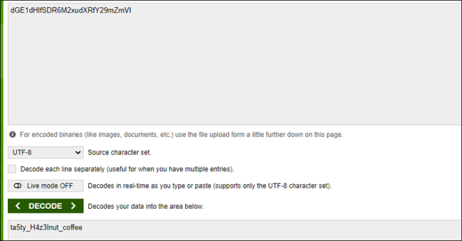

# [목차]
**1. [Description](#Description)**

**2. [Write-Up](#Write-Up)**

**3. [FLAG](#FLAG)**

***

# **Description**

# **Write-Up**

압축파일을 다운받을 수 있는데, 해제하려고 하면 암호를 묻는다.

zip파일 포맷을 보면 시그니처(0x04034B50)부터 2byte떨어진 곳부터 Flags라는 구역이 있다.

해당 구역을 보면 0번째 bit(맨 마지막 bit)가 1이면 암호화, 0이면 비암호화 파일임을 나타낸다.

압축파일을 해제하려고 할때, Am_I_key.zip이 암호가 걸려있다고 하니, 해당하는 곳의 Flags를 바꿔주자.

다른 파일도 암호가 걸려있어 전부 풀려면 모두 Flags를 바꿔주면 되지만 Am_I_key.zip만 Flags를 바꿔줘도 해당 파일만 압축해제할 수 있고, Am_I_key.zip을 열어보면 FLAG를 획득할 수 있다.

FLAG인 줄 알았지만, 인증이 실패해서 보니 base64로 인코딩되어 있었다.

# **FLAG**

**ta5ty_H4z3lnut_coffee**