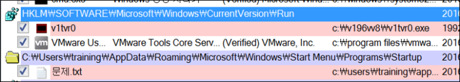

# [목차]
**1. [Description](#Description)**

**2. [Write-Up](#Write-Up)**

**3. [FLAG](#FLAG)**


***


# **Description**


# **Write-Up**

엄청난 용량의 파일을 받을 수 있다. 시그니처를 보니 egg확장자로 압축되어 있는 파일같다.


압축을 해제하면 vm파일임을 알 수 있다.


vm을 키면 30초 후에 종료된다고 한다. 닫기


귀찮으니 예약을 없앤다.

```shell
C:\Windows\system32>shutdown -a
```

작업 스케줄러에서도 없애 주자.


1번 문제는 www.naver.com으로 접속하면 사이버 경찰청화면이 뜬다고 한다. hosts파일 조작 의심 99.9%다. C:\Windows\System32\drivers\etc를 보면 hosts.txt가 있다.


하지만 hosts는 확장자가 없다. 숨김파일 해제하여 hosts파일을 보면 1번 FLAG를 획득할 수 있다. 

(what_the_he11_1s_keey)


2번 문제는 키로거를 찾으라고 한다. 키로거의 입장에서 생각하면 시스템 시작 시 실행되어야 사용자의 모든 키를 입력받을 것이다. autoruns을 이용하자. (문제에서 주어진 시스템은 32bit)



FLAG(Jump to Image로 해당 위치)를 얻을 수 있다.

(c:\v196vv8\v1tvr0.exe)

* C드라이브를 소문자로 해야한다.


kco.dat은 html파일인데 html로 바꾸고 확인하면 PC SPY 2010이라는 프로그램인가보다.


의심스러운 Hook API와 String값들이다.


스크린샷도 모아둔다.


3번 문제는 다운로드 시간을 찾으란다. 브라우징 히스토리를 이용하자.


v1tvr0.exe는 2016-05-24T04:26:09에 생성되었다.


생성된 시간 근처로 타임라인을 보면 pc-spy-2010~~.exe로 접근한 시간(FLAG)을 알 수 있다.

(2016-05-24_04:25:06)

* 사설네트워크에서 키로거를 다운받았네 내부 서버부터 털렸나보네


4번 문제는 C:\v196vv8\v1valv\Computer1\24052016 #training\z1.dat을 보면 나와있다.


MD5를 이용하여 최종 FLAG를 생성하자.

```python
import hashlib

data = "what_the_he11_1s_keeyc:\\v196vv8\\v1tvr0.exe2016-05-24_04:25:06blackkey is a Good man".encode('utf-8')
enc = hashlib.md5()
enc.update(data)
print(enc.hexdigest())

[Output]
970f891e3667fce147b222cc9a8699d4
```


# **FLAG**

**970f891e3667fce147b222cc9a8699d4**