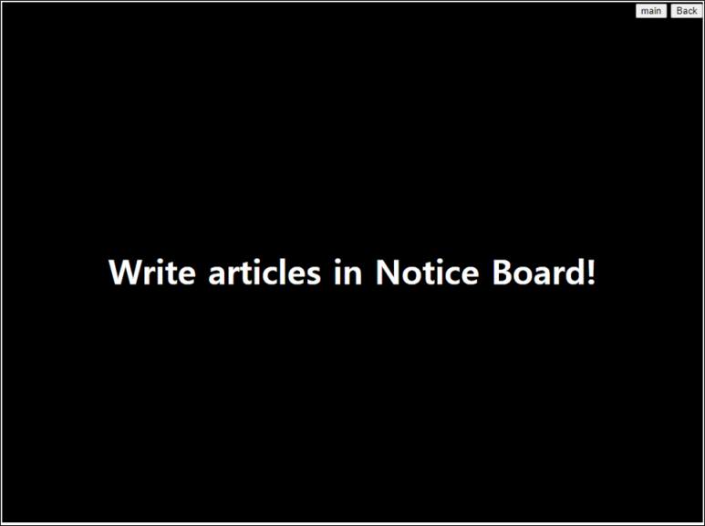
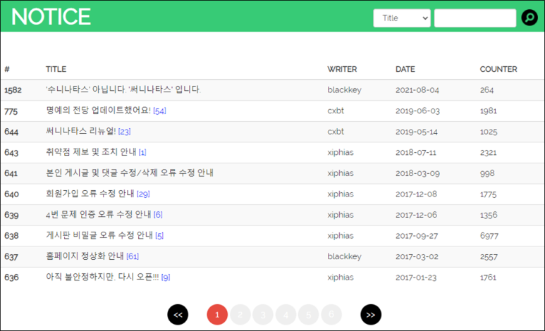
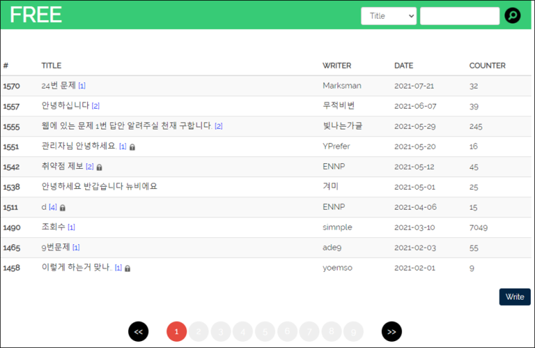
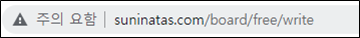
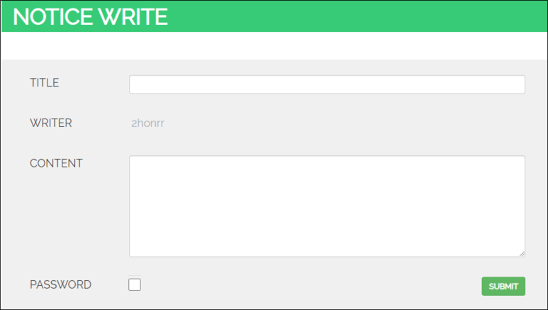
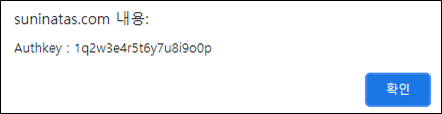

# [목차]
**1. [Description](#Description)**

**2. [Write-Up](#Write-Up)**

**3. [FLAG](#FLAG)**

***

# **Description**

# **Write-Up**

Notice Board에 게시글을 쓰라고한다. Notice로 가보자.

글쓰기 버튼이 없다. Free로 가보면 Write버튼이 있다.

글쓰기 버튼을 누르면 다음과 같은 URL 형식이다.

free를 notice로 바꿔서 접속한다.

글을 작성하면 FLAG를 획득할 수 있다.

# **FLAG**

**1q2w3e4r5t6y7u8i9o0p**