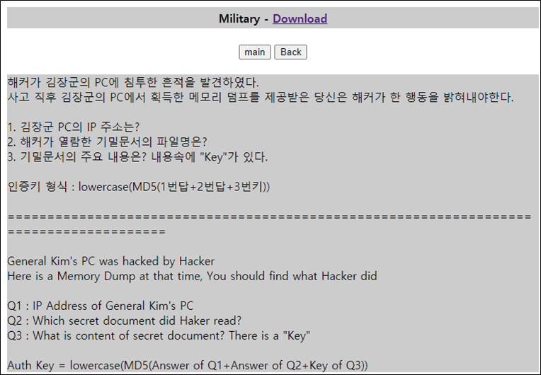
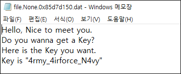

# [목차]
**1. [Description](#Description)**

**2. [Write-Up](#Write-Up)**

**3. [FLAG](#FLAG)**


***


# **Description**




# **Write-Up**

파일 명부터 메모리 덤프라고 한다. 바로 volatility로 imageinfo부터 알아낸다.

> [volatility](https://github.com/volatilityfoundation/volatility/wiki/Installation)

```shell
volatility_2.6_win64_standalone.exe -f "MemoryDump(SuNiNaTaS)" imageinfo
Volatility Foundation Volatility Framework 2.6
INFO    : volatility.debug    : Determining profile based on KDBG search...
          Suggested Profile(s) : Win7SP1x86_23418, Win7SP0x86, Win7SP1x86
                     AS Layer1 : IA32PagedMemoryPae (Kernel AS)
                     AS Layer2 : FileAddressSpace (C:\Users\admin\Downloads\volatility_2.6_win64_standalone\volatility_2.6_win64_standalone\MemoryDump(SuNiNaTaS))
                      PAE type : PAE
                           DTB : 0x185000L
                          KDBG : 0x82f6cc28L
          Number of Processors : 1
     Image Type (Service Pack) : 1
                KPCR for CPU 0 : 0x82f6dc00L
             KUSER_SHARED_DATA : 0xffdf0000L
           Image date and time : 2016-05-24 09:47:40 UTC+0000
     Image local date and time : 2016-05-24 18:47:40 +0900
```

1번이 IP를 알아내라고 한다. netscan 하자.

(192.168.197.138)

```shell
volatility_2.6_win64_standalone.exe -f "MemoryDump(SuNiNaTaS)" --profile=Win7SP1x86 netscan
Offset(P)          Proto    Local Address                  Foreign Address      State            Pid      Owner          Created
... 생략 ...
0x3f430b70         TCPv4    192.168.197.138:49168          216.58.197.132:80    ESTABLISHED      -1                     
0x3f7854b8         TCPv4    192.168.197.138:49164          211.233.62.122:80    ESTABLISHED      -1                     
0x3f78bd68         TCPv4    192.168.197.138:49179          59.18.34.167:443     ESTABLISHED      -1                     
0x3f7deb30         TCPv4    192.168.197.138:49184          114.108.157.50:80    ESTABLISHED      -1                     
0x3fc5f998         TCPv4    192.168.197.138:49178          59.18.34.167:443     ESTABLISHED      -1                     
0x3fc6d638         TCPv4    192.168.197.138:49172          172.217.25.67:443    ESTABLISHED      -1                     
0x3fc77df8         TCPv4    192.168.197.138:49176          172.217.25.67:443    ESTABLISHED      -1                     
0x3fc84348         TCPv4    192.168.197.138:49169          216.58.197.132:80    ESTABLISHED      -1                     
0x3fc86008         TCPv4    192.168.197.138:49175          59.18.35.55:80       CLOSED           -1                     
0x3fc8b5f0         TCPv4    192.168.197.138:49251          61.111.58.11:80      ESTABLISHED      -1                     
0x3fc8d4a0         TCPv4    192.168.197.138:49177          172.217.25.67:443    ESTABLISHED      -1                     
0x3fc90df8         TCPv4    192.168.197.138:49265          59.18.44.44:80       ESTABLISHED      -1                     
0x3fc98738         TCPv4    192.168.197.138:49182          59.18.44.226:443     ESTABLISHED      -1                     
0x3fc9fbe8         TCPv4    192.168.197.138:49181          59.18.44.226:443     ESTABLISHED      -1                     
0x3fca8828         TCPv4    192.168.197.138:49180          59.18.35.55:80       CLOSED           -1                     
0x3fcbbbb0         TCPv4    192.168.197.138:49237          180.70.93.13:80      CLOSED           -1                     
... 생략 ...
```

해커가 열람한 파일 명을 알아내라고 한다. 우선 프로세스가 뭐 떠있는 지 본다. psscan하자.

```shell
volatility_2.6_win64_standalone.exe -f "MemoryDump(SuNiNaTaS)" --profile=Win7SP1x86 psscan
Volatility Foundation Volatility Framework 2.6
Offset(P)          Name                PID   PPID PDB        Time created                   Time exited
------------------ ---------------- ------ ------ ---------- ------------------------------ ------------------------------
0x000000003da3b228 svchost.exe        3320    460 0x3eb23500 2016-05-24 09:24:42 UTC+0000
0x000000003daa6a88 conhost.exe        2920    368 0x3eb235a0 2016-05-24 09:41:57 UTC+0000
0x000000003dafb650 iexplore.exe       2432   3948 0x3eb23200 2016-05-24 09:35:30 UTC+0000
0x000000003dafc030 wlrmdr.exe         2836    416 0x3eb231a0 2016-05-24 09:23:07 UTC+0000   2016-05-24 09:23:17 UTC+0000
0x000000003dafcd40 svchost.exe        3352    460 0x3eb234a0 2016-05-24 09:24:42 UTC+0000
0x000000003dc11d40 conhost.exe        3556    368 0x3eb235c0 2016-05-24 09:24:49 UTC+0000   2016-05-24 09:27:52 UTC+0000
0x000000003dc6ed40 msdtc.exe          2464    460 0x3eb232c0 2016-05-24 09:23:02 UTC+0000
0x000000003dcf7d00 WmiPrvSE.exe       2580    588 0x3eb23520 2016-05-24 09:23:03 UTC+0000
0x000000003dd01ab8 VGAuthService.     2020    460 0x3eb23420 2016-05-24 09:22:40 UTC+0000
0x000000003dd11bd0 vmtoolsd.exe       2044    460 0x3eb23440 2016-05-24 09:22:40 UTC+0000
0x000000003dd5b498 notepad.exe        3728   1256 0x3eb23280 2016-05-24 09:45:46 UTC+0000
0x000000003dd6d638 iexplore.exe       1840   3948 0x3eb23560 2016-05-24 09:34:45 UTC+0000
0x000000003dd8d030 WmiPrvSE.exe       1548    588 0x3eb23480 2016-05-24 09:22:43 UTC+0000
0x000000003dd9b9a0 iexplore.exe       3948   1408 0x3eb233c0 2016-05-24 09:34:28 UTC+0000
0x000000003ddb55c8 dllhost.exe        2084    460 0x3eb234c0 2016-05-24 09:22:45 UTC+0000
0x000000003de055f0 svchost.exe        1072    460 0x3eb23240 2016-05-24 09:22:24 UTC+0000
0x000000003dea8bc0 spoolsv.exe        1348    460 0x3eb232a0 2016-05-24 09:22:27 UTC+0000
0x000000003dec4bb8 dwm.exe            1392    852 0x3eb232e0 2016-05-24 09:22:27 UTC+0000
0x000000003ded04c0 explorer.exe       1408   1368 0x3eb23320 2016-05-24 09:22:27 UTC+0000
0x000000003ded1c88 svchost.exe        1464    460 0x3eb23360 2016-05-24 09:22:28 UTC+0000
0x000000003ded34b0 taskhost.exe       1420    460 0x3eb23340 2016-05-24 09:22:27 UTC+0000
0x000000003df6c030 v1tvr0.exe         1640   1408 0x3eb233a0 2016-05-24 09:22:30 UTC+0000
0x000000003df7e680 vmtoolsd.exe       1632   1408 0x3eb23380 2016-05-24 09:22:30 UTC+0000
0x000000003e074698 csrss.exe           368    352 0x3eb23040 2016-05-24 09:22:19 UTC+0000
0x000000003e084ba0 winlogon.exe        416    352 0x3eb230c0 2016-05-24 09:22:19 UTC+0000
0x000000003e0bb030 svchost.exe        1184    460 0x3eb23260 2016-05-24 09:22:25 UTC+0000
0x000000003e0ca498 services.exe        460    360 0x3eb23080 2016-05-24 09:22:20 UTC+0000
0x000000003e0cb720 svchost.exe         588    460 0x3eb23120 2016-05-24 09:22:21 UTC+0000
0x000000003e0cba58 lsass.exe           476    360 0x3eb230e0 2016-05-24 09:22:20 UTC+0000
0x000000003e0de030 lsm.exe             484    360 0x3eb23100 2016-05-24 09:22:20 UTC+0000
0x000000003e155570 svchost.exe         732    460 0x3eb23180 2016-05-24 09:22:22 UTC+0000
0x000000003e168030 vmacthlp.exe        652    460 0x3eb23140 2016-05-24 09:22:22 UTC+0000
0x000000003e16e030 svchost.exe         684    460 0x3eb23160 2016-05-24 09:22:22 UTC+0000
0x000000003e1b5c58 SearchIndexer.      832    460 0x3eb23400 2016-05-24 09:22:43 UTC+0000
0x000000003e1dcb18 svchost.exe         852    460 0x3eb231c0 2016-05-24 09:22:23 UTC+0000
0x000000003e1e0818 svchost.exe         892    460 0x3eb231e0 2016-05-24 09:22:23 UTC+0000
0x000000003e1f1398 svchost.exe         996    460 0x3eb23220 2016-05-24 09:22:24 UTC+0000
0x000000003e27b030 csrss.exe           320    300 0x3eb23060 2016-05-24 09:22:19 UTC+0000
0x000000003e5c5218 wininit.exe         360    300 0x3eb230a0 2016-05-24 09:22:19 UTC+0000
0x000000003eadd148 smss.exe            236      4 0x3eb23020 2016-05-24 09:22:16 UTC+0000
0x000000003ef28a20 System                4      0 0x00185000 2016-05-24 09:22:16 UTC+0000
0x000000003f428b18 DumpIt.exe         1260   1408 0x3eb235c0 2016-05-24 09:47:38 UTC+0000
0x000000003f772bc0 cmd.exe            1256   1408 0x3eb233e0 2016-05-24 09:41:57 UTC+0000
0x000000003fc9dd40 SearchFilterHo     2696    832 0x3eb23600 2016-05-24 09:46:48 UTC+0000
0x000000003fca4a58 SearchProtocol     4048    832 0x3eb23300 2016-05-24 09:46:47 UTC+0000
0x000000003fcbb468 dllhost.exe        2536    588 0x3eb23620 2016-05-24 09:47:41 UTC+0000   2016-05-24 09:47:46 UTC+0000
0x000000003fcfa610 conhost.exe        1980    368 0x3eb235e0 2016-05-24 09:47:38 UTC+0000
0x000000003ff8ba20 System                4      0 0x00185000 2016-05-24 09:22:16 UTC+0000
```

그 놈의 v1tvr0.exe는 또 있네.. 파일을 열어서 확인한다는 것으로 미루어보아 의심스러운 프로세스는 notepad.exe, cmd.exe, iexplore.exe다.

그렇다면 먼저 cmd history를 본다. cmdline하자.

(SecreetDocumen7.txt)

```shell
volatility_2.6_win64_standalone.exe -f "MemoryDump(SuNiNaTaS)" --profile=Win7SP1x86 cmdline
Volatility Foundation Volatility Framework 2.6
... 생략 ...
v1tvr0.exe pid:   1640
Command line : "C:\v196vv8\v1tvr0.exe"
************************************************************************
VGAuthService. pid:   2020
Command line : "C:\Program Files\VMware\VMware Tools\VMware VGAuth\VGAuthService.exe"
************************************************************************
vmtoolsd.exe pid:   2044
Command line : "C:\Program Files\VMware\VMware Tools\vmtoolsd.exe"
************************************************************************
SearchIndexer. pid:    832
Command line : C:\Windows\system32\SearchIndexer.exe /Embedding
************************************************************************
WmiPrvSE.exe pid:   1548
Command line : C:\Windows\system32\wbem\wmiprvse.exe
************************************************************************
dllhost.exe pid:   2084
Command line : C:\Windows\system32\dllhost.exe /Processid:{02D4B3F1-FD88-11D1-960D-00805FC79235}
************************************************************************
msdtc.exe pid:   2464
Command line : C:\Windows\System32\msdtc.exe
************************************************************************
WmiPrvSE.exe pid:   2580
Command line : C:\Windows\system32\wbem\wmiprvse.exe
************************************************************************
wlrmdr.exe pid:   2836
************************************************************************
svchost.exe pid:   3320
Command line : C:\Windows\system32\svchost.exe -k LocalServiceAndNoImpersonation
************************************************************************
svchost.exe pid:   3352
Command line : C:\Windows\System32\svchost.exe -k secsvcs
************************************************************************
iexplore.exe pid:   3948
Command line : "C:\Program Files\Internet Explorer\iexplore.exe"
************************************************************************
iexplore.exe pid:   1840
Command line : "C:\Program Files\Internet Explorer\iexplore.exe" SCODEF:3948 CREDAT:79873
************************************************************************
iexplore.exe pid:   2432
Command line : "C:\Program Files\Internet Explorer\iexplore.exe" SCODEF:3948 CREDAT:79875
************************************************************************
cmd.exe pid:   1256
Command line : "C:\Windows\system32\cmd.exe"
************************************************************************
conhost.exe pid:   2920
Command line : \??\C:\Windows\system32\conhost.exe "-17822292631605537652-1122368051-1296438897354674444-1861956393-17555046251938550102
************************************************************************
notepad.exe pid:   3728
Command line : notepad  C:\Users\training\Desktop\SecreetDocumen7.txt
************************************************************************
... 생략 ...
```

파일 내용을 확인하라고 한다. 우선 SecreetDocumen7.txt의 메모리 주소를 알아낸다. filescan하자.

```shell
volatility_2.6_win64_standalone.exe -f "MemoryDump(SuNiNaTaS)" --profile=Win7SP1x86 filescan | findstr SecreetDocumen7.txt
Volatility Foundation Volatility Framework 2.6
0x000000003df2ddd8      8      0 RW-r-- \Device\HarddiskVolume1\Users\training\Desktop\SecreetDocumen7.txt
```

메모리 주소를 알아냈으면 파일을 덤프뜬다. dumpfiles하자.

```shell
volatility_2.6_win64_standalone.exe -f "MemoryDump(SuNiNaTaS)" --profile=Win7SP1x86 dumpfiles -Q 0x000000003df2ddd8 -D ./
Volatility Foundation Volatility Framework 2.6
DataSectionObject 0x3df2ddd8   None   \Device\HarddiskVolume1\Users\training\Desktop\SecreetDocumen7.txt
```

내용을 확인한다.

(4rmy_4irforce_N4vy)



3개의 FLAG를 합쳐 MD5로 해쉬뜬 다음 최종 FLAG를 획득한다.

```python
import hashlib

data = "192.168.197.138SecreetDocumen7.txt4rmy_4irforce_N4vy".encode('utf-8')
enc = hashlib.md5()
enc.update(data)
print(enc.hexdigest())

[Output]
c152e3fb5a6882563231b00f21a8ed5f
```


# **FLAG**

**c152e3fb5a6882563231b00f21a8ed5f**