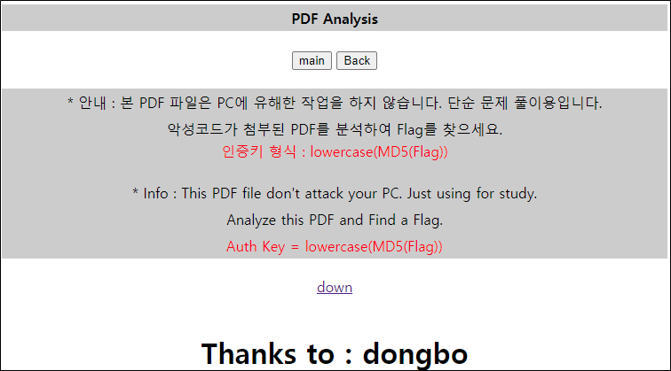
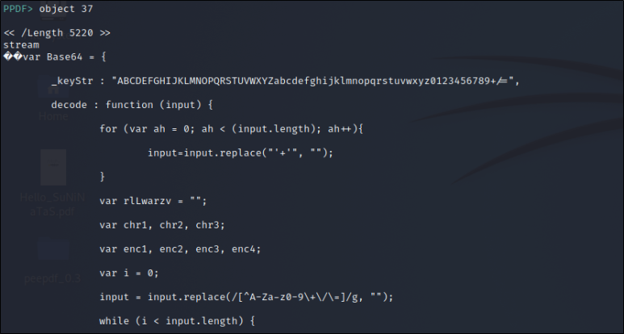
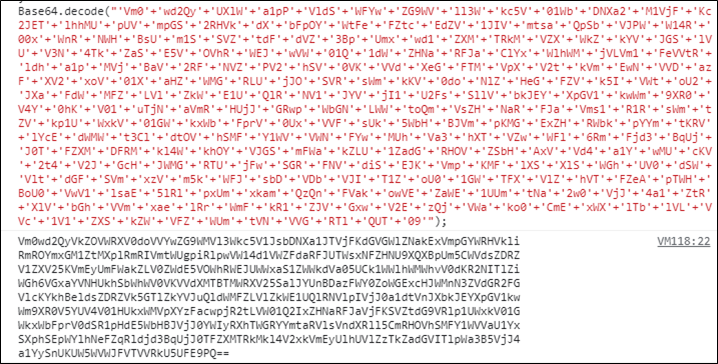
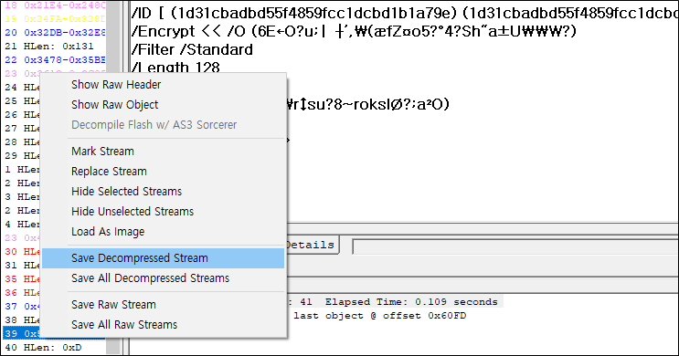
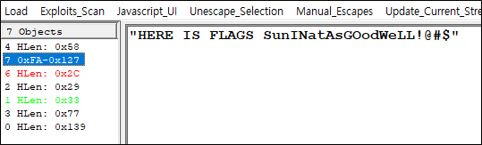

# [목차]
**1. [Description](#Description)**

**2. [Write-Up](#Write-Up)**

**3. [FLAG](#FLAG)**


***


# **Description**




# **Write-Up**

peepdf.py으로 살펴봤을 때, 37 object에 javascript가 있었다.



개발자 도구에 붙혀넣기 한다음, eval문을 console.log로 바꿔서 돌려봤다.



base64로 다중 인코딩되어 있기 때문에 exception이 터질때 까지 디코딩 했더니 FLAG가 아니라고 한다.

```python
import base64

data = """
Vm0wd2QyVkZOVWRXV0doVVYwZG9WMVl3Wkc5V1JsbDNXa1JTVjFKdGVGWlZNakExVmpGYWRHVkli
RmROYmxGM1ZtMXplRmRIVmtWUgpiRlpwVW14d1VWZFdaRFJUTWsxNFZHNU9XQXBpUm5CWVdsZDRZ
V1ZXV25KVmEyUmFWakZLV0ZWdE5VOWhRWEJUWWxaS1ZWWkdVa05UCk1WWlhWMWhvV0dKR2NITlZi
WGh6VGxaYVNHUkhSbWhWV0VKVVdXMTBTMWRXV25SalJYUnBDazFWY0ZoWGExcHJWMnN3ZVdGR2FG
VlcKYkhBeldsZDRZVk5GTlZkYVJuQldWMFZLVlZkWE1UQlRNVlpIVjJ0a1dtVnJXbkJEYXpGV1kw
Wm9XR0V5YUV4V01HUkxWMVpXYzFacwpjR2tLVW01Q2IxZHNaRFJaVjFKSVZtdG9VRlp1UWxkV01G
WkxWbFprV0dSR1pHdE5WbHBJVjJ0YWIyRXhTWGRYYmtaRVlsVndXRll5CmRHOVhSMFY1WVVaU1Yx
SXphSEpWYlhNeFZqRldjd3BqUjJ0TFZXMTRkMkl4V2xkVmEyUlhUVlZzTkZadGVITlpWa3B5VjJ4
a1YySnUKUW5WVWJFVTVVRkU5UFE9PQ==
"""
data = data.replace("\n", "")
while True:
    data = base64.b64decode(data).decode()
    print(data)

[Output]
... 생략 ...
U1NCaGJTQnpiM0p5ZVN3Z1ZHaHBjeUJwY3lCdWIzUWdTMlY1ZmlFaA==
SSBhbSBzb3JyeSwgVGhpcyBpcyBub3QgS2V5fiEh
I am sorry, This is not Key~!
```

PDF StreamDumper라는 툴이 있다. 39 object에서 PDF시그니처를 다시 볼 수 있는데, encrypt라는 구문이 있다. 해당 오브젝트만 PDF로 저장한다.

> [PDF StreamDumper](http://sandsprite.com/blogs/index.php?uid=7&pid=57)



PDF 잠금 해제하는 온라인 서비스에 부탁한 뒤, 결과를 다시 열어보자.

> [PDF 잠금 해제](https://smallpdf.com/kr/unlock-pdf)



# **FLAG**

**13d45a1e25471e72d2acc46f8ec46e95**