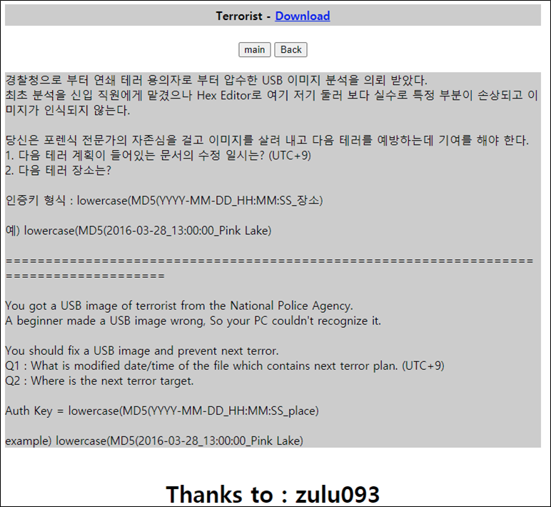
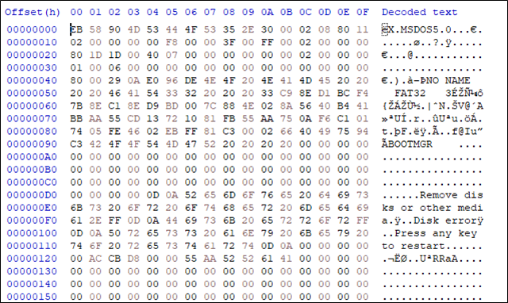
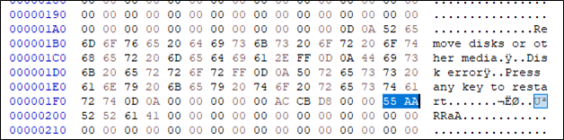
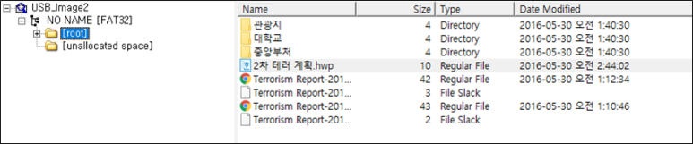
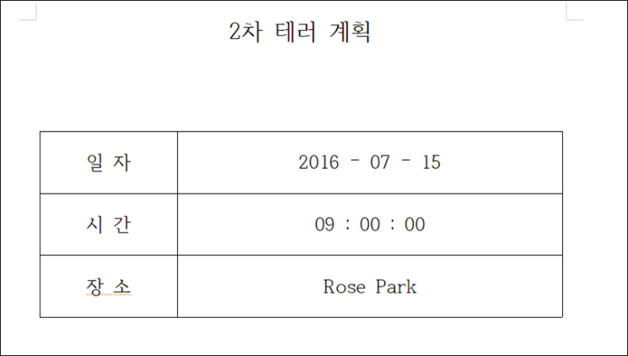

# [목차]
**1. [Description](#Description)**

**2. [Write-Up](#Write-Up)**

**3. [FLAG](#FLAG)**

***

# **Description**

# **Write-Up**

Hex editor로 열어보면 Boot sector로 추정된다.

Boot Sector의 시그니쳐는 0x1FE에 0x55, 0x1FF에 0xAA가 있어야하는데, 문제 파일에서는 0x126에 존재한다. 0x00으로 채워서 시그니쳐를 맞춰주자.

> [Boot Sector](https://en.wikipedia.org/wiki/Design_of_the_FAT_file_system#Bootsector)

해당 이미지를 FTK Imager로 열어보면 2차 테러 계획.hwp를 확인 할 수 있다.

(수정 시각 : 2016-05-30_11:44:02 (UTC+9))

해당 파일을 열어보면 장소를 알 수 있다.

(다음 테러 장소 : Rose Park)

MD5로 해쉬 돌릴 값은 2016-05-30_11:44:02_Rose Park이고, 해쉬 값은 8ce84f2f0568e3c70665167d44e53c2a이다.

# **FLAG**

**8ce84f2f0568e3c70665167d44e53c2a**