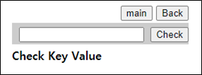
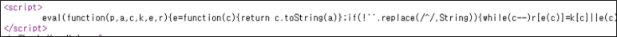
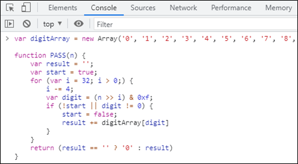
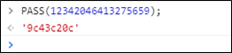
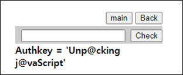

# [목차]
**1. [Description](#Description)**

**2. [Write-Up](#Write-Up)**

**3. [FLAG](#FLAG)**


***


# **Description**




# **Write-Up**

난독화된 javascript이다.



이쁘게 펼쳐주자.

> [JS 자동 정렬](https://beautifier.io/)

```javascript
var digitArray = new Array('0', '1', '2', '3', '4', '5', '6', '7', '8', '9', 'a', 'b', 'c', 'd', 'e', 'f');

function PASS(n) {
    var result = '';
    var start = true;
    for (var i = 32; i > 0;) {
        i -= 4;
        var digit = (n >> i) & 0xf;
        if (!start || digit != 0) {
            start = false;
            result += digitArray[digit]
        }
    }
    return (result == '' ? '0' : result)
}
```

적용 시켜준다.



Hint로 어떤 값이 주어진다.

```html
<!--Hint : 12342046413275659 -->
<!-- M@de by 2theT0P -->
```

PASS 함수에 넣어본다.



FLAG를 획득할 수 있다.




# **FLAG**

**Unp@cking j@vaScript**