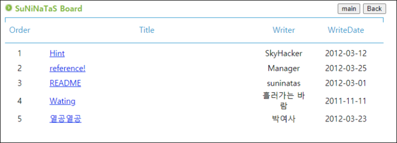
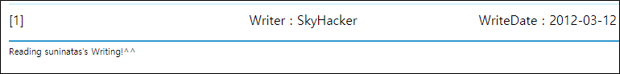
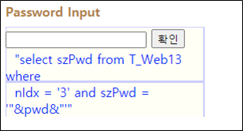
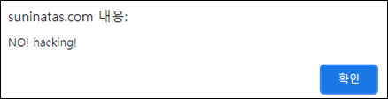
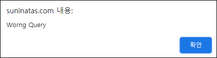
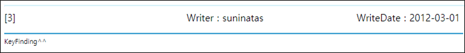
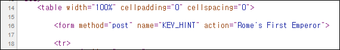
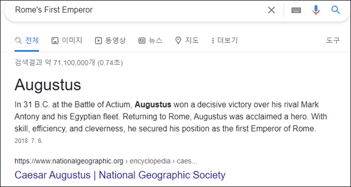

# [목차]
**1. [Description](#Description)**

**2. [Write-Up](#Write-Up)**

**3. [FLAG](#FLAG)**

***

# **Description**

# **Write-Up**

Hint를 보면 suninatas가 쓴 글을 읽으란다.

suninatas가 작성한 글을 읽으면 새 창으로 sql문이 나온다. (ui 개구리다)

' or 1=1--넣어봤으나 필터링된다.

' or True--넣어봤으나 Wrong Query라 나온다... ?

' or 2 > 1--로 넣었을 때, auth key를 얻고 페이지가 이동된다. 또 키를 찾으란다.

소스를 까보면 form 태그의 action에서 이상한 문구가 적혀 있다. (개연성이 실종...)

FLAG를 획득할 수 있다.

# **FLAG**

**Augustus**