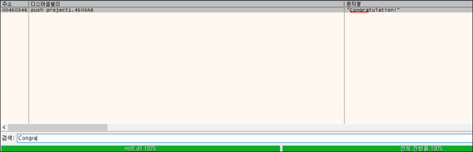

# [목차]
**1. [Description](#Description)**

**2. [Write-Up](#Write-Up)**

**3. [FLAG](#FLAG)**

***

# **Description**

# **Write-Up**

압축파일을 다운로드할 수 있는데, 압축해제하면 Windows Defender가 감지하니 제외해주자.(압축 해제 비밀번호 : suninatas)

기본적으로 파일 정보를 확인하면 32bit pe파일임을 확인할 수 있다.

문자열중 Congratulation!을 찾을 수 있다.

x32dbg에서 해당 문자열을 찾자.

해당 주소로 가서 위에 분기문의 cmp문에 bp를 걸고 Run시키면 edx에 비밀번호가 나온다.

검증하자.

# **FLAG**

**913465**