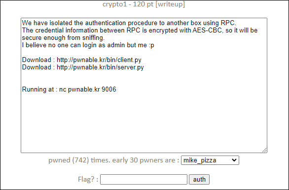
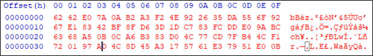

# [목차]
**1. [Description](#Description)**

**2. [Write-Up](#Write-Up)**

**3. [FLAG](#FLAG)**


***


# **Description**




# **Write-Up**

서버에 접속해 보면 ID, PW를 입력받고 암호화된 데이터를 반환해준다.

```sh
nc64.exe pwnable.kr 9006
---------------------------------------------------
-       PWNABLE.KR secure RPC login system        -
---------------------------------------------------

Input your ID
a
Input your PW
a
sending encrypted data (b6e140be3a3eb4b4facdaa1b94ac1f389ca015b53a3e5e838d6429f176fadad17dae2874d349b5a52d67b94dffd14444f7dd3b1834ec0f02f357a3a70fd3df85)
you are not authenticated user
```

client.py를 보면 ID와 PW는 digits와 ascii_lowercase와 -, _만을 허용한다.

```py
def sanitize(arg):
	for c in arg:
		if c not in '1234567890abcdefghijklmnopqrstuvwxyz-_':
			return False
	return True
```

그 다음 입력받은 ID와 PW와 지정된 cookie를 가지고 AES-128-CBC 블록 암호화를 거친다.

```py
def request_auth(id, pw):
	packet = '{0}-{1}-{2}'.format(id, pw, cookie)
	e_packet = AES128_CBC(packet)
	print 'sending encrypted data ({0})'.format(e_packet)
	sys.stdout.flush()
	return rpc.authenticate(e_packet)
```

그 후 hex값으로 출력한다.

```py
EncodeAES = lambda c, s: c.encrypt(pad(s)).encode('hex')
```

server.py에서 인증을 거치는데 ID는 admin이여야 하고, PW는 SHA256(ID + cookie)값이여야 한다.

즉, cookie값만 알면 admin으로 인증을 할 수 있다.

```py
def authenticate(e_packet):
    packet = AES128_CBC(e_packet)
    
    id = packet.split('-')[0]
    pw = packet.split('-')[1]
    
    if packet.split('-')[2] != cookie:
        return 0	# request is not originated from expected server
        
    if hashlib.sha256(id+cookie).hexdigest() == pw and id == 'guest':
        return 1
    if hashlib.sha256(id+cookie).hexdigest() == pw and id == 'admin':
        return 2
    return 0
```

블록 암호이기 때문에 블록 사이즈가 맞지 않으면, 패딩을 해줘야한다.

이때, ID/PW에 각각 패딩을 추가해주는 것이 아닌 ID-PW-cookie에 패딩을 취하기 때문에 cookie값을 알아낼 수 있는 방법이 있다.

    1. ID = 13글자 더미, PW = 빈 값을 넣으면 Encrypt("더미" + "-" + "" + "-" + cookie[0])된 결과를 받을 수 있다.
        ID = "-"*13 / PW = "" -> 결과 c178376374b28c26c62943a8257db334...
    2. PW에 [1-9a-z-_]를 넣어가면서 결과 확인
        ID = "-"*14 / PW = "y" -> 결과 c178376374b28c26c62943a8257db334...
    3. 첫 블록 사이즈만큼 값이 같기 때문에 cookie[0]는 y임을 알 수 있다.

먼저 cookie의 최대 길이를 구해보자. ID/PW에 아무값도 입력하지 않았을 시 16byte * 4만큼의 길이를 받을 수 있다.

즉, - 2개를 제외한 62byte의 최대 길이를 가진다.



cookie를 알아내는 코드는 다음과 같다.

```py
import math
from pwn import *

context.log_level   = "error"
COOKIE              = ''

def connect(ACCOUNT : tuple, i : int):
        r = remote('pwnable.kr', 9006)
        r.recvuntil('ID\n')
        r.sendline(ACCOUNT[0])
        r.recvuntil('PW\n')
        r.sendline(ACCOUNT[1])
        r.recvuntil('sending encrypted data (')

        encrypted_data = r.recvline().decode().strip()[:-1]
        return encrypted_data[i * 32 : (i + 1) * 32]

for i in range(math.floor(len(COOKIE) / 14), 5):
    for step in range(len(COOKIE) % 14, 14):
        BASE    = 13 + math.floor(len(COOKIE) / 14) * 2
        ACCOUNT = ('-' * (BASE - step), '')
        TARGET  = connect(ACCOUNT=ACCOUNT, i=i)
        OLD_LEN = len(COOKIE)

        for c in '1234567890abcdefghijklmnopqrstuvwxyz-_':
            ACCOUNT = ('-' * (BASE - step + 1), COOKIE + c)
            RESULT  = connect(ACCOUNT=ACCOUNT, i=i)
            if TARGET == RESULT:
                COOKIE += c
                print(f'COOKIE\t: {COOKIE}') # you_will_never_guess_this_sugar_honey_salt_cookie
                break
        if OLD_LEN == len(COOKIE): break

import hashlib
ID  = 'admin'
PW  = hashlib.sha256((ID + COOKIE).encode()).hexdigest()
print('ID\t: {}'.format(ID))
print('PW\t: {}'.format(PW))
```

ID와 PW를 알맞게 입력하여 FLAG를 획득하자.

```sh
nc64.exe pwnable.kr 9006
---------------------------------------------------
-       PWNABLE.KR secure RPC login system        -
---------------------------------------------------

Input your ID
admin
Input your PW
fcf00f6fc7f66ffcfec02eaf69d30398b773fa9b2bc398f960784d60048cc503
sending encrypted data (05c4ccfd4880c92339b995c7754ec2e6567f2ed91d955cb7144c1b6037855db1b3a8525e74d30fd4505bb38c975b86f23d0e5aa23eed44b9beaa7e2195da93ba53cb08758a261ada5612245f49d25b81aa5a297aa5d555886073b17e2ed719b3607da6fbfe40b260a45485910404d69c818a2faedac7bb3a727cfbb53eab8406)
hi admin, here is your flag
byte to byte leaking against block cipher plaintext is fun!!
```


# **FLAG**

**byte to byte leaking against block cipher plaintext is fun!!**