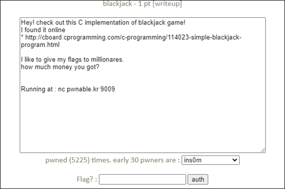

# [목차]
**1. [Description](#Description)**

**2. [Write-Up](#Write-Up)**

**3. [FLAG](#FLAG)**


***


# **Description**




# **Write-Up**

nc로 접속하면 다음과 같은 화면이 나온다.

```
              222                111
            222 222            11111
           222   222          11 111
                222              111
               222               111

CCCCC     SS            DD         HHHHH    C    C
C    C    SS           D  D       H     H   C   C
C    C    SS          D    D     H          C  C
CCCCC     SS          D DD D     H          C C
C    C    SS         D DDDD D    H          CC C
C     C   SS         D      D    H          C   C
C     C   SS        D        D    H     H   C    C
CCCCCC    SSSSSSS   D        D     HHHHH    C     C

                        21
     DDDDDDDD      HH         CCCCC    S    S
        DD        H  H       C     C   S   S
        DD       H    H     C          S  S
        DD       H HH H     C          S S
        DD      H HHHH H    C          SS S
        DD      H      H    C          S   S
     D  DD     H        H    C     S   S    C
      DDD      H        H     CCCCC    S     S

         222                     111
        222                      111
       222                       111
      222222222222222      111111111111111
      2222222222222222    11111111111111111


                 Are You Ready?
                ----------------
                      (Y/N)
```

Y를 입력하면 메뉴가 나오고, 1을 입력하면 게임이 시작되고, 2를 입력하면 규칙을 설명하고 3을 입력하면 게임을 종료한다는 뜻이다.

```
Enter 1 to Begin the Greatest Game Ever Played.
Enter 2 to See a Complete Listing of Rules.
Enter 3 to Exit Game. (Not Recommended)
Choice:
```

1을 입력하여 게임을 시작하면 사용자에게는 $500만큼의 Cash가 주어지고, 내가 가진 카드의 총합과 Dealer의 카드 총합을 알 수 있고, 얼만큼의 Cash를 걸건지 배팅하라고 나온다. 이때, 문제에서 Cash가 백만을 얻으면 FLAG를 획득할 수 있다고 한다.

```
Cash: $500
-------
|D    |
|  6  |
|    D|
-------

Your Total is 6

The Dealer Has a Total of 10

Enter Bet:
```

게임의 소스는 나와있는 링크에서 확인할 수 있고, 소스에서 betting함수를 보면 한번만 검사하고, 두번째 입력 시 보유한 Cash보다 더 많은 값을 입력할 수 있다.

> [Source Code](https://cboard.cprogramming.com/c-programming/114023-simple-blackjack-program.html)

```cpp
int betting() //Asks user amount to bet
{
 printf("\n\nEnter Bet: $");
 scanf("%d", &bet);

 if (bet > cash) //If player tries to bet more money than player has
 {
		printf("\nYou cannot bet more money than you have.");
		printf("\nEnter Bet: ");
        scanf("%d", &bet); //보유한 Cash보다 많은 값을 넣을 수 있다.
        return bet;
 }
 else return bet;
} // End Function
```

또한, bet변수와 cash변수는 int타입이기 때문에 overflow가 발생하여 음수가 되지 않도록 주의하여 

입력하고, 게임에서 이길 때까지 반복하면 FLAG를 획득할 수 있다.

```
Enter Bet: $2140000000

You cannot bet more money than you have.
Enter Bet: 2140000000


Would You Like to Hit or Stay?
Please Enter H to Hit or S to Stay.
H
-------
|C    |
|  1  |
|    C|
-------

Your Total is 7

The Dealer Has a Total of 15

Would You Like to Hit or Stay?
Please Enter H to Hit or S to Stay.
H
-------
|C    |
|  5  |
|    C|
-------

Your Total is 12

The Dealer Has a Total of 25
Dealer Has Went Over!. You Win!

You have 1 Wins and 0 Losses. Awesome!

Would You Like To Play Again?
Please Enter Y for Yes or N for No
Y
YaY_I_AM_A_MILLIONARE_LOL
```


# **FLAG**

**YaY_I_AM_A_MILLIONARE_LOL**