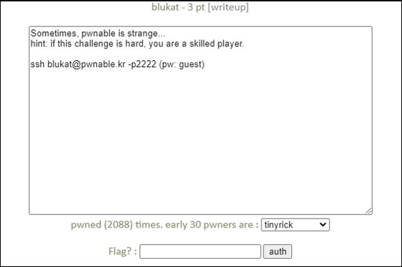
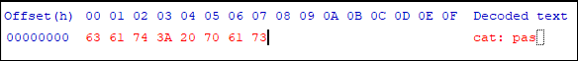

# [목차]
**1. [Description](#Description)**

**2. [Write-Up](#Write-Up)**

**3. [FLAG](#FLAG)**


***


# **Description**




# **Write-Up**

내가 입력해야하는 값과 password파일의 내용이 일치해야 한다.

```cpp
... 생략 ...
        if(!strcmp(password, buf)){
                printf("congrats! here is your flag: ");
                calc_flag(password);
        }
... 생략 ...
```

gdb로 password내용을 알아보자.

```sh
blukat@pwnable:~$ gdb blukat
... 생략 ...
(gdb) disas main
Dump of assembler code for function main:
   0x00000000004007fa <+0>:     push   %rbp
   0x00000000004007fb <+1>:     mov    %rsp,%rbp
   0x00000000004007fe <+4>:     add    $0xffffffffffffff80,%rsp
   0x0000000000400802 <+8>:     mov    %fs:0x28,%rax
   0x000000000040080b <+17>:    mov    %rax,-0x8(%rbp)
   0x000000000040080f <+21>:    xor    %eax,%eax
   0x0000000000400811 <+23>:    mov    $0x40096a,%esi
   0x0000000000400816 <+28>:    mov    $0x40096c,%edi
   0x000000000040081b <+33>:    callq  0x400660 <fopen@plt>
   0x0000000000400820 <+38>:    mov    %rax,-0x78(%rbp)
   0x0000000000400824 <+42>:    mov    -0x78(%rbp),%rax
   0x0000000000400828 <+46>:    mov    %rax,%rdx
   0x000000000040082b <+49>:    mov    $0x64,%esi
   0x0000000000400830 <+54>:    mov    $0x6010a0,%edi
   0x0000000000400835 <+59>:    callq  0x400640 <fgets@plt>
   0x000000000040083a <+64>:    mov    $0x400982,%edi
... 생략 ...
(gdb) b *main+64
Breakpoint 1 at 0x40083a
(gdb) r
Starting program: /home/blukat/blukat

Breakpoint 1, 0x000000000040083a in main ()
(gdb) x/100x 0x6010a0
0x6010a0 <password>:    0x3a746163      0x73617020      0x726f7773      0x50203a64
0x6010b0 <password+16>: 0x696d7265      0x6f697373      0x6564206e      0x6465696e
0x6010c0 <password+32>: 0x0000000a      0x00000000      0x00000000      0x00000000
... 생략 ...
```

password의 내용은 cat : pass~로 시작하는데, cat 명령어로 출력되는 내용과 일치한다.



```sh
blukat@pwnable:~$ cat password
cat: password: Permission denied
```

파일의 소유 그룹은 blukat_pwn이고, 권한도 해당 그룹은 읽을 수 있게 되어 있으며, 로그인 계정의 그룹은 blukat_pwn에 속해있다. 즉, 권한 상승이 필요없다.

내용에 장난질을 친것이다.

```sh
blukat@pwnable:~$ ls -al password
-rw-r----- 1 root blukat_pwn 33 Jan  6  2017 password
blukat@pwnable:~$ id
uid=1104(blukat) gid=1104(blukat) groups=1104(blukat),1105(blukat_pwn)
```

FLAG를 획득하자.

```sh
blukat@pwnable:~$ ./blukat
guess the password!
cat: password: Permission denied
congrats! here is your flag: Pl3as_DonT_Miss_youR_GrouP_Perm!!
```


# **FLAG**

**Pl3as_DonT_Miss_youR_GrouP_Perm!!**