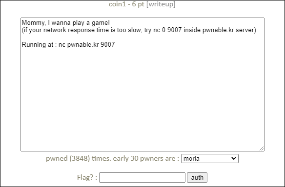

# [목차]
**1. [Description](#Description)**

**2. [Write-Up](#Write-Up)**

**3. [FLAG](#FLAG)**


***


# **Description**




# **Write-Up**

nc로 접속하면 다음과 같이 게임 설명 문이 나오고, 3초안으로 시작한다. 게임 룰은 다음과 같다.

    1. 100 stage로 구성 (60초 안에 해결해야 함)
    2. 코인의 수(N)과 최대 시도 횟수(C)가 먼저 주어진다.
    3. 코인의 인덱스 값(단일 정수)을 보내면 해당하는 인덱스의 코인의 무게를 반환한다. (진짜 코인 = 10, 가짜 코인 = 9)
    4. 코인의 인덱스 리스트(복수개의 정수)를 보내면 해당하는 인덱스의 코인들의 무게를 합한 값을 반환한다.
    5. 가짜 코인의 인덱스를 보내면 Correct라는 문구가 반환된다.

```sh
---------------------------------------------------
-              Shall we play a game?              -
---------------------------------------------------

You have given some gold coins in your hand
however, there is one counterfeit coin among them
counterfeit coin looks exactly same as real coin
however, its weight is different from real one
real coin weighs 10, counterfeit coin weighes 9
help me to find the counterfeit coin with a scale
if you find 100 counterfeit coins, you will get reward :)
FYI, you have 60 seconds.

- How to play -
1. you get a number of coins (N) and number of chances (C)
2. then you specify a set of index numbers of coins to be weighed
3. you get the weight information
4. 2~3 repeats C time, then you give the answer

- Example -
[Server] N=4 C=2        # find counterfeit among 4 coins with 2 trial
[Client] 0 1            # weigh first and second coin
[Server] 20                     # scale result : 20
[Client] 3                      # weigh fourth coin
[Server] 10                     # scale result : 10
[Client] 2                      # counterfeit coin is third!
[Server] Correct!

- Ready? starting in 3 sec... -
```

이진 탐색트리를 사용하여 반환 값이 10으로 나누어 떨어지는 지로 판별하면 된다. 다음과 같은 코드로 FLAG를 획득할 수 있다.

```python
from pwn import *

r = remote('pwnable.kr', 9007)
r.recvuntil('- Ready? starting in 3 sec... -')
for x in range(100):
    r.recvuntil('N=')
    data = r.recvline().decode().strip()
    N = int(data.split(' ')[0])
    C = int(data.split('=')[-1])

    first = 0
    last = N - 1

    for i in range(C):
        mid = (first + last) // 2
        r.sendline(' '.join([str(i) for i in range(first, mid)]))
        if int(r.recvline().decode()) % 10 == 0: first = mid
        else: last = mid
    r.sendline(str(first))
r.interactive()
```

하지만, 네트워크 상태가 좋지 않아 x=29일 때, 60초를 초과(time out)한다. 따라서 Description에서 나와있듯이, pwnable.kr서버에 접속하여 localhost로 통신하는 방법으로 시도한다. (mistake 문제로 접속해서 시도하였음)

```sh
mistake@pwnable:~$ cd /tmp
mistake@pwnable:/tmp$ mkdir ljw
mistake@pwnable:/tmp$ cd ljw
mistake@pwnable:/tmp/ljw$ vi coin1.py
```

```python
from pwn import *

r = remote('localhost', 9007)
r.recvuntil('- Ready? starting in 3 sec... -')
for x in range(100):
    r.recvuntil('N=')
    data = r.recvline().decode().strip()
    N = int(data.split(' ')[0])
    C = int(data.split('=')[-1])

    first = 0
    last = N - 1

    for i in range(C):
        mid = (first + last) // 2
        r.sendline(' '.join([str(i) for i in range(first, mid)]))
        if int(r.recvline().decode()) % 10 == 0: first = mid
        else: last = mid
    r.sendline(str(first))
r.interactive()
```

```sh
mistake@pwnable:/tmp/ljw$ python coin1.py
[+] Opening connection to localhost on port 9007: Done
[*] Switching to interactive mode
Correct! (99)
Congrats! get your flag
b1NaRy_S34rch1nG_1s_3asy_p3asy
time expired! bye!
[*] Got EOF while reading in interactive
$
```


# **FLAG**

**b1NaRy_S34rch1nG_1s_3asy_p3asy**